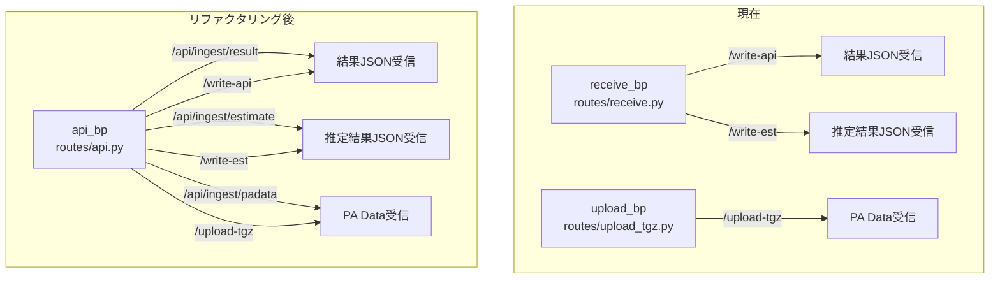
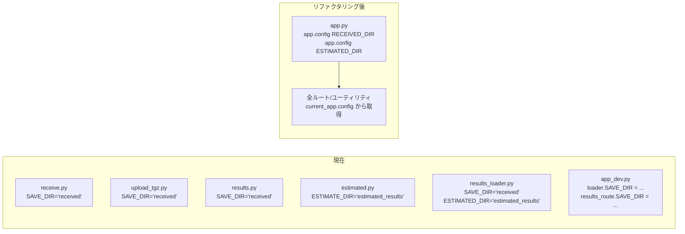

# 設計ドキュメント: API整理・リファクタリング

## Overview

BenchKit結果サーバ（result_server）のAPIルート構造を整理し、一貫性のある設計に改善するリファクタリング。主な変更は以下の通り：

1. データ受信APIを `/api/ingest/` プレフィックス配下に統一
2. `receive_bp` + `upload_bp` を `api_bp` に統合（`routes/api.py`）
3. 旧パスの後方互換ルートを deprecatedログ付きで維持
4. SAVE_DIR/ESTIMATED_DIR を `current_app.config` から取得する方式に統一
5. 推定結果ページのURLを `/estimated_results/` → `/estimated/` に短縮
6. 旧ルートファイル（`receive.py`, `upload_tgz.py`）の削除
7. CI/CDクライアント（`send_results.sh`）の新パス対応

### 現在のルート構造

```
POST /write-api          → receive_bp (routes/receive.py)  結果JSON受信
POST /write-est          → receive_bp (routes/receive.py)  推定結果JSON受信
POST /upload-tgz         → upload_bp  (routes/upload_tgz.py) PA Data受信
GET  /results/           → results_bp (routes/results.py)  結果一覧
GET  /estimated_results/ → estimated_bp (routes/estimated.py) 推定結果一覧
```

### リファクタリング後のルート構造

```
POST /api/ingest/result   → api_bp (routes/api.py)  結果JSON受信
POST /api/ingest/estimate → api_bp (routes/api.py)  推定結果JSON受信
POST /api/ingest/padata   → api_bp (routes/api.py)  PA Data受信
POST /write-api           → api_bp (互換ルート, deprecatedログ)
POST /write-est           → api_bp (互換ルート, deprecatedログ)
POST /upload-tgz          → api_bp (互換ルート, deprecatedログ)
GET  /results/            → results_bp (変更なし)
GET  /estimated/          → estimated_bp (プレフィックス短縮)
```

## Architecture

### Blueprint構成の変更



### SAVE_DIR管理の変更



### 設計判断

1. **Blueprint統合**: `receive_bp`と`upload_bp`は同じ「データ受信」責務を持つため、`api_bp`に統合。APIキー認証ロジックも共通化。
2. **互換ルート方式**: 旧パスは同一Blueprint内の別ルートとして定義し、同じハンドラ関数を呼び出す。`app.logger.warning()`でdeprecatedログを出力。
3. **`/api/ingest/` プレフィックス**: Blueprint自体の`url_prefix`を`/api/ingest`に設定し、各ルートは`/result`, `/estimate`, `/padata`とする。互換ルートはBlueprintの外（`app.py`側）で登録するか、Blueprint内で絶対パスとして定義する。
4. **互換ルートの実装方法**: `api_bp`のurl_prefixを空にし、新旧両方のルートを同一Blueprint内で定義する。これにより、`app.py`側の変更を最小限に抑える。

## Components and Interfaces

### 1. `routes/api.py` (新規)

統合されたデータ受信Blueprint。

```python
# api_bp = Blueprint("api", __name__)
# url_prefix="" で登録（app.py側）

# 新パス
@api_bp.route("/api/ingest/result", methods=["POST"])
def ingest_result(): ...

@api_bp.route("/api/ingest/estimate", methods=["POST"])
def ingest_estimate(): ...

@api_bp.route("/api/ingest/padata", methods=["POST"])
def ingest_padata(): ...

# 互換ルート（deprecatedログ付き）
@api_bp.route("/write-api", methods=["POST"])
def compat_write_api():
    current_app.logger.warning("Deprecated: /write-api → /api/ingest/result")
    return ingest_result()

@api_bp.route("/write-est", methods=["POST"])
def compat_write_est():
    current_app.logger.warning("Deprecated: /write-est → /api/ingest/estimate")
    return ingest_estimate()

@api_bp.route("/upload-tgz", methods=["POST"])
def compat_upload_tgz():
    current_app.logger.warning("Deprecated: /upload-tgz → /api/ingest/padata")
    return ingest_padata()
```

共通関数:
- `require_api_key()`: APIキー認証（`EXPECTED_API_KEY`環境変数と比較）
- `save_json_file(data, prefix, out_dir, given_uuid=None)`: JSON保存（既存ロジック移植）

ディレクトリパスの取得:
- `current_app.config["RECEIVED_DIR"]` で受信ディレクトリを取得
- `current_app.config["ESTIMATED_DIR"]` で推定結果ディレクトリを取得

### 2. `routes/results.py` (変更)

変更点:
- モジュールレベル変数 `SAVE_DIR = "received"` を削除
- 各ハンドラで `current_app.config["RECEIVED_DIR"]` を使用
- `check_file_permission()` と `result_compare()` の `SAVE_DIR` 参照を変更

### 3. `routes/estimated.py` (変更)

変更点:
- モジュールレベル変数 `ESTIMATE_DIR = "estimated_results"` を削除
- 各ハンドラで `current_app.config["ESTIMATED_DIR"]` を使用
- Blueprint登録時のurl_prefixを `/estimated` に変更

### 4. `utils/results_loader.py` (変更)

変更点:
- モジュールレベル変数 `SAVE_DIR`, `ESTIMATED_DIR` を削除
- `load_results_table()`, `load_estimated_results_table()` に `directory` 引数を追加（必須）
- `load_single_result()`, `load_multiple_results()` の `save_dir` 引数をデフォルトなしの必須引数に変更
- 呼び出し元（routes）が `current_app.config` から取得したパスを渡す

### 5. `app.py` (変更)

変更点:
- `receive_bp`, `upload_bp` のimportを `api_bp` に変更
- Blueprint登録:
  ```python
  app.register_blueprint(api_bp, url_prefix=prefix)
  app.register_blueprint(results_bp, url_prefix=f"{prefix}/results")
  app.register_blueprint(estimated_bp, url_prefix=f"{prefix}/estimated")  # 短縮
  ```

### 6. `app_dev.py` (変更)

変更点:
- モジュール変数の直接書き換え（`loader.SAVE_DIR = ...`, `results_route.SAVE_DIR = ...`）を削除
- `app.config["RECEIVED_DIR"]` と `app.config["ESTIMATED_DIR"]` の設定のみで動作

### 7. `templates/_navigation.html` (変更)

変更点:
- `/estimated_results` → `/estimated` にリンク更新

### 8. `scripts/send_results.sh` (変更)

変更点:
- `/write-api` → `/api/ingest/result`
- `/upload-tgz` → `/api/ingest/padata`

## Data Models

データモデル自体に変更はない。APIのリクエスト/レスポンス形式は完全に維持される。

### 結果JSON受信 (`/api/ingest/result`)
- Request: `POST` with raw JSON body, `X-API-Key` header
- Response: `{"status": "ok", "id": "<uuid>", "timestamp": "<ts>", "json_file": "<filename>"}`

### 推定結果JSON受信 (`/api/ingest/estimate`)
- Request: `POST` with raw JSON body, `X-API-Key` header, optional `X-UUID` header
- Response: `{"status": "ok", "id": "<uuid>", "timestamp": "<ts>", "json_file": "<filename>"}`

### PA Data受信 (`/api/ingest/padata`)
- Request: `POST` multipart form with `id`, `timestamp`, `file` fields, `X-API-Key` header
- Response: `{"status": "uploaded", "id": "<uuid>", "timestamp": "<ts>", "file": "<filename>", "replaced": <bool>}`

### 設定値 (`app.config`)
- `RECEIVED_DIR`: 結果JSON/PA Dataの保存先ディレクトリ（絶対パス）
- `ESTIMATED_DIR`: 推定結果JSONの保存先ディレクトリ（絶対パス）


## Correctness Properties

*プロパティとは、システムの全ての有効な実行において成り立つべき特性や振る舞いのことです。人間が読める仕様と機械的に検証可能な正しさの保証を橋渡しする、形式的な記述です。*

### Property 1: APIプレフィックスの一貫性

*For any* データ受信エンドポイント（ingest系）のルール、そのURLパスは `/api/ingest/` プレフィックスで始まること（互換ルートを除く）。

**Validates: Requirements 1.1**

### Property 2: レスポンス形式の保全

*For any* 有効なJSON入力データ、`/api/ingest/result` へのPOSTレスポンスは必ず `status`, `id`, `timestamp`, `json_file` キーを含み、`/api/ingest/padata` へのPOSTレスポンスは必ず `status`, `id`, `timestamp`, `file`, `replaced` キーを含むこと。

**Validates: Requirements 1.5**

### Property 3: APIキー認証の統一性

*For any* ingestエンドポイント（`/api/ingest/result`, `/api/ingest/estimate`, `/api/ingest/padata`）と *for any* リクエスト、不正なAPIキーまたはAPIキーなしの場合は401ステータスが返り、正しいAPIキーの場合は認証が通過すること。

**Validates: Requirements 2.4**

### Property 4: 旧パスと新パスのレスポンス等価性

*For any* 有効なリクエストボディ、旧パス（`/write-api`）と新パス（`/api/ingest/result`）に同一のリクエストを送信した場合、レスポンスのJSON構造（キーセット）が同一であること。同様に `/write-est` と `/api/ingest/estimate`、`/upload-tgz` と `/api/ingest/padata` についても成り立つこと。

**Validates: Requirements 3.1, 3.2**

### Property 5: ディレクトリ設定の伝播

*For any* `app.config["RECEIVED_DIR"]` に設定されたディレクトリパス、結果JSON受信時にそのパスにファイルが保存されること。同様に `app.config["ESTIMATED_DIR"]` に設定されたパスに推定結果が保存されること。

**Validates: Requirements 4.1, 4.3, 4.4**

## Error Handling

### APIキー認証エラー
- 不正なAPIキーまたはキーなし → HTTP 401 `Invalid API Key`
- 既存の動作を維持

### PA Dataアップロードエラー
- UUIDなしまたは不正 → HTTP 400 `Invalid or missing UUID`
- タイムスタンプなし → HTTP 400 `Missing Timestamp`
- ファイルなし → HTTP 400 `No file uploaded`
- 既存の動作を維持

### ディレクトリ不在
- `app.config["RECEIVED_DIR"]` / `app.config["ESTIMATED_DIR"]` は `create_app()` 内で `os.makedirs(exist_ok=True)` により自動作成（既存動作維持）

### 互換ルートのログ
- 旧パスへのアクセス時に `current_app.logger.warning()` でdeprecated警告を出力
- リクエスト処理自体は正常に実行（エラーにはしない）

## Testing Strategy

### テストフレームワーク
- **pytest**: ユニットテスト・統合テスト
- **hypothesis**: プロパティベーステスト（Python用PBTライブラリ）
- Flask `test_client()` を使用したHTTPレベルのテスト

### ユニットテスト（example-based）

1. **新パスの動作確認**: `/api/ingest/result`, `/api/ingest/estimate`, `/api/ingest/padata` への正常リクエスト
2. **互換ルートの動作確認**: `/write-api`, `/write-est`, `/upload-tgz` への正常リクエスト
3. **deprecatedログの出力確認**: 互換ルートアクセス時のログメッセージ検証
4. **Blueprint統合の確認**: `api_bp` が登録されていること
5. **URLプレフィックス変更の確認**: `/estimated/` でアクセス可能なこと
6. **既存テスト25件の通過**: リファクタリング後も全テストがパス

### プロパティベーステスト

各プロパティテストは最低100回のイテレーションで実行する。
各テストにはコメントで設計ドキュメントのプロパティ番号を参照する。

タグ形式: **Feature: api-restructure, Property {number}: {property_text}**

- **Property 1テスト**: Flaskアプリのルールを列挙し、ingest系（互換ルート除く）が全て `/api/ingest/` で始まることを検証
- **Property 2テスト**: hypothesisで任意のJSON辞書を生成し、`/api/ingest/result` へPOSTした際のレスポンスキーセットを検証
- **Property 3テスト**: hypothesisで任意のAPIキー文字列を生成し、正しいキーなら認証通過、不正なキーなら401が返ることを全エンドポイントで検証
- **Property 4テスト**: hypothesisで任意のJSON辞書を生成し、旧パスと新パスに同一リクエストを送信してレスポンスのキーセットが一致することを検証
- **Property 5テスト**: hypothesisで任意のディレクトリ名を生成し、`app.config["RECEIVED_DIR"]` に設定後、結果受信でそのディレクトリにファイルが作成されることを検証

各プロパティは1つのプロパティベーステストで実装する。
