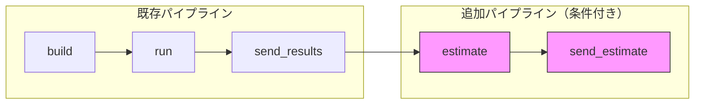
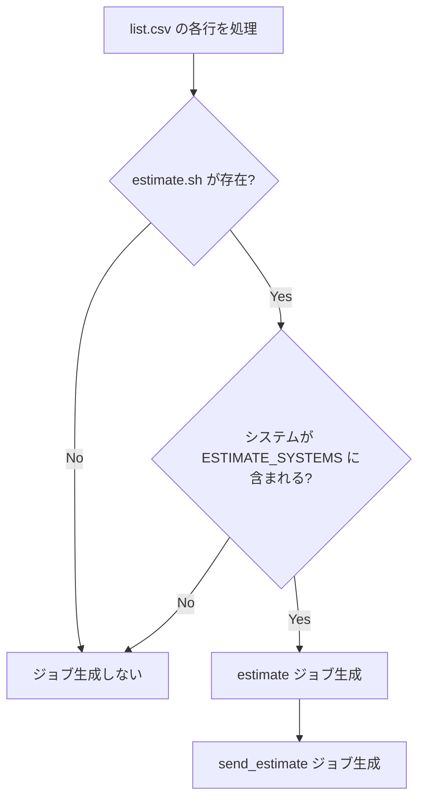
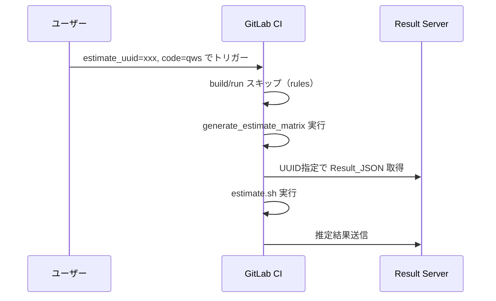

# 設計書: 性能推定機能のBenchKit統合

## 概要

BenchKitのCIパイプラインに性能推定（BenchEst）機能を統合する。既存の `build → run → send_results` パイプラインに `estimate → send_estimate` ステージを追加し、推定スクリプトが存在するアプリケーション×推定対象システム（MiyabiG, RC_GH200）の組み合わせでのみ推定ジョブを自動生成する。

### 設計方針

1. **既存パターンの踏襲**: `send_results.sh` / `emit_send_results_job` のパターンを踏襲し、推定版を追加する
2. **YAML生成ルール準拠**: scriptセクションはシンプルに、複雑なロジックは `scripts/run_estimate.sh` に分離
3. **差し替え可能性**: `estimate.sh` 内の推定ロジック部分のみを変更すれば実推定ツールに差し替え可能
4. **推定対象システムのハードコード**: `ESTIMATE_SYSTEMS` 変数として `job_functions.sh` に定義。設定ファイル化は将来の拡張時に検討

## アーキテクチャ

### パイプライン全体像



### 推定ジョブ生成の判定フロー



### ファイル構成

```
scripts/
├── job_functions.sh          # 既存 + emit_estimate_job, emit_send_estimate_job, ESTIMATE_SYSTEMS 追加
├── matrix_generate.sh        # 既存 + estimate/send_estimate ステージ追加
├── run_estimate.sh           # 新規: 推定実行ラッパー
├── send_estimate.sh          # 新規: 推定結果送信
├── estimate_common.sh        # 新規: 推定共通関数ライブラリ
├── send_results.sh           # 既存（変更なし）
└── result.sh                 # 既存（変更なし）

programs/
└── qws/
    ├── build.sh              # 既存
    ├── run.sh                # 既存
    ├── list.csv              # 既存
    └── estimate.sh           # 新規: ダミー推定スクリプト

.gitlab-ci.yml                # estimate_uuid, code 変数追加、推定モードrules追加
```

### 推定トリガーモード（UUID指定）



## コンポーネントとインターフェース

### 1. `scripts/estimate_common.sh` — 推定共通関数ライブラリ

benchest_ref/common_funcs.sh を参考に、result_server互換のJSON出力を行う共通関数群。

#### グローバル変数

```bash
# read_values で設定される変数
est_code=""
est_exp=""
est_fom=""
est_system=""
est_node_count=""

# estimate.sh 側で設定する変数（print_json が参照）
est_benchmark_system=""
est_benchmark_fom=""
est_benchmark_nodes=""
est_current_system=""
est_current_fom=""
est_current_nodes=""
est_current_method=""
est_future_system=""
est_future_fom=""
est_future_nodes=""
est_future_method=""
```

#### 関数

| 関数名 | 引数 | 説明 |
|--------|------|------|
| `read_values` | `$1`: Result_JSONファイルパス | JSONからcode, exp, FOM, system, node_countを読み取り、グローバル変数に設定。ファイル不在やFOM欠落時はエラー終了 |
| `print_json` | なし | グローバル変数からresult_server互換のEstimate_JSONを標準出力に出力 |

#### `read_values` の実装方針

- `jq` コマンドでJSONフィールドを抽出
- ファイル不在時: `echo "ERROR: ..." >&2; exit 1`
- FOMフィールド欠落時: `echo "ERROR: ..." >&2; exit 1`

#### `print_json` の出力フォーマット

```json
{
  "code": "$est_code",
  "exp": "$est_exp",
  "benchmark_system": "$est_benchmark_system",
  "benchmark_fom": <number>,
  "benchmark_nodes": "$est_benchmark_nodes",
  "current_system": {
    "system": "$est_current_system",
    "fom": <number>,
    "nodes": "$est_current_nodes",
    "method": "$est_current_method"
  },
  "future_system": {
    "system": "$est_future_system",
    "fom": <number>,
    "nodes": "$est_future_nodes",
    "method": "$est_future_method"
  },
  "performance_ratio": <number>
}
```

`performance_ratio` は `print_json` 内で `current_system.fom / future_system.fom` として計算する（`awk` 使用）。

### 2. `programs/<code>/estimate.sh` — アプリケーション別推定スクリプト

#### インターフェース

```bash
#!/bin/bash
# Usage: bash programs/<code>/estimate.sh <result_json_path>
# Output: results/estimate*.json
```

- 第1引数: Result_JSONファイルパス（例: `results/result0.json`）
- 出力先: `results/estimate_<code>_<index>.json`（estimate.sh内で決定）
- `source scripts/estimate_common.sh` で共通関数を読み込む

#### qwsダミー推定の実装例

```bash
#!/bin/bash
source scripts/estimate_common.sh

read_values "$1"

# --- Dummy estimation model (scale-mock) ---
est_benchmark_system="$est_system"
est_benchmark_fom="$est_fom"
est_benchmark_nodes="$est_node_count"

est_current_system="Fugaku"
est_current_fom=$(awk -v fom="$est_fom" 'BEGIN {printf "%.3f", fom * 10}')
est_current_nodes="$est_node_count"
est_current_method="scale-mock"

est_future_system="FugakuNEXT"
est_future_fom=$(awk -v fom="$est_fom" 'BEGIN {printf "%.3f", fom * 2}')
est_future_nodes="$est_node_count"
est_future_method="scale-mock"

# --- Output ---
output_file="results/estimate_${est_code}_0.json"
print_json > "$output_file"
echo "Estimate written to $output_file"
```

### 3. `scripts/run_estimate.sh` — 推定実行ラッパー

CIジョブのscriptセクションから `bash scripts/run_estimate.sh <code>` で呼び出される。

#### 処理フロー

1. 第1引数からプログラムコード名を取得
2. `programs/<code>/estimate.sh` の存在確認
3. `results/` ディレクトリ内の `result*.json` を検出
4. 各 Result_JSON に対して `estimate.sh` を実行
5. 推定結果ファイルの存在確認

```bash
#!/bin/bash
set -euo pipefail

code="$1"
estimate_script="programs/${code}/estimate.sh"

if [[ ! -f "$estimate_script" ]]; then
  echo "WARNING: $estimate_script not found, skipping estimation"
  exit 0
fi

found=0
for json_file in results/result*.json; do
  [[ ! -f "$json_file" ]] && continue
  found=1
  echo "Running estimation: $estimate_script $json_file"
  bash "$estimate_script" "$json_file"
done

if [[ "$found" -eq 0 ]]; then
  echo "WARNING: No result*.json found in results/, skipping estimation"
  exit 0
fi

echo "Estimation complete. Estimate files:"
ls results/estimate*.json 2>/dev/null || echo "No estimate files generated"
```

### 4. `scripts/send_estimate.sh` — 推定結果送信

`send_results.sh` のパターンを踏襲。

#### 処理フロー

1. `results/` 内の `estimate*.json` を検出
2. 各ファイルを `/api/ingest/estimate` にPOST
3. ファイルが存在しない場合は警告のみで正常終了

```bash
#!/bin/bash
set -euo pipefail

echo "Sending estimate results to server"

found=0
for json_file in results/estimate*.json; do
  [[ ! -f "$json_file" ]] && continue
  found=1
  echo "Posting $json_file to ${RESULT_SERVER}/api/ingest/estimate"
  curl --fail -sS -X POST "${RESULT_SERVER}/api/ingest/estimate" \
    -H "X-API-Key: ${RESULT_SERVER_KEY}" \
    -H "Content-Type: application/json" \
    --data-binary @"$json_file"
  echo "Sent: $json_file"
done

if [[ "$found" -eq 0 ]]; then
  echo "WARNING: No estimate*.json files found in results/"
fi

echo "All estimate results sent."
```

### 5. `scripts/job_functions.sh` への追加

#### 追加定数

```bash
# Estimate target systems (comma-separated)
ESTIMATE_SYSTEMS="MiyabiG,RC_GH200"
```

#### 追加関数

| 関数名 | 引数 | 説明 |
|--------|------|------|
| `is_estimate_target` | `$1`: system名 | システムが推定対象か判定。`ESTIMATE_SYSTEMS` に含まれれば return 0 |
| `has_estimate_script` | `$1`: program_dir | `$1/estimate.sh` が存在すれば return 0 |
| `emit_estimate_job` | `$1`: job_prefix, `$2`: depends_on, `$3`: code, `$4`: output_file | estimate ジョブのYAMLブロックを出力 |
| `emit_send_estimate_job` | `$1`: job_prefix, `$2`: depends_on, `$3`: output_file | send_estimate ジョブのYAMLブロックを出力 |

#### `emit_estimate_job` の出力YAML

```yaml
${job_prefix}_estimate:
  stage: estimate
  needs: ["${depends_on}"]
  tags: ["general"]
  script:
    - echo "Running estimation for ${code}"
    - bash scripts/run_estimate.sh ${code}
  artifacts:
    paths:
      - results/
    expire_in: 1 week
```

#### `emit_send_estimate_job` の出力YAML

```yaml
${job_prefix}_send_estimate:
  stage: send_estimate
  needs: ["${depends_on}"]
  tags: [fncx-curl-jq]
  environment:
    name: $CI_COMMIT_BRANCH
  script:
    - bash scripts/send_estimate.sh
```

### 6. `scripts/matrix_generate.sh` への変更

#### ステージ追加

```bash
stages:
  - build
  - run
  - send_results
  - estimate        # 追加
  - send_estimate   # 追加
```

#### 推定ジョブ生成ロジック

既存の `emit_send_results_job` 呼び出しの直後に、条件付きで推定ジョブを生成する:

```bash
# After emit_send_results_job call:
if has_estimate_script "$program_path" && is_estimate_target "$system"; then
  emit_estimate_job "$job_prefix" "${job_prefix}_send_results" "$program" "$OUTPUT_FILE"
  emit_send_estimate_job "$job_prefix" "${job_prefix}_estimate" "$OUTPUT_FILE"
fi
```

推定ジョブは `send_results` ジョブの後に実行される（`needs` で依存）。これにより、ベンチマーク結果の送信が完了してから推定が開始される。

### 7. `.gitlab-ci.yml` への変更

#### 変数追加

```yaml
variables:
  code: ""
  system: ""
  app: ""
  benchpark: "false"
  park_only: "false"
  park_send: "false"
  estimate_uuid: ""    # 追加: UUID指定による再推定トリガー
```

#### 推定モード用ジョブ追加

`estimate_uuid` が指定された場合、通常のbuild/runをスキップし、推定専用パイプラインを実行する。

```yaml
generate_estimate_matrix:
  stage: generate
  script:
    - bash scripts/generate_estimate_from_uuid.sh
  tags:
    - general
  artifacts:
    paths:
      - .gitlab-ci.estimate.yml
    expire_in: 1 hour
  rules:
    - if: '$estimate_uuid != ""'
      when: always
    - when: never

trigger_estimate_pipeline:
  stage: trigger
  trigger:
    include:
      - artifact: .gitlab-ci.estimate.yml
        job: generate_estimate_matrix
    strategy: depend
  needs:
    - job: generate_estimate_matrix
      optional: true
  rules:
    - if: '$estimate_uuid != ""'
      when: always
    - when: never
```

#### 既存ジョブのrules修正

`generate_matrix` と `trigger_child_pipeline` に推定モード除外ルールを追加:

```yaml
rules:
  - if: '$estimate_uuid != ""'
    when: never  # 推定モードでは通常パイプラインを無効化
  # ... 既存のrules
```

### 8. `scripts/generate_estimate_from_uuid.sh` — UUID指定推定用YAMLジェネレータ

`estimate_uuid` と `code` が指定された場合に、推定専用の子パイプラインYAMLを生成する。

#### 処理フロー

1. `estimate_uuid` と `code` の両方が指定されていることを確認
2. Result_ServerからUUID指定でResult_JSONを取得
3. 推定実行 → 結果送信のYAMLを生成

```yaml
# 生成されるYAML
stages:
  - fetch
  - estimate
  - send_estimate

fetch_result:
  stage: fetch
  tags: [fncx-curl-jq]
  script:
    - mkdir -p results
    - bash scripts/fetch_result_by_uuid.sh
  artifacts:
    paths:
      - results/
    expire_in: 1 week

estimate_${code}:
  stage: estimate
  needs: ["fetch_result"]
  tags: ["general"]
  script:
    - bash scripts/run_estimate.sh ${code}
  artifacts:
    paths:
      - results/
    expire_in: 1 week

send_estimate_${code}:
  stage: send_estimate
  needs: ["estimate_${code}"]
  tags: [fncx-curl-jq]
  environment:
    name: $CI_COMMIT_BRANCH
  script:
    - bash scripts/send_estimate.sh
```

### 9. `scripts/fetch_result_by_uuid.sh` — UUID指定結果取得

```bash
#!/bin/bash
set -euo pipefail

if [[ -z "${estimate_uuid:-}" || -z "${code:-}" ]]; then
  echo "ERROR: Both estimate_uuid and code must be specified"
  exit 1
fi

echo "Fetching result for UUID: $estimate_uuid"
curl --fail -sS -o "results/result0.json" \
  "${RESULT_SERVER}/api/result/${estimate_uuid}"
echo "Fetched result to results/result0.json"
```

## データモデル

### Estimate_JSON フォーマット（result_server互換）

```json
{
  "code": "qws",
  "exp": "strong_scaling_48",
  "benchmark_system": "MiyabiG",
  "benchmark_fom": 123.456,
  "benchmark_nodes": "48",
  "current_system": {
    "system": "Fugaku",
    "fom": 1234.56,
    "nodes": "48",
    "method": "measured"
  },
  "future_system": {
    "system": "FugakuNEXT",
    "fom": 246.912,
    "nodes": "48",
    "method": "scale-mock"
  },
  "performance_ratio": 5.0
}
```

### フィールド定義

| フィールド | 型 | 説明 |
|-----------|-----|------|
| `code` | string | アプリケーションコード名 |
| `exp` | string | 実験名（Exp） |
| `benchmark_system` | string | ベンチマーク実行システム名 |
| `benchmark_fom` | number | ベンチマーク実行時のFOM値 |
| `benchmark_nodes` | string | ベンチマーク実行時のノード数 |
| `current_system.system` | string | 現行システム名（例: "Fugaku"） |
| `current_system.fom` | number | 現行システムでのFOM値 |
| `current_system.nodes` | string | 現行システムでのノード数 |
| `current_system.method` | string | 推定手法（"measured", "scale-mock" 等） |
| `future_system.system` | string | 将来システム名（例: "FugakuNEXT"） |
| `future_system.fom` | number | 将来システムでの推定FOM値 |
| `future_system.nodes` | string | 将来システムでのノード数 |
| `future_system.method` | string | 推定手法 |
| `performance_ratio` | number | current_system.fom / future_system.fom |

### ESTIMATED_FIELD_MAP との互換性

result_server の `results_loader.py` で定義されている:

```python
ESTIMATED_FIELD_MAP = {"system": "benchmark_system", "code": "code", "exp": "exp"}
```

`load_estimated_results_table` は以下のフィールドを参照する:
- `data.get("code")` → `code`
- `data.get("exp")` → `exp`
- `data.get("benchmark_system")` → `benchmark_system`
- `data.get("benchmark_fom")` → `benchmark_fom`
- `data.get("benchmark_nodes")` → `benchmark_nodes`
- `data.get("current_system", {})` → current_system オブジェクト
- `data.get("future_system", {})` → future_system オブジェクト
- `data.get("performance_ratio")` → `performance_ratio`

上記のEstimate_JSONフォーマットはこれらすべてと互換性がある。

### 推定対象システム定義

```bash
ESTIMATE_SYSTEMS="MiyabiG,RC_GH200"
```

`job_functions.sh` にハードコードする。将来的にシステム数が増えた場合は `config/estimate_systems.csv` 等に外出しを検討する。


## 正当性プロパティ（Correctness Properties）

*プロパティとは、システムのすべての有効な実行において成り立つべき特性や振る舞いのことである。人間が読める仕様と機械的に検証可能な正当性保証の橋渡しとなる形式的な記述である。*

### Property 1: read_values ラウンドトリップ

*For any* 有効なResult_JSON（code, exp, FOM, system, node_countフィールドを含む）に対して、`read_values` を実行した後のグローバル変数（est_code, est_exp, est_fom, est_system, est_node_count）は、元のJSONの対応するフィールド値と一致する。

**Validates: Requirements 1.1**

### Property 2: print_json フォーマット完全性

*For any* 有効なグローバル変数の組み合わせ（est_code, est_exp, est_benchmark_system, est_benchmark_fom, est_benchmark_nodes, est_current_*, est_future_*）に対して、`print_json` の出力は有効なJSONであり、以下のすべてを満たす:
- トップレベルに code, exp, benchmark_system, benchmark_fom, benchmark_nodes, performance_ratio フィールドが存在する
- current_system オブジェクトに system, fom, nodes, method フィールドが存在する
- future_system オブジェクトに system, fom, nodes, method フィールドが存在する
- 各フィールドの値がグローバル変数の値と一致する

**Validates: Requirements 1.2, 1.3, 1.4, 5.1, 5.2, 5.3**

### Property 3: performance_ratio 計算の正確性

*For any* 正の数値ペア（current_fom, future_fom）に対して、`print_json` が出力するJSONの `performance_ratio` は `current_fom / future_fom` と等しい（浮動小数点精度の範囲内）。

**Validates: Requirements 5.4**

### Property 4: Estimate_JSON と result_server の互換性

*For any* 有効なEstimate_JSON に対して、そのJSONファイルを `load_estimated_results_table` で読み込んだ結果の行（row）は、code, exp, benchmark_system, benchmark_fom, benchmark_nodes, systemA_fom, systemA_system, systemA_nodes, systemA_method, systemB_fom, systemB_system, systemB_nodes, systemB_method, performance_ratio の各フィールドが元のJSONの対応する値と一致する。

**Validates: Requirements 5.5**

### Property 5: 推定ジョブ生成の条件判定

*For any* プログラム×システムの組み合わせに対して、推定ジョブ（estimate, send_estimate）が生成されるのは、`programs/<code>/estimate.sh` が存在し、かつシステムが `ESTIMATE_SYSTEMS`（MiyabiG, RC_GH200）に含まれる場合に限る。それ以外の組み合わせでは推定ジョブは一切生成されない。

**Validates: Requirements 2.7, 4.4, 4.5**

### Property 6: 生成YAMLの構造正当性

*For any* 推定対象のプログラム×システムの組み合わせに対して、生成されたYAMLは以下を満たす:
- `estimate` ステージと `send_estimate` ステージが存在する
- estimate ジョブの `needs` が対応する send_results ジョブを参照する
- send_estimate ジョブの `needs` が対応する estimate ジョブを参照する

**Validates: Requirements 4.1, 4.2, 4.3**

### Property 7: ダミー推定モデルのスケーリング

*For any* 正のFOM値に対して、qwsのダミー推定モデルは current_system.fom = FOM × 10、future_system.fom = FOM × 2 を出力し、両方の method フィールドが "scale-mock" である。

**Validates: Requirements 7.2, 7.3**

### Property 8: send_estimate.sh の全ファイル送信

*For any* `results/` ディレクトリ内の `estimate*.json` ファイル集合に対して、`send_estimate.sh` はすべてのファイルを `/api/ingest/estimate` エンドポイントにPOSTする。送信されたファイル数は元のファイル数と一致する。

**Validates: Requirements 3.1, 3.2**

### Property 9: run_estimate.sh の全結果処理

*For any* `results/` ディレクトリ内の `result*.json` ファイル集合に対して、`run_estimate.sh` は各ファイルに対して `programs/<code>/estimate.sh` を1回ずつ呼び出す。

**Validates: Requirements 9.2**

## エラーハンドリング

### estimate_common.sh

| エラー条件 | 処理 |
|-----------|------|
| `read_values`: ファイルが存在しない | stderr にエラーメッセージ出力、`exit 1` |
| `read_values`: FOMフィールドが欠落 | stderr にエラーメッセージ出力、`exit 1` |
| `read_values`: jqコマンドが利用不可 | stderr にエラーメッセージ出力、`exit 1` |
| `print_json`: future_fom が 0 | performance_ratio を 0 として出力（ゼロ除算回避） |

### run_estimate.sh

| エラー条件 | 処理 |
|-----------|------|
| estimate.sh が存在しない | 警告メッセージ出力、`exit 0`（正常終了） |
| result*.json が存在しない | 警告メッセージ出力、`exit 0`（正常終了） |
| estimate.sh が非ゼロで終了 | `set -euo pipefail` により即座にエラー終了 |

### send_estimate.sh

| エラー条件 | 処理 |
|-----------|------|
| estimate*.json が存在しない | 警告メッセージ出力、`exit 0`（正常終了） |
| HTTP POST失敗（curl --fail） | エラーメッセージ出力、非ゼロ終了 |
| RESULT_SERVER 未設定 | `set -euo pipefail` により即座にエラー終了 |
| RESULT_SERVER_KEY 未設定 | `set -euo pipefail` により即座にエラー終了 |

### fetch_result_by_uuid.sh

| エラー条件 | 処理 |
|-----------|------|
| estimate_uuid 未設定 | エラーメッセージ出力、`exit 1` |
| code 未設定 | エラーメッセージ出力、`exit 1` |
| Result_Server からの取得失敗 | `curl --fail` によりエラー終了 |

### matrix_generate.sh（推定関連）

| エラー条件 | 処理 |
|-----------|------|
| estimate.sh が存在しない | 推定ジョブを生成しない（正常動作） |
| システムが推定対象外 | 推定ジョブを生成しない（正常動作） |

## テスト戦略

### テストアプローチ

ユニットテストとプロパティベーステストの二本立てで検証する。

- **ユニットテスト**: 具体的な入出力例、エッジケース、エラー条件の検証
- **プロパティベーステスト**: ランダム生成された入力に対する普遍的な性質の検証

### プロパティベーステスト

**ライブラリ**: Python の `hypothesis` を使用（result_server のテストで既に使用実績あり）

シェルスクリプトのテストは、Python から `subprocess` でシェルスクリプトを呼び出す形式で実施する。YAML生成のテストは生成されたYAMLをパースして検証する。

**設定**: 各プロパティテストは最低100イテレーション実行する。

**タグ付け**: 各テストにコメントでプロパティ参照を記載する。
- フォーマット: `Feature: benchest-integration, Property {number}: {property_text}`

**各プロパティは1つのプロパティベーステストで実装する。**

### テスト対象と手法

| コンポーネント | プロパティテスト | ユニットテスト |
|--------------|----------------|--------------|
| `estimate_common.sh` (read_values) | Property 1: ラウンドトリップ | エッジケース: ファイル不在、FOM欠落 |
| `estimate_common.sh` (print_json) | Property 2: フォーマット完全性, Property 3: ratio計算 | — |
| Estimate_JSON ↔ result_server | Property 4: 互換性 | — |
| matrix_generate.sh（推定ジョブ生成） | Property 5: 条件判定, Property 6: YAML構造 | 具体的なプログラム×システム組み合わせの例 |
| qws/estimate.sh（ダミーモデル） | Property 7: スケーリング | — |
| send_estimate.sh | Property 8: 全ファイル送信 | エッジケース: ファイル不在時の正常終了 |
| run_estimate.sh | Property 9: 全結果処理 | エッジケース: result不在時の正常終了 |

### ユニットテスト

- `read_values` に存在しないファイルを渡した場合のエラー終了確認
- `read_values` にFOM欠落JSONを渡した場合のエラー終了確認
- `send_estimate.sh` でestimate*.jsonが存在しない場合の正常終了確認
- `run_estimate.sh` でresult*.jsonが存在しない場合の正常終了確認
- `fetch_result_by_uuid.sh` でestimate_uuid/code未設定時のエラー確認
- `.gitlab-ci.yml` のrules: estimate_uuid指定時に通常パイプラインがスキップされることの確認
