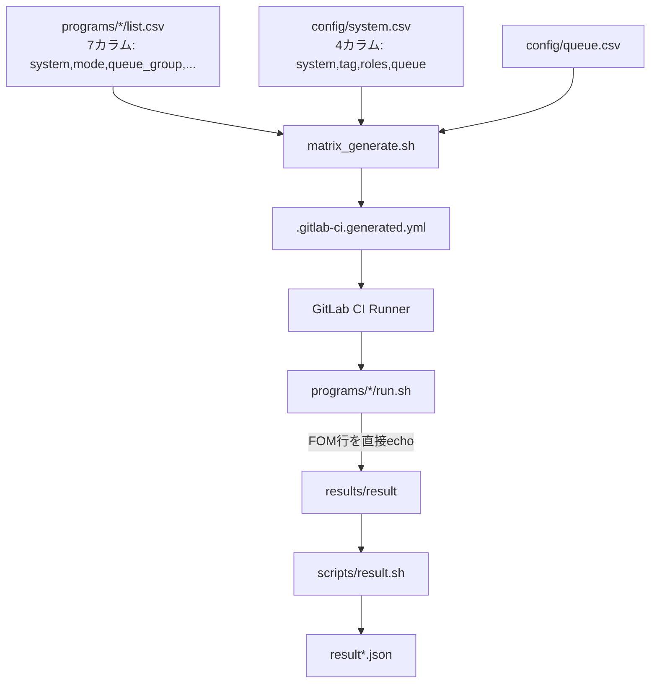
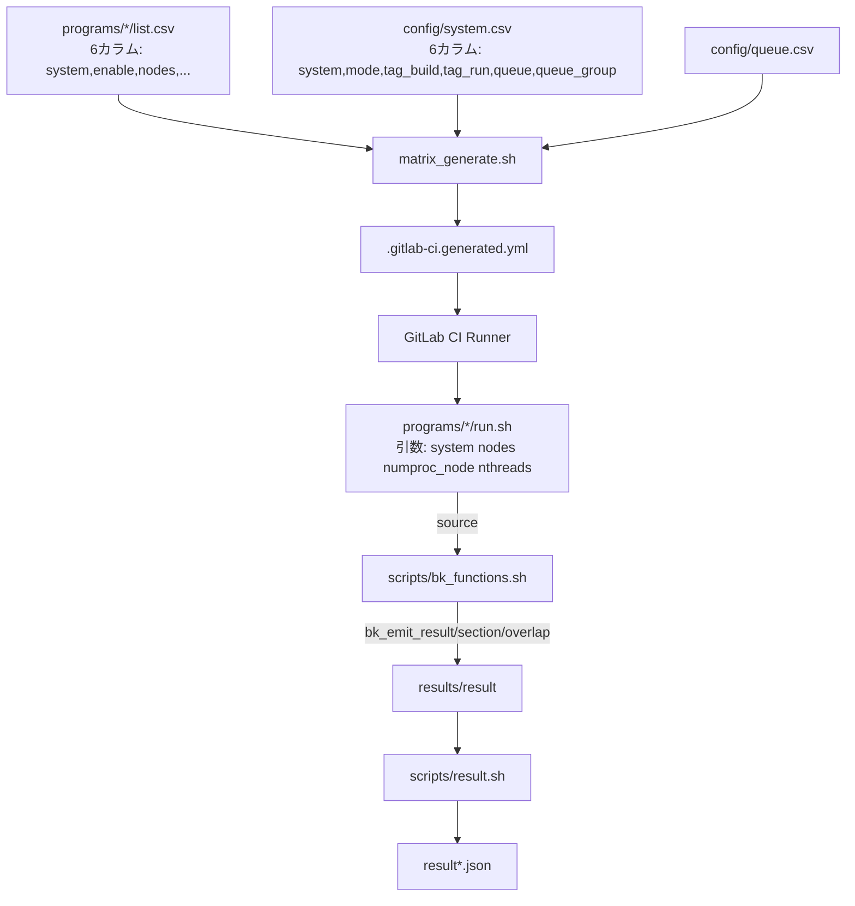

# 設計文書: CI基盤リファクタリングと堅牢化

## 概要 (Overview)

本設計は、CIパイプライン基盤のリファクタリングを行い、以下の5つの主要変更を実現する:

1. **List_CSVの簡素化**: `system,enable,nodes,numproc_node,nthreads,elapse` の6カラム形式に変更。mode/queue_groupをList_CSVから削除し、enableカラムを追加する
2. **System_CSVの拡張**: mode/queue_groupカラムを追加し、システム設定を一元管理する
3. **Run_Scriptの引数統一**: genesis/genesis-nonbonded-kernelsのrun.shからList_CSV読み込みを廃止し、4引数（system, nodes, numproc_node, nthreads）ベースに統一する
4. **BK_Functions共通関数**: `scripts/bk_functions.sh` にFOM/SECTION/OVERLAP出力の標準化関数を作成する
5. **Matrix_Generator/Test_Submit対応**: 新CSV形式に対応するよう既存スクリプトを更新する

### 設計判断の根拠

- **mode/queue_groupのSystem_CSV集約**: 同一システムのmode/queue_groupは全プログラムで共通であるため、各list.csvに重複定義する必要がない。System_CSVに集約することで単一の真実の源（Single Source of Truth）を実現する
- **enableカラム**: `#`コメントアウトは機械的なパースが困難で、意図が不明確。明示的なyes/noフラグにより、プログラム的なフィルタリングが容易になる
- **引数ベースRun_Script**: Run_ScriptがList_CSVを直接読む現在の設計は、呼び出し元（Matrix_Generator）との責任分離が不明確。引数ベースにすることで、Run_Scriptは純粋な実行ロジックに集中できる
- **bk_functions.sh**: 各Run_Scriptで独自にFOM行を構築している現状は、フォーマットの不整合リスクがある。共通関数で標準化することで、Result_Parser（result.sh）との互換性を保証する

## アーキテクチャ (Architecture)

### 現在のデータフロー



### 変更後のデータフロー



### 変更影響範囲

| ファイル | 変更種別 | 概要 |
|---------|---------|------|
| `config/system.csv` | 修正 | 1システム1行形式に再設計（mode, tag_build, tag_run, queue, queue_group） |
| `programs/*/list.csv` (5ファイル) | 修正 | 6カラム形式に変更 |
| `scripts/bk_functions.sh` | 新規 | 共通関数ライブラリ |
| `scripts/job_functions.sh` | 修正 | parse_list_csv_line を6カラム対応に変更、get_system_info関数追加（1行からmode/tag_build/tag_run/queue/queue_group取得） |
| `scripts/matrix_generate.sh` | 修正 | 新CSV形式対応、enableフィルタリング、System_CSVからmode/queue_group取得 |
| `scripts/test_submit.sh` | 修正 | 新CSV形式対応 |
| `programs/genesis/run.sh` | 修正 | List_CSV読み込み削除、引数ベースに変更 |
| `programs/genesis-nonbonded-kernels/run.sh` | 修正 | List_CSV読み込み削除、引数ベースに変更 |

## コンポーネントとインターフェース (Components and Interfaces)

### 1. List_CSV（新形式）

```
system,enable,nodes,numproc_node,nthreads,elapse
Fugaku,yes,1,4,12,0:10:00
FugakuLN,no,1,1,1,0:10:00
```

- 6カラム固定
- enableは `yes` または `no` のみ有効
- `#`コメント行は使用しない

### 2. System_CSV（新形式: 1システム1行）

```
system,mode,tag_build,tag_run,queue,queue_group
Fugaku,cross,fugaku_login1,fugaku_jacamar,FJ,small
FugakuLN,native,,fugaku_login1,none,small
FugakuCN,native,,fugaku_jacamar,FJ,small
RC_GH200,native,,cloud_jacamar,SLURM_RC_GH200,dummy
RC_DGXS,native,,cloud_jacamar,SLURM_RC_DGXS,dummy
RC_GENOA,native,,cloud_jacamar,SLURM_RC_GENOA,dummy
MiyabiG,cross,miyabi_g_login,miyabi_g_jacamar,PBS_Miyabi,debug-g
MiyabiC,cross,miyabi_c_login,miyabi_c_jacamar,PBS_Miyabi,debug-c
```

- 1システム1行（旧形式の複数行を統合）
- `mode=cross`: `tag_build`でビルドジョブ、`tag_run`でランジョブを生成
- `mode=native`: `tag_run`のみ使用（build_runジョブ）、`tag_build`は空
- 旧`roles`カラムは廃止（modeから自動判定）
- Matrix_Generatorはシステム名で検索し、modeに応じてタグを使い分ける

### 3. bk_functions.sh

`source scripts/bk_functions.sh` でRun_Scriptから読み込む。

#### bk_emit_result

```bash
# 名前付き引数
bk_emit_result --fom 12.345 --fom-version DDSolverJacobi --exp CASE0 \
               --nodes 1 --numproc-node 4 --nthreads 12
# 出力: FOM:12.345 FOM_version:DDSolverJacobi Exp:CASE0 node_count:1 numproc_node:4 nthreads:12

# --fomのみ（最小）
bk_emit_result --fom 12.345
# 出力: FOM:12.345

# --confidentialオプション
bk_emit_result --fom 12.345 --confidential TeamA
# 出力: FOM:12.345 confidential:TeamA
```

- `--fom` は必須。未指定時はstderrにエラーを出力し、exit code 1を返す
- `--fom` に非数値が渡された場合もstderrにエラーを出力し、exit code 1を返す
- その他の引数は省略可能。省略時は対応するkey:valueペアを出力しない
- POSIX互換（jq不要）

#### bk_emit_section

```bash
# 位置引数2つ
bk_emit_section compute_kernel 0.30
# 出力: SECTION:compute_kernel time:0.30
```

- 引数不足時はstderrにエラーを出力し、exit code 1を返す
- time値が非数値の場合もstderrにエラーを出力し、exit code 1を返す

#### bk_emit_overlap

```bash
# 位置引数2つ（セクション名はカンマ区切り）
bk_emit_overlap compute_kernel,communication 0.05
# 出力: OVERLAP:compute_kernel,communication time:0.05
```

- 引数不足時はstderrにエラーを出力し、exit code 1を返す
- time値が非数値の場合もstderrにエラーを出力し、exit code 1を返す

### 4. job_functions.sh の変更

#### parse_list_csv_line（変更）

```bash
# 変更前: 7引数（system, mode, queue_group, nodes, numproc_node, nthreads, elapse）
# 変更後: 6引数（system, enable, nodes, numproc_node, nthreads, elapse）
parse_list_csv_line "$system" "$enable" "$nodes" "$numproc_node" "$nthreads" "$elapse"
# エクスポート変数: csv_system, csv_enable, csv_nodes, csv_numproc_node, csv_nthreads, csv_elapse
```

- ヘッダ行（`system`で始まる行）はスキップ（return 1）
- enable値が `yes` でも `no` でもない場合、stderrに警告を出力しスキップ（return 1）
- enable値が `no` の場合もスキップ（return 1）

#### get_system_mode（新規）

```bash
# System_CSVからmodeを取得（1システム1行なので直接取得）
get_system_mode "Fugaku"
# 出力: cross
```

- システム名で検索し、2カラム目のmode値を返す

#### get_system_queue_group（新規）

```bash
# System_CSVからqueue_groupを取得
get_system_queue_group "Fugaku"
# 出力: small
```

- システム名で検索し、6カラム目のqueue_group値を返す

#### get_system_tag_build（新規）

```bash
# System_CSVからビルド用タグを取得
get_system_tag_build "Fugaku"
# 出力: fugaku_login1
```

- mode=crossの場合に使用。mode=nativeの場合は空文字を返す

#### get_system_tag_run（新規）

```bash
# System_CSVから実行用タグを取得
get_system_tag_run "Fugaku"
# 出力: fugaku_jacamar
```

- cross/native両方で使用。nativeの場合はbuild_runジョブのタグとして使用

### 5. matrix_generate.sh の変更

主な変更点:
- `parse_list_csv_line` の呼び出しを6カラム対応に変更
- mode/queue_groupを `get_system_mode` / `get_system_queue_group` で取得
- tag_build/tag_runを `get_system_tag_build` / `get_system_tag_run` で取得（旧awkベースのタグ検索を置き換え）
- enableフィルタリングは `parse_list_csv_line` 内で処理（`no`の行はスキップ）
- `get_queue_template` はqueue値を使うので変更不要（System_CSVのqueue列から取得）

### 6. Run_Script の変更

#### genesis/run.sh

```bash
# 変更前: $1=system のみ、list.csvからnodes等を読み込み
# 変更後: $1=system, $2=nodes, $3=numproc_node, $4=nthreads
system="$1"
nodes="$2"
numproc_node="$3"
nthreads="$4"
numproc=$(( numproc_node * nodes ))
totalcores=$(( numproc * nthreads ))
```

#### genesis-nonbonded-kernels/run.sh

```bash
# 変更前: $1=system のみ、list.csvからnodes等を読み込み
# 変更後: $1=system, $2=nodes, $3=numproc_node, $4=nthreads
system="$1"
nodes="$2"
numproc_node="$3"
nthreads="$4"
numproc=$(( numproc_node * nodes ))
```

### 7. test_submit.sh の変更

- 新しい6カラムList_CSV形式に対応
- mode/queue_group/tag情報をSystem_CSVから取得する関数を使用
- 旧rolesベースのタグ検索を廃止

## データモデル (Data Models)

### List_CSV スキーマ

| カラム | 型 | 必須 | 説明 |
|-------|-----|------|------|
| system | string | ○ | システム名（Fugaku, FugakuLN等） |
| enable | enum(yes,no) | ○ | ジョブ有効/無効 |
| nodes | integer | ○ | ノード数 |
| numproc_node | integer | ○ | ノードあたりプロセス数 |
| nthreads | integer | ○ | スレッド数 |
| elapse | time_string | ○ | 実行時間制限（H:MM:SS形式） |

### System_CSV スキーマ

| カラム | 型 | 必須 | 説明 |
|-------|-----|------|------|
| system | string | ○ | システム名（1システム1行） |
| mode | enum(cross,native) | ○ | 実行モード |
| tag_build | string | △ | ビルド用GitLab Runnerタグ（cross時は必須、native時は空） |
| tag_run | string | ○ | 実行用GitLab Runnerタグ（native時はbuild_run用） |
| queue | string | ○ | キュー名（queue.csvのキーに対応） |
| queue_group | string | ○ | キューグループ名 |

### bk_emit_result 出力フォーマット

```
FOM:<数値> [FOM_version:<文字列>] [Exp:<文字列>] [node_count:<整数>] [numproc_node:<整数>] [nthreads:<整数>] [confidential:<文字列>]
```

- スペース区切りのkey:valueペア
- FOMは必須、他はオプション
- Result_Parser（result.sh）の既存パースロジック（`grep -Eo 'KEY:[ ]*VALUE'`）と互換

### bk_emit_section 出力フォーマット

```
SECTION:<セクション名> time:<数値>
```

### bk_emit_overlap 出力フォーマット

```
OVERLAP:<カンマ区切りセクション名> time:<数値>
```

### System_CSV マッピング（具体値）

| system | mode | tag_build | tag_run | queue | queue_group |
|--------|------|-----------|---------|-------|-------------|
| Fugaku | cross | fugaku_login1 | fugaku_jacamar | FJ | small |
| FugakuLN | native | | fugaku_login1 | none | small |
| FugakuCN | native | | fugaku_jacamar | FJ | small |
| RC_GH200 | native | | cloud_jacamar | SLURM_RC_GH200 | dummy |
| RC_DGXS | native | | cloud_jacamar | SLURM_RC_DGXS | dummy |
| RC_GENOA | native | | cloud_jacamar | SLURM_RC_GENOA | dummy |
| MiyabiG | cross | miyabi_g_login | miyabi_g_jacamar | PBS_Miyabi | debug-g |
| MiyabiC | cross | miyabi_c_login | miyabi_c_jacamar | PBS_Miyabi | debug-c |


## 正当性プロパティ (Correctness Properties)

*プロパティとは、システムの全ての有効な実行において真であるべき特性や振る舞いのことである。プロパティは、人間が読める仕様と機械的に検証可能な正当性保証の橋渡しをする。*

以下のプロパティは、prework分析に基づいて冗長性を排除し統合したものである。

### Property 1: parse_list_csv_lineの6カラムパース正当性

*For any* 有効な6カラムCSV行（system, enable, nodes, numproc_node, nthreads, elapse）に対して、`parse_list_csv_line` を呼び出した場合、エクスポートされる変数 `csv_system`, `csv_enable`, `csv_nodes`, `csv_numproc_node`, `csv_nthreads`, `csv_elapse` は入力値と一致すること（前後空白のトリムを除く）。

**Validates: Requirements 1.3, 8.1, 8.9**

### Property 2: enableフィルタリング

*For any* CSV行に対して、`parse_list_csv_line` が成功（return 0）するのは enable 値が `yes` の場合のみであり、enable 値が `no` の場合はスキップ（return 1）されること。

**Validates: Requirements 2.2, 2.3, 8.2**

### Property 3: 不正なenable値の拒否

*For any* `yes` でも `no` でもない文字列が enable カラムに指定された場合、`parse_list_csv_line` はスキップ（return 1）し、stderrに警告メッセージを出力すること。

**Validates: Requirements 2.4**

### Property 4: numproc/totalcoresの算術導出

*For any* 正の整数 nodes, numproc_node, nthreads に対して、numproc は `numproc_node × nodes` と等しく、totalcores は `numproc × nthreads` と等しいこと。

**Validates: Requirements 3.3, 3.6**

### Property 5: bk_emit_resultの出力正当性

*For any* 有効な引数の組み合わせ（--fom は必須の数値、他はオプション）に対して、`bk_emit_result` の出力は提供された引数に対応するkey:valueペアのみを含み、`FOM:<値>` が先頭に来ること。省略された引数に対応するkey:valueペアは出力に含まれないこと。

**Validates: Requirements 4.2, 4.6, 4.7**

### Property 6: bk_functions数値バリデーション

*For any* 数値が期待される引数（bk_emit_resultの--fom、bk_emit_sectionのtime、bk_emit_overlapのtime）に非数値文字列が渡された場合、関数はstderrにエラーメッセージを出力し、exit code 1を返すこと。

**Validates: Requirements 4.5, 5.5, 6.5**

### Property 7: bk_emit出力とResult_Parserの往復互換性

*For any* 有効なFOM値、セクション名、時間値に対して、`bk_emit_result` / `bk_emit_section` / `bk_emit_overlap` が出力した行を `result.sh` のパースロジックで処理した場合、元の値が正しく抽出されること。

**Validates: Requirements 4.9, 5.7, 6.7**

### Property 8: bk_emit_sectionの出力フォーマット

*For any* 有効なセクション名と数値の時間値に対して、`bk_emit_section` の出力は `SECTION:<名前> time:<時間>` の形式であること。

**Validates: Requirements 5.2, 5.6**

### Property 9: bk_emit_overlapの出力フォーマット

*For any* 有効なカンマ区切りセクション名と数値の時間値に対して、`bk_emit_overlap` の出力は `OVERLAP:<セクション名> time:<時間>` の形式であること。

**Validates: Requirements 6.2, 6.6**

### Property 10: System_CSVのモード・タグ整合性

*For any* System_CSVの行に対して、modeが `cross` の場合はtag_buildとtag_runが両方非空であり、modeが `native` の場合はtag_buildが空でtag_runが非空であること。

**Validates: Requirements 7.2, 7.3**

### Property 11: System_CSVからのmode/tag/queue_group検索

*For any* システム名に対して、`get_system_mode`、`get_system_tag_build`、`get_system_tag_run`、`get_system_queue_group` は、System_CSVの該当行から正しい値を返すこと。

**Validates: Requirements 7.5, 7.6, 8.3, 8.4**

### Property 12: YAML生成のモード別ジョブ構造

*For any* 有効な構成（system, nodes, numproc_node, nthreads）に対して、modeが `cross` の場合は分離されたbuildジョブとrunジョブが生成され、modeが `native` の場合はbuild_runジョブが生成されること。

**Validates: Requirements 8.5, 8.6**

## エラーハンドリング (Error Handling)

### bk_functions.sh

| エラー条件 | 対応 | 終了コード |
|-----------|------|-----------|
| `bk_emit_result` で `--fom` 未指定 | stderrにエラーメッセージ出力 | 1 |
| `bk_emit_result` で `--fom` に非数値 | stderrにエラーメッセージ出力 | 1 |
| `bk_emit_section` で引数不足 | stderrにエラーメッセージ出力 | 1 |
| `bk_emit_section` でtime値が非数値 | stderrにエラーメッセージ出力 | 1 |
| `bk_emit_overlap` で引数不足 | stderrにエラーメッセージ出力 | 1 |
| `bk_emit_overlap` でtime値が非数値 | stderrにエラーメッセージ出力 | 1 |
| 不明な名前付き引数 | 無視（将来の拡張性のため） |  0 |

### parse_list_csv_line

| エラー条件 | 対応 | 終了コード |
|-----------|------|-----------|
| ヘッダ行（`system`で始まる） | スキップ | 1 |
| enable値が `yes` でも `no` でもない | stderrに警告出力、スキップ | 1 |
| enable値が `no` | スキップ | 1 |

### get_system_mode / get_system_tag_build / get_system_tag_run / get_system_queue_group

| エラー条件 | 対応 | 終了コード |
|-----------|------|-----------|
| 指定システムがSystem_CSVに存在しない | 空文字を返す | 0 |

### matrix_generate.sh

| エラー条件 | 対応 |
|-----------|------|
| mode/queue_groupが空（System_CSVに未定義） | 警告を出力しその構成をスキップ |
| テンプレートが見つからない | 警告を出力しその構成をスキップ |

## テスト戦略 (Testing Strategy)

### テストアプローチ

本機能では、ユニットテストとプロパティベーステストの二重アプローチを採用する。

- **ユニットテスト**: 具体的な例、エッジケース、エラー条件の検証
- **プロパティベーステスト**: 全入力に対する普遍的プロパティの検証

### プロパティベーステスト設定

- **ライブラリ**: [Hypothesis](https://hypothesis.readthedocs.io/) (Python) を使用
  - シェルスクリプトの関数テストは、Pythonから `subprocess` でシェル関数を呼び出す形式で実施
  - CSVパースやSystem_CSV検索のロジックはPythonでも再実装可能だが、実際のシェル関数をテストすることで実装との乖離を防ぐ
- **反復回数**: 各プロパティテストは最低100回実行
- **タグ形式**: `Feature: ci-pipeline-refactor, Property {number}: {property_text}`
- **各正当性プロパティは1つのプロパティベーステストで実装する**

### ユニットテスト

以下のケースをユニットテストでカバーする:

1. **List_CSVファイル構造検証** (Requirements 1.1, 1.2, 1.4, 2.1, 2.5)
   - 各プログラムのlist.csvが正しい6カラムヘッダを持つこと
   - mode/queue_groupカラムが存在しないこと
   - `#`コメント行が存在しないこと

2. **マイグレーション値保存検証** (Requirements 1.5, 2.6, 2.7)
   - 既存の構成値（nodes, numproc_node, nthreads, elapse）が保存されていること
   - 旧コメント行がenable=noに変換されていること
   - 旧アクティブ行がenable=yesに変換されていること

3. **System_CSVファイル構造検証** (Requirements 7.1, 7.7)
   - 正しい6カラムヘッダを持つこと
   - mode/queue_group値が旧List_CSVの値と一致すること

4. **Run_Script構造検証** (Requirements 3.1, 3.2, 3.4, 3.5)
   - genesis/run.shがlist.csvを読み込まないこと
   - genesis-nonbonded-kernels/run.shがlist.csvを読み込まないこと

5. **bk_functions.sh存在検証** (Requirements 4.1, 4.8, 5.1, 6.1)
   - ファイルが存在すること
   - jqへの依存がないこと
   - 3つの関数が定義されていること

6. **bk_emit_result エッジケース** (Requirements 4.3, 4.4)
   - `--fom` 未指定時のエラー出力とexit code 1
   - `--confidential` オプションの動作

7. **bk_emit_section/overlap エッジケース** (Requirements 5.3, 5.4, 6.3, 6.4)
   - 引数不足時のエラー出力とexit code 1

8. **YAML生成の機能等価性検証** (Requirements 8.8)
   - 同一の有効構成に対して、新旧のYAML出力が機能的に等価であること

9. **test_submit.sh対応検証** (Requirements 8.10)
   - 新しい6カラム形式を正しくパースすること

### プロパティベーステスト

| Property | テスト内容 | 生成戦略 |
|----------|-----------|---------|
| P1 | parse_list_csv_lineの6カラムパース | ランダムなシステム名、数値、時間文字列を生成 |
| P2 | enableフィルタリング | enable=yes/noをランダムに生成し、戻り値を検証 |
| P3 | 不正enable値の拒否 | yes/no以外のランダム文字列を生成 |
| P4 | numproc/totalcores算術 | ランダムな正の整数を生成し、計算結果を検証 |
| P5 | bk_emit_result出力 | ランダムな数値と文字列の組み合わせを生成 |
| P6 | 数値バリデーション | 非数値文字列をランダム生成し、拒否を検証 |
| P7 | emit/parse往復互換性 | ランダムなFOM値・セクション名・時間値を生成し、emit→parseの往復を検証 |
| P8 | bk_emit_section出力 | ランダムなセクション名と時間値を生成 |
| P9 | bk_emit_overlap出力 | ランダムなカンマ区切り名と時間値を生成 |
| P10 | System_CSVロール整合性 | ランダムなSystem_CSV行を生成し、ロールとmode/queue_groupの整合性を検証 |
| P11 | mode/queue_group検索 | ランダムなSystem_CSVデータを生成し、検索結果を検証 |
| P12 | YAML生成モード別構造 | ランダムな構成とモードを生成し、生成されたYAMLのジョブ構造を検証 |
