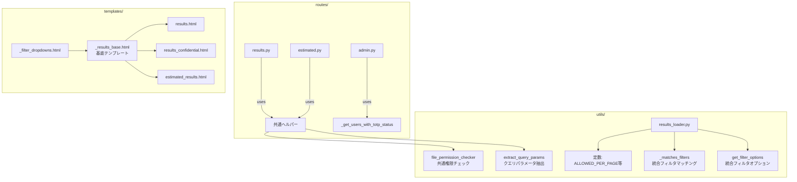

# デザインドキュメント: result_server コードクリーンアップ

## 概要

result_server コードベースのリファクタリングを行い、保守性と可読性を向上させる。対象は以下の領域：

1. **ファイル権限チェックの統合** — `results.py` と `estimated.py` に重複する権限チェック関数を共通ユーティリティに集約
2. **結果一覧ルートの統合** — `results()` と `results_confidential()` の重複ロジックを内部共通関数に抽出
3. **クエリパラメータ抽出の共通化** — 3箇所で重複する page/per_page/filter パラメータ抽出を共通ヘルパーに集約
4. **フィルタマッチング関数の統合** — `_matches_filters()` と `_matches_estimated_filters()` をフィールドマッピング方式で統合
5. **フィルタオプション抽出関数の統合** — `get_filter_options()` と `get_estimated_filter_options()` を統合
6. **テンプレートの重複排除** — 結果一覧ページの共通レイアウトを基底テンプレートに抽出、estimated_results.html のインラインコードを共通パーシャルに置換
7. **不要コードの除去** — コメントアウトされたコード、未使用インポート、デバッグ print 文の除去
8. **マジックナンバーの定数化** — ページサイズ許可値・デフォルト値を名前付き定数に置換
9. **管理画面のユーザーリスト準備ロジック統合** — admin.py 内の TOTP 状態付与ロジックを共通ヘルパーに抽出

既存の HTTP レスポンス（テンプレート出力、ステータスコード、リダイレクト先）は一切変更しない。

## アーキテクチャ

### 現在の構造

```
result_server/
├── app.py                    # Flask アプリケーションファクトリ
├── routes/
│   ├── api.py                # データ受信 API
│   ├── results.py            # 結果一覧・詳細ルート
│   ├── estimated.py          # 推定結果ルート
│   ├── auth.py               # 認証ルート
│   └── admin.py              # 管理者ルート
├── utils/
│   ├── results_loader.py     # 結果読み込み・フィルタ・ページネーション
│   ├── result_file.py        # ファイル読み込み・confidential タグ取得
│   ├── system_info.py        # システム情報定義
│   ├── totp_manager.py       # TOTP 認証ユーティリティ
│   └── user_store.py         # Redis ベースユーザーストア
└── templates/
    ├── results.html
    ├── results_confidential.html
    ├── estimated_results.html
    ├── _results_table.html
    ├── _pagination.html
    ├── _table_base.html
    ├── _navigation.html
    └── ...
```

### リファクタリング後の変更点



新規ファイルは作成せず、既存ファイル内にヘルパー関数・定数を追加する方針とする。テンプレートについては `_results_base.html` と `_filter_dropdowns.html` を新規パーシャルとして追加する。

## コンポーネントとインターフェース

### 1. 共通ファイル権限チェック（utils/result_file.py に追加）

```python
def check_file_permission(filename: str, dir_path: str) -> None:
    """
    ファイルの confidential タグを確認し、アクセス権限がなければ abort(403) する。
    公開ファイル（タグなし）の場合は何もしない。

    results.py の check_file_permission() と estimated.py の _check_file_permission() を統合。
    """
```

現在の2つの実装は同一ロジック（session から authenticated/email を取得 → UserStore から affiliations を取得 → タグとの交差判定）であるため、そのまま統合可能。

### 2. クエリパラメータ抽出ヘルパー（routes/ 内の共通関数）

```python
def extract_query_params() -> dict:
    """
    request.args から page, per_page, system, code, exp を抽出して返す。
    per_page が ALLOWED_PER_PAGE に含まれない場合は DEFAULT_PER_PAGE を使用。

    Returns:
        {
            "page": int,
            "per_page": int,
            "filter_system": str | None,
            "filter_code": str | None,
            "filter_exp": str | None,
        }
    """
```

この関数は `results.py` に配置し、`estimated.py` からインポートする。Flask の `request` コンテキストに依存するため、ルートモジュール側に配置するのが適切。

### 3. 結果一覧ルートの内部共通関数（routes/results.py）

```python
def _render_results_list(
    public_only: bool,
    template_name: str,
    redirect_endpoint: str,
) -> Response:
    """
    results() と results_confidential() の共通ロジック。
    クエリパラメータ抽出、データ読み込み、ページ範囲外リダイレクト、
    テンプレートレンダリングを一括処理する。
    """
```

### 4. 統合フィルタマッチング関数（utils/results_loader.py）

```python
# フィールドマッピング定数
RESULT_FIELD_MAP = {"system": "system", "code": "code", "exp": "Exp"}
ESTIMATED_FIELD_MAP = {"system": "benchmark_system", "code": "code", "exp": "exp"}

def _matches_filters(data: dict, filter_system, filter_code, filter_exp, field_map: dict) -> bool:
    """フィールドマッピングに基づいてフィルタ条件を判定する。"""
```

### 5. 統合フィルタオプション抽出関数（utils/results_loader.py）

```python
def get_filter_options(directory, public_only=True, authenticated=False, affiliations=None,
                       field_map=None) -> dict:
    """
    field_map に基づいて systems/codes/exps の選択肢を抽出する。
    field_map が None の場合は RESULT_FIELD_MAP をデフォルトとして使用。
    """
```

### 6. ページサイズ定数（utils/results_loader.py）

```python
ALLOWED_PER_PAGE = (50, 100, 200)
DEFAULT_PER_PAGE = 100
```

### 7. 管理画面ユーザーリストヘルパー（routes/admin.py）

```python
def _get_users_with_totp_status() -> list:
    """
    全ユーザーを取得し、各ユーザーに has_totp フラグを付与して返す。
    users(), add_user(), reinvite_user() の重複ロジックを統合。
    """
```

### 8. テンプレート構造

#### _results_base.html（新規）
```html
<!DOCTYPE html>
<html lang="en">
<head>
    <meta charset="UTF-8">
    <title>Results</title>
    
</head>
<body>

<h1>Results</h1>

<input type="text" id="filterInput" onkeyup="filterTable()" placeholder="Search by multiple keywords...">
<br><br>

</body>
</html>
```

#### _filter_dropdowns.html（新規）
estimated_results.html 内のインラインフィルタドロップダウンを `_results_table.html` と同様のパーシャルとして抽出。

## データモデル

本リファクタリングではデータモデルの変更はない。既存の JSON ファイル構造、Redis キー構造、セッションデータ構造はすべて維持される。

変更されるのは以下の内部定数のみ：

| 定数名 | 値 | 配置先 |
|--------|-----|--------|
| `ALLOWED_PER_PAGE` | `(50, 100, 200)` | `utils/results_loader.py` |
| `DEFAULT_PER_PAGE` | `100` | `utils/results_loader.py` |
| `RESULT_FIELD_MAP` | `{"system": "system", "code": "code", "exp": "Exp"}` | `utils/results_loader.py` |
| `ESTIMATED_FIELD_MAP` | `{"system": "benchmark_system", "code": "code", "exp": "exp"}` | `utils/results_loader.py` |


## 正しさの性質（Correctness Properties）

*プロパティとは、システムのすべての有効な実行において成り立つべき特性や振る舞いのことである。人間が読める仕様と機械的に検証可能な正しさの保証を橋渡しする、形式的な記述である。*

### Property 1: 権限チェックの等価性

*任意の* ファイル名、confidential タグリスト、認証状態（True/False）、所属リストの組み合わせに対して、統合後の `check_file_permission()` 関数は、統合前の `results.py` 版および `estimated.py` 版と同一の判定結果（許可 or 403 abort）を返す。具体的には：タグなしファイルは常に許可、タグ付き＋未認証は常に拒否、タグ付き＋認証済みはタグと所属の交差が空でなければ許可。

**Validates: Requirements 1.3**

### Property 2: per_page バリデーションの正しさ

*任意の* 整数値 per_page に対して、`extract_query_params()` が返す per_page 値は、入力値が許可リスト `(50, 100, 200)` に含まれる場合はその値そのもの、含まれない場合はデフォルト値 `100` と等しい。

**Validates: Requirements 3.2, 8.1, 8.2**

### Property 3: フィルタマッチングの等価性

*任意の* JSON データ辞書と、フィルタ条件（system, code, exp の各値が None または任意の文字列）の組み合わせに対して、統合後の `_matches_filters(data, system, code, exp, RESULT_FIELD_MAP)` は統合前の `_matches_filters(data, system, code, exp)` と同一の結果を返し、`_matches_filters(data, system, code, exp, ESTIMATED_FIELD_MAP)` は統合前の `_matches_estimated_filters(data, system, code, exp)` と同一の結果を返す。

**Validates: Requirements 4.4**

### Property 4: フィルタオプション抽出の等価性

*任意の* JSON データリスト（各要素が system/code/exp 等のフィールドを持つ辞書）に対して、統合後の `get_filter_options(field_map=RESULT_FIELD_MAP)` は統合前の `get_filter_options()` と同一の結果を返し、`get_filter_options(field_map=ESTIMATED_FIELD_MAP)` は統合前の `get_estimated_filter_options()` と同一の結果を返す。

**Validates: Requirements 5.4**

### Property 5: ユーザーリスト準備の正しさ

*任意の* ユーザーリスト（各ユーザーが email, totp_secret, affiliations を持つ）に対して、`_get_users_with_totp_status()` が返すリストの各要素は、元のユーザーの email と affiliations を保持し、かつ `has_totp` フラグが `totp_secret` の存在有無と一致する。

**Validates: Requirements 9.3**

## エラーハンドリング

本リファクタリングではエラーハンドリングの変更はない。既存のエラーハンドリング（abort(403), abort(404), abort(400) 等）はそのまま維持される。

統合後の共通関数は、統合前の各関数と同一のエラー発生条件・エラーレスポンスを保持する：

- `check_file_permission()`: 権限不足時に `abort(403)` を発生
- `extract_query_params()`: エラーは発生しない（不正値はデフォルト値にフォールバック）
- `_matches_filters()`: エラーは発生しない（`dict.get()` で安全にアクセス）
- `get_filter_options()`: ディレクトリ読み込み失敗時は空リストを返す（既存動作を維持）

## テスト戦略

### テストアプローチ

ユニットテストとプロパティベーステストの二本立てで検証する。

- **ユニットテスト**: 具体的な入出力例、エッジケース、統合テスト
- **プロパティテスト**: 統合前後の等価性を大量のランダム入力で検証

### プロパティベーステスト

ライブラリ: **Hypothesis**（Python 用プロパティベーステストライブラリ）

各プロパティテストは最低 100 回のイテレーションで実行する。

各テストには以下の形式でコメントタグを付与する：
```
# Feature: code-cleanup, Property {number}: {property_text}
```

各正しさの性質（Property 1〜5）は、それぞれ1つのプロパティベーステストで実装する。

### ユニットテスト

以下の具体例・エッジケースをユニットテストでカバーする：

1. **権限チェック**:
   - 公開ファイル（タグなし）へのアクセスが許可されること
   - confidential ファイルへの未認証アクセスが 403 になること
   - admin 所属ユーザーが全ファイルにアクセスできること

2. **クエリパラメータ抽出**:
   - デフォルト値（page=1, per_page=100）が正しいこと
   - 不正な per_page 値（例: 999）がデフォルト値にフォールバックすること

3. **フィルタマッチング**:
   - フィルタなし（全 None）で全データがマッチすること
   - 単一フィルタでの正しいマッチング
   - 複数フィルタの AND 条件

4. **フィルタオプション抽出**:
   - 空ディレクトリで空リストが返ること
   - "N/A" 値がフィルタオプションに含まれないこと

5. **ユーザーリスト準備**:
   - 空のユーザーリストで空リストが返ること
   - TOTP 秘密鍵の有無が正しく反映されること

6. **不要コード除去後の動作確認**:
   - 既存テストスイートが全てパスすること

### テストファイル配置

```
result_server/tests/
├── test_code_cleanup.py          # 新規: リファクタリング検証テスト
├── test_api_routes.py            # 既存
├── test_pagination.py            # 既存
├── test_results_loader.py        # 既存
├── test_result_detail_template.py # 既存
├── test_totp_manager.py          # 既存
└── test_totp_security.py         # 既存
```
