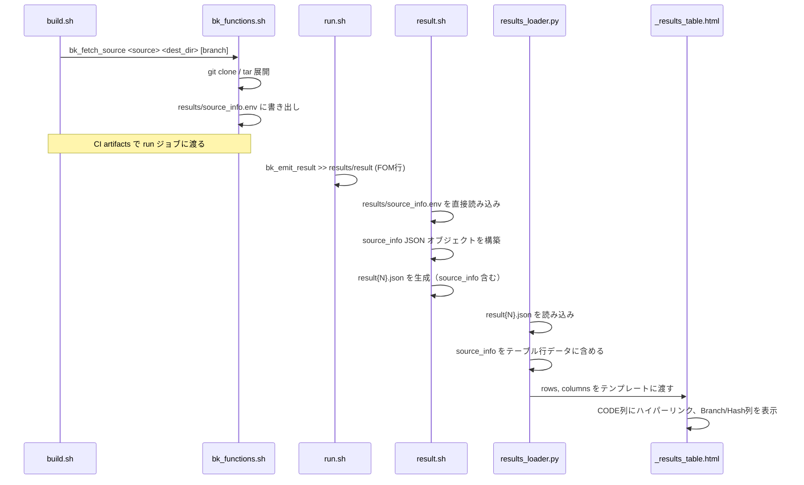
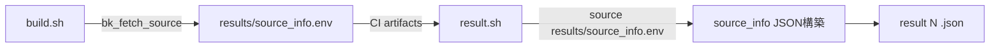

# 設計書: コードソース追跡機能

## 概要

BenchKitフレームワークにおいて、ベンチマーク結果と使用されたソースコードの紐付けを実現する機能の設計。
現在、各プログラムの `build.sh` では `git clone` や `tar -xzf` を個別に実行しており、ソースコードのメタデータ（リポジトリURL、コミットハッシュ、md5sum等）は結果JSONに記録されていない。

本設計では以下の3層にわたる変更を行う:

1. **シェル関数層** (`bk_functions.sh`): `bk_fetch_source` の追加
2. **結果生成層** (`result.sh`): `results/source_info.env` の読み込みと `source_info` オブジェクトのJSON出力
3. **表示層** (`results_loader.py`, `_results_table.html`): `source_info` の読み込みとテーブル表示

既存のプログラム（qws, genesis, ffb, LQCD_dw_solver, scale-letkf）は段階的に `bk_fetch_source` へ移行可能であり、移行前でも後方互換性が維持される。

## アーキテクチャ

### データフロー



### ジョブ間のメタデータ伝搬

`bk_fetch_source` は `build.sh` 内で呼ばれ、環境変数（`BK_SOURCE_TYPE` 等）を設定する。
CIパイプラインでは `build` ステージと `run` ステージが別ジョブとなるため、環境変数は直接伝搬しない。

**解決策**: `bk_fetch_source` は `results/source_info.env` ファイルにメタデータを書き出す。`result.sh` が直接このファイルを読み込んで `source_info` JSON オブジェクトを構築する。アプリ開発者は run.sh で追加の関数呼び出しをする必要がない。



## コンポーネントとインターフェース

### 1. `bk_fetch_source` 関数 (bk_functions.sh)

```sh
# bk_fetch_source - ソースコードの取得とメタデータ収集を行う統合関数
#
# シグネチャ:
#   bk_fetch_source <source> <dest_dir> [branch]
#
# 引数:
#   $1 - source: リポジトリURL または アーカイブファイルパス
#   $2 - dest_dir: 展開先ディレクトリ名
#   $3 - branch: (オプション) git clone時のブランチ指定
#
# 自動判定ロジック:
#   source が http:// / https:// で始まる、または .git で終わる → git clone
#   それ以外 → tar.gz/tgz アーカイブ展開
#
# 設定される環境変数:
#   BK_SOURCE_TYPE  - "git" または "file"
#   BK_REPO_URL     - (git時) リポジトリURL
#   BK_BRANCH       - (git時) ブランチ名
#   BK_COMMIT_HASH  - (git時) HEADの完全コミットハッシュ (40桁)
#   BK_FILE_PATH    - (file時) アーカイブファイルの絶対パス
#   BK_MD5SUM       - (file時) アーカイブファイルのmd5sum (32桁)
#
# 副作用:
#   results/source_info.env にも同じ環境変数をエクスポート形式で書き出す
#
# 戻り値:
#   0 - 成功
#   1 - 失敗（エラーメッセージは stderr に出力）
```

**ソース種別の自動判定ロジック**:

```
case "$source" in
  http://*|https://*) → git clone
  *.git)              → git clone
  *)                  → tar 展開
esac
```

**既存ディレクトリのスキップ**: `dest_dir` が既に存在する場合、クローン/展開をスキップし、既存ディレクトリからメタデータのみ取得する。git の場合は `git -C <dest_dir> rev-parse HEAD` でコミットハッシュを取得。

**md5sum のクロスプラットフォーム対応**: Linux では `md5sum`、macOS では `md5 -r` を使用。POSIX互換を維持するため、コマンドの存在を確認してフォールバックする。

### 2. `result.sh` の変更

`result.sh` の冒頭で `results/source_info.env` ファイルの存在を確認し、存在すれば読み込んで `source_info` JSON オブジェクトを構築する。

**読み込みロジック**:

```sh
# results/source_info.env の読み込み
source_info_block="null"
if [ -f results/source_info.env ]; then
  source results/source_info.env
  if [ "$BK_SOURCE_TYPE" = "git" ]; then
    source_info_block=$(cat <<EOFSI
{
    "source_type": "git",
    "repo_url": "$BK_REPO_URL",
    "branch": "$BK_BRANCH",
    "commit_hash": "$BK_COMMIT_HASH"
  }
EOFSI
)
  elif [ "$BK_SOURCE_TYPE" = "file" ]; then
    source_info_block=$(cat <<EOFSI
{
    "source_type": "file",
    "file_path": "$BK_FILE_PATH",
    "md5sum": "$BK_MD5SUM"
  }
EOFSI
)
  fi
fi
```

- `results/source_info.env` が存在しない場合 → `source_info: null`
- ファイルが存在するが `BK_SOURCE_TYPE` が git/file 以外 → `source_info: null`
- `write_result_json` 関数内で `$source_info_block` を JSON に埋め込む

**JSON出力への追加**:

```json
{
  "code": "qws",
  "system": "Fugaku",
  "FOM": "5.123",
  "source_info": {
    "source_type": "git",
    "repo_url": "https://github.com/RIKEN-LQCD/qws.git",
    "branch": "main",
    "commit_hash": "a1b2c3d4e5f6a1b2c3d4e5f6a1b2c3d4e5f6a1b2"
  }
}
```

または file の場合:

```json
{
  "source_info": {
    "source_type": "file",
    "file_path": "/vol0003/rccs-sdt/data/a01008/apps/ffb/ffb-frt_cpu.fugaku.tar.gz",
    "md5sum": "d41d8cd98f00b204e9800998ecf8427e"
  }
}
```

`source_info` が無い場合:

```json
{
  "source_info": null
}
```

### 3. `results_loader.py` の変更

`_build_row` 関数に `source_info` の読み込みを追加:

```python
# source_info の読み込み
source_info = data.get("source_info", None)

# source_hash の生成（Branch/Hash列用）
if source_info and isinstance(source_info, dict):
    st = source_info.get("source_type")
    if st == "git":
        branch = source_info.get("branch", "")
        commit = source_info.get("commit_hash", "")
        short_hash = commit[:7] if commit else ""
        source_hash = f"{branch}@{short_hash}" if branch and short_hash else short_hash or branch or "-"
    elif st == "file":
        md5 = source_info.get("md5sum", "")
        source_hash = md5[:8] if md5 else "-"
    else:
        source_hash = "-"
else:
    source_hash = "-"

row["source_info"] = source_info
row["source_hash"] = source_hash
```

`columns` 定義に追加:

```python
("Branch/Hash", "source_hash"),
```

### 4. `_results_table.html` の変更

**CODE列の条件付きハイパーリンク**:

```html

    <td><a href="{{ row.source_info.repo_url }}" target="_blank" title="{{ row.source_info.repo_url }}">{{ row.code }}</a></td>

    <td title="{{ row.source_info.file_path }}">{{ row.code }}</td>

    <td title="{{ row.code }}">{{ row.code }}</td>

```

**Branch/Hash列**: `source_hash` の値をそのまま表示。git の場合は `main@a1b2c3d` 形式、file の場合は `d41d8cd9` 形式。

## データモデル

### Result_JSON スキーマ拡張

```json
{
  "$schema": "http://json-schema.org/draft-07/schema#",
  "type": "object",
  "properties": {
    "source_info": {
      "oneOf": [
        { "type": "null" },
        {
          "type": "object",
          "properties": {
            "source_type": { "enum": ["git", "file"] },
            "repo_url": { "type": "string", "format": "uri" },
            "branch": { "type": "string" },
            "commit_hash": { "type": "string", "pattern": "^[0-9a-f]{40}$" }
          },
          "required": ["source_type", "repo_url", "branch", "commit_hash"]
        },
        {
          "type": "object",
          "properties": {
            "source_type": { "enum": ["file"] },
            "file_path": { "type": "string" },
            "md5sum": { "type": "string", "pattern": "^[0-9a-f]{32}$" }
          },
          "required": ["source_type", "file_path", "md5sum"]
        }
      ]
    }
  }
}
```

### results/result ファイル形式

既存形式のまま変更なし（SOURCE_INFO 行は不要）:
```
FOM:5.123 FOM_version:v1 Exp:CASE0 node_count:1
SECTION:compute_kernel time:0.30
```

ソース追跡情報は `results/source_info.env` ファイル経由で `result.sh` に渡される。

### テーブル行データ (row dict) の拡張

| キー | 型 | 説明 |
|------|------|------|
| `source_info` | `dict \| None` | source_info オブジェクト全体 |
| `source_hash` | `str` | 表示用文字列（`main@a1b2c3d` or `d41d8cd9` or `-`） |

## 正当性プロパティ (Correctness Properties)

### Property 1: ソース種別の自動判定

*任意の* 文字列 `source` に対して、`http://` または `https://` で始まるか `.git` で終わる場合は `git` と判定され、それ以外の場合は `file` と判定される。判定結果は常にどちらか一方のみである。

**Validates: Requirements 2.2, 2.3**

### Property 2: source_info.env の書き出し/読み込みラウンドトリップ

*任意の* 有効な source_info データ（git型: source_type, repo_url, branch, commit_hash、file型: source_type, file_path, md5sum）に対して、`bk_fetch_source` が `results/source_info.env` に書き出した内容を `result.sh` が読み込むと、元のデータと等価な `source_info` JSON オブジェクトが生成される。

**Validates: Requirements 1.1, 1.2, 1.3, 3.1, 3.2, 3.3**

### Property 3: ハッシュ値のフォーマット検証

*任意の* source_info オブジェクトに対して、source_type が `git` の場合 `commit_hash` は正確に40桁の16進数文字列であり、source_type が `file` の場合 `md5sum` は正確に32桁の16進数文字列である。

**Validates: Requirements 1.5, 1.6**

### Property 4: source_hash 表示文字列のフォーマット

*任意の* source_info オブジェクトに対して、git型の場合は `source_hash` が `<branch>@<commit_hashの先頭7桁>` 形式となり、file型の場合は `<md5sumの先頭8桁>` 形式となる。source_info が null の場合は `-` となる。

**Validates: Requirements 4.3, 4.5, 4.6**

### Property 5: results_loader の source_info ラウンドトリップ

*任意の* Result_JSON ファイルに対して、`source_info` フィールドが存在する場合は `_build_row` が返す行データの `source_info` キーに同じオブジェクトが含まれ、`source_info` フィールドが存在しない場合は `None` が設定される。

**Validates: Requirements 5.1, 5.2**

### Property 6: bk_fetch_source のべき等性

*任意の* 有効なソース（git リポジトリまたはアーカイブファイル）に対して、`bk_fetch_source` を同じ引数で2回呼び出した場合、2回目の呼び出しは再クローン/再展開をスキップし、1回目と同じ環境変数（BK_SOURCE_TYPE, BK_REPO_URL/BK_FILE_PATH, BK_BRANCH, BK_COMMIT_HASH/BK_MD5SUM）が設定される。

**Validates: Requirements 2.9**

### Property 7: CODE列のレンダリング条件

*任意の* テーブル行データに対して、source_info.source_type が `git` の場合は CODE 列に `repo_url` へのハイパーリンク（`<a>` タグ）が含まれ、source_type が `file` の場合は `file_path` を `title` 属性に持つプレーンテキストが表示される。

**Validates: Requirements 4.1, 4.2**

## エラーハンドリング

### bk_fetch_source のエラー処理

| エラー条件 | 処理 |
|---|---|
| git clone 失敗 | stderr にエラーメッセージ出力、戻り値 1 |
| アーカイブファイル不存在 | stderr にエラーメッセージ出力、戻り値 1 |
| tar 展開失敗 | stderr にエラーメッセージ出力、戻り値 1 |
| md5sum コマンド不存在 | stderr に警告出力、BK_MD5SUM を空文字に設定、戻り値 0（処理続行） |
| git rev-parse 失敗 | stderr に警告出力、BK_COMMIT_HASH を空文字に設定、戻り値 0（処理続行） |

### result.sh のエラー処理

| エラー条件 | 処理 |
|---|---|
| results/source_info.env なし | `source_info: null` として出力（正常動作） |
| source_info.env のフォーマット不正 | `source_info: null` として出力 |
| BK_SOURCE_TYPE が git/file 以外 | `source_info: null` として出力 |

### results_loader.py のエラー処理

| エラー条件 | 処理 |
|---|---|
| JSON に source_info キーなし | `source_info = None`, `source_hash = "-"` |
| source_info が dict でない | `source_info = None`, `source_hash = "-"` |
| source_type が不明な値 | `source_hash = "-"` |

### _results_table.html のエラー処理

| エラー条件 | 処理 |
|---|---|
| source_info が None | CODE列はプレーンテキスト、Branch/Hash列は `-` |
| repo_url が空 | CODE列はプレーンテキスト（リンクなし） |

## テスト戦略

### テストアプローチ

ユニットテストとプロパティベーステストの二本立てで網羅的にカバーする。

### プロパティベーステスト

**ライブラリ**: Python テストには [Hypothesis](https://hypothesis.readthedocs.io/) を使用する。シェルスクリプトのテストは Python から subprocess 経由で実行する。

**設定**: 各プロパティテストは最低100イテレーション実行する。

**タグ形式**: 各テストにコメントで以下の形式のタグを付与する:
```
# Feature: code-source-tracking, Property {number}: {property_text}
```

**各プロパティは単一のプロパティベーステストで実装する。**

| Property | テスト内容 | ジェネレータ |
|---|---|---|
| Property 1 | ソース種別判定ロジックの検証 | ランダムURL文字列、ファイルパス文字列 |
| Property 2 | env ファイル書き出し/読み込みラウンドトリップ | ランダム source_info データ（git/file両方） |
| Property 3 | ハッシュ値フォーマット検証 | ランダム40桁/32桁16進数文字列 |
| Property 4 | source_hash 表示文字列生成 | ランダム source_info + null ケース |
| Property 5 | results_loader の source_info 読み込み | ランダム Result_JSON データ |
| Property 6 | bk_fetch_source べき等性 | 実際の git リポジトリ（統合テスト） |
| Property 7 | CODE列 HTML レンダリング | ランダム source_info + Jinja2 テンプレート |

### ユニットテスト

| テスト対象 | テスト内容 |
|---|---|
| `bk_fetch_source` | 存在しないアーカイブファイルでエラー戻り値1 |
| `bk_fetch_source` | 不正なURLでgit clone失敗時にエラー戻り値1 |
| `result.sh` | results/source_info.env なしの既存形式が正常処理されること |
| `result.sh` | results/source_info.env ありで source_info が正しくJSONに含まれること |
| `results_loader._build_row` | source_info なしの既存JSONでエラーなく行構築 |
| `results_loader._build_row` | source_info ありのJSONで source_hash が正しく生成 |
| `_results_table.html` | source_info null 時にCODE列がプレーンテキスト |
| `columns` | columns リストに `("Branch/Hash", "source_hash")` が含まれること |

### 統合テスト

| テスト対象 | テスト内容 |
|---|---|
| エンドツーエンド (git) | `bk_fetch_source` → `results/source_info.env` → `result.sh` → JSON に正しい source_info |
| エンドツーエンド (file) | 同上（tar.gz アーカイブ版） |
| 後方互換性 | `bk_fetch_source` 未使用の既存 build.sh が正常動作すること |
