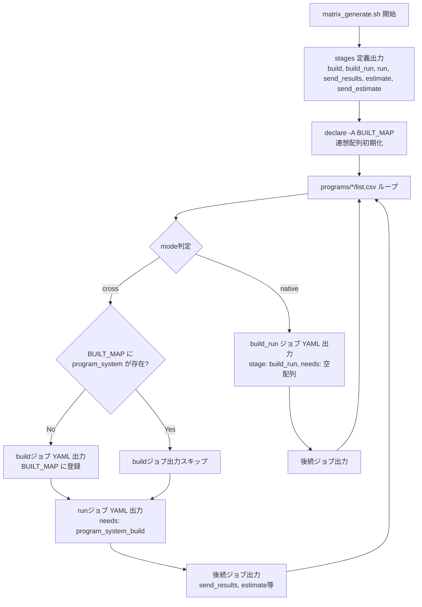
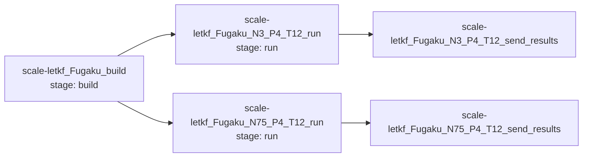

# 設計ドキュメント: crossモードbuildジョブ重複排除

## 概要

`scripts/matrix_generate.sh` の crossモード処理を変更し、同一の code+system ペアに対して buildジョブを1回だけ生成する。現状は `list.csv` の各行ごとに `{program}_{system}_N{nodes}_P{numproc}_T{nthreads}_build` という一意なジョブを生成しているが、buildスクリプトは `bash programs/{program}/build.sh {system}` を実行するだけで実験パラメータに依存しない。

変更後は:
- buildジョブ名: `{program}_{system}_build`（実験パラメータなし）
- bash連想配列（`declare -A`）で code+system の重複を検出
- 2回目以降の同一ペアではbuildジョブ出力をスキップ
- runジョブは全て共通の `{program}_{system}_build` に `needs` で依存
- nativeモードの `build_run` ジョブは新しい `build_run` ステージに配置し、`needs: []` で即時開始可能に

## アーキテクチャ

### 変更対象ファイル

変更は `scripts/matrix_generate.sh` の1ファイルのみ。`job_functions.sh` への変更は不要。

### 処理フロー（変更後）



### ジョブ依存関係（変更後の例: scale-letkf Fugaku cross N3/N75）



## コンポーネントとインターフェース

### 1. stages 定義の変更

現状:
```yaml
stages:
  - build
  - run
  - send_results
  - estimate
  - send_estimate
```

変更後:
```yaml
stages:
  - build
  - build_run
  - run
  - send_results
  - estimate
  - send_estimate
```

`build_run` ステージを `build` と `run` の間に追加。nativeモードのジョブはここに配置される。

### 2. 重複検出メカニズム（BUILT_MAP）

メインループの前に連想配列を宣言:
```bash
declare -A BUILT_MAP
```

crossモード処理内で、buildジョブ出力前にキーを確認:
```bash
build_key="${program}_${system}"
if [[ -z "${BUILT_MAP[$build_key]+_}" ]]; then
    # buildジョブ YAML を出力
    BUILT_MAP[$build_key]=1
fi
```

キーの形式は `{program}_{system}`（例: `scale-letkf_Fugaku`）。

### 3. crossモード buildジョブの変更

変更前のジョブ名: `{program}_{system}_N{nodes}_P{numproc}_T{nthreads}_build`
変更後のジョブ名: `{program}_{system}_build`

ジョブ内容（script, tags, artifacts）は変更なし。ジョブ名のみ変更。

### 4. crossモード runジョブの変更

ジョブ名は従来通り: `{program}_{system}_N{nodes}_P{numproc_node}_T{nthreads}_run`

`needs` フィールドの変更:
- 変更前: `needs: [{program}_{system}_N{nodes}_P{numproc_node}_T{nthreads}_build]`
- 変更後: `needs: [{program}_{system}_build]`

### 5. nativeモード build_run ジョブの変更

ジョブ名・内容は変更なし。以下の2点のみ変更:
- `stage: build` → `stage: build_run`
- `needs: []` を追加（buildステージの完了を待たずに即時開始）

### 6. 後続ジョブ（send_results, estimate, send_estimate）

変更なし。既存の `emit_send_results_job`, `emit_estimate_job`, `emit_send_estimate_job` 関数はそのまま使用。runジョブ名は従来と同じ形式なので、後続ジョブの依存関係も自動的に正しくなる。


## データモデル

### 入力データ

#### list.csv（各プログラムディレクトリ内）
```
system,mode,queue_group,nodes,numproc_node,nthreads,elapse
Fugaku,cross,small,3,4,12,1:00:00
Fugaku,cross,small,75,4,12,1:00:00
RC_GH200,native,dummy,1,4,1,1:00:00
```

重複排除の対象となるのは、同一 `system` かつ `mode=cross` の行が複数存在するケース。上記例では Fugaku cross が2行あり、buildジョブは1つだけ生成される。

#### system.csv
```
system,tag,roles,queue
Fugaku,fugaku_login1,build,none
Fugaku,fugaku_jacamar,run,FJ
```

crossモードでは `roles=build` の行から `build_tag`、`roles=run` の行から `run_tag` を取得。この参照方法は変更なし。

### 内部データ構造

#### BUILT_MAP（bash連想配列）
- キー: `{program}_{system}`（例: `scale-letkf_Fugaku`）
- 値: `1`（存在チェックのみ使用）
- スコープ: `matrix_generate.sh` のメインループ全体
- 用途: 同一 code+system ペアのbuildジョブが既に出力済みかを判定

### 出力データ（.gitlab-ci.generated.yml）

#### 変更後の出力例（scale-letkf Fugaku cross N3/N75）

```yaml
stages:
  - build
  - build_run
  - run
  - send_results
  - estimate
  - send_estimate

scale-letkf_Fugaku_build:
  stage: build
  tags: ["fugaku_login1"]
  script:
    - echo "[BUILD] scale-letkf for Fugaku"
    - bash programs/scale-letkf/build.sh Fugaku
  artifacts:
    paths:
      - artifacts/
    expire_in: 1 week

scale-letkf_Fugaku_N3_P4_T12_run:
  stage: run
  id_tokens:
    CI_JOB_JWT:
      aud: https://gitlab.swc.r-ccs.riken.jp
  tags: ["fugaku_jacamar"]
  variables:
    SCHEDULER_PARAMETERS: "..."
  needs: [scale-letkf_Fugaku_build]
  before_script:
    - mkdir -p results
    - echo "Pre-created results directory on login node"
  script:
    - echo "Starting job"
    - ls -la programs/scale-letkf/
    - bash programs/scale-letkf/run.sh Fugaku 3 4 12
    - echo "Job completed"
    - ls -la .
    - bash scripts/result.sh scale-letkf Fugaku
    - echo "After result.sh execution"
    - ls -la results/
    - echo "Results directory contents count"
    - ls results/ | wc -l
  after_script:
    - bash scripts/wait_for_nfs.sh results
  artifacts:
    paths:
      - results/
    expire_in: 1 week

scale-letkf_Fugaku_N75_P4_T12_run:
  stage: run
  # ... 同様の構造、needs: [scale-letkf_Fugaku_build]
```


## 正確性プロパティ (Correctness Properties)

*プロパティとは、システムの全ての有効な実行において成り立つべき特性や振る舞いのことです。人間が読める仕様と機械的に検証可能な正確性保証の橋渡しとなる、形式的な記述です。*

prework 分析に基づき、要件の受け入れ基準を以下のプロパティに統合しました。

### Property 1: cross build の一意性と依存関係

*任意の* list.csv 入力（同一 system かつ mode=cross の行が1行以上）に対して、生成される YAML において:
- 当該 code+system ペアの build ジョブ（`{program}_{system}_build`）はちょうど1つだけ存在する
- 当該 code+system ペアの全ての run ジョブの `needs` フィールドが、その唯一の build ジョブ名を参照している

**Validates: Requirements 1.1, 1.2, 1.3, 1.4, 2.2, 3.5, 5.2**

### Property 2: ジョブ名形式と後続ジョブチェーンの正確性

*任意の* cross モードの Experiment_Config に対して、生成される YAML において:
- run ジョブ名が `{program}_{system}_N{nodes}_P{numproc_node}_T{nthreads}_run` の形式である
- send_results ジョブ名が `{program}_{system}_N{nodes}_P{numproc_node}_T{nthreads}_send_results` の形式である
- send_results ジョブの `needs` が対応する run ジョブ名を参照している

**Validates: Requirements 2.1, 2.3, 4.1, 4.3**

### Property 3: native モードのステージ配置と即時開始

*任意の* native モードの Experiment_Config に対して、生成される YAML において:
- build_run ジョブの `stage` が `build_run` である
- build_run ジョブの `needs` が空配列 `[]` である
- ジョブ名が従来通り `{program}_{system}_N{nodes}_P{numproc_node}_T{nthreads}_build_run` の形式である

**Validates: Requirements 3.2, 3.3, 3.4**

## エラーハンドリング

### 既存のエラーハンドリング（変更なし）

以下のエラーハンドリングは現行の `matrix_generate.sh` に既に実装されており、本変更では維持する:

1. `build_tag` または `run_tag` が空の場合: ジョブをスキップし警告を出力
2. `build_run_tag` が空の場合: ジョブをスキップし警告を出力
3. 不明な `mode` の場合: エラーメッセージを出力して `exit 1`
4. テンプレートが見つからない場合: 警告を出力して `continue`

### 新規のエラーハンドリング

本変更で追加されるエラーハンドリングは特にない。`declare -A` による連想配列は bash 4.0 以上で利用可能であり、CI 環境（GitLab Runner）では bash 4.0 以上が前提。連想配列のキー存在チェック（`${BUILT_MAP[$key]+_}`）は標準的な bash イディオムであり、キーが存在しない場合でもエラーにならない。

## テスト戦略

### テストアプローチ

本変更はシェルスクリプト（`matrix_generate.sh`）の出力 YAML を検証するため、以下の2層でテストする:

1. **単体テスト（example-based）**: 具体的な list.csv 入力に対する YAML 出力の検証
2. **プロパティテスト（property-based）**: ランダム生成した list.csv 入力に対する YAML 出力の普遍的性質の検証

### テスト実装方針

テストは Python + pytest で実装する。`matrix_generate.sh` を `subprocess` で実行し、生成された `.gitlab-ci.generated.yml` を PyYAML でパースして検証する。

プロパティテストには **Hypothesis** ライブラリを使用する。

### プロパティテスト設定

- 各プロパティテストは最低 100 回のイテレーションで実行
- 各テストにはコメントで設計プロパティへの参照を記載
- タグ形式: **Feature: deduplicate-cross-build, Property {number}: {property_text}**
- 各正確性プロパティは1つのプロパティテストで実装

### 単体テスト（具体例）

| テストケース | 入力 | 期待結果 |
|---|---|---|
| 同一 system cross 2行 | scale-letkf Fugaku N3/N75 | build 1つ、run 2つ、両 run が同一 build に依存 |
| 同一 system cross 1行 | genesis Fugaku N2 | build 1つ、run 1つ |
| cross + native 混在 | LQCD Fugaku cross + FugakuCN native | build 1つ(cross)、build_run 1つ(native) |
| stages 定義 | 任意 | `build, build_run, run, send_results, estimate, send_estimate` の順 |
| native の needs | FugakuCN native | `needs: []` が存在 |
| native の stage | FugakuCN native | `stage: build_run` |
| estimate 付き | estimate 対象 system + estimate.sh あり | estimate, send_estimate ジョブが生成される |

### プロパティテスト

| プロパティ | ジェネレータ | 検証内容 |
|---|---|---|
| Property 1 | ランダムな program 名、system 名、1〜5行の cross 設定 | build ジョブが1つ、全 run の needs が正しい |
| Property 2 | ランダムな cross 設定 | run/send_results のジョブ名形式と依存関係 |
| Property 3 | ランダムな native 設定 | stage=build_run、needs=[]、ジョブ名形式 |

### テストに必要な前提条件

- テスト用の一時ディレクトリに `config/system.csv`, `config/queue.csv` を配置
- テスト用の `programs/{program}/list.csv`, `build.sh`, `run.sh` を生成
- `scripts/matrix_generate.sh` と `scripts/job_functions.sh` をテスト環境からアクセス可能にする

