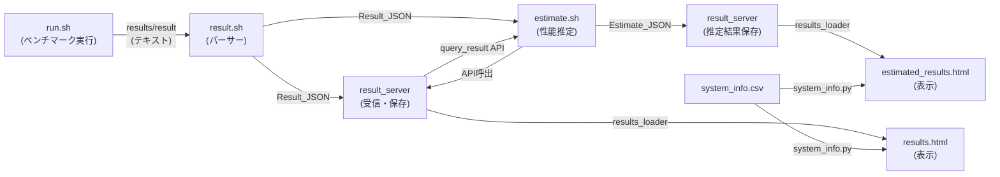

# 設計ドキュメント: Estimate_JSON スキーマ再設計

## 概要

本設計は、Estimate_JSON と Result_JSON のスキーマを再設計し、以下の3つの主要変更を実現する。

1. **Estimate_JSON スキーマの構造変更**: トップレベルの `benchmark_*` フィールドを廃止し、`current_system` と `future_system` がそれぞれ独立した `benchmark` サブオブジェクトを持つ構造に変更する。`nodes` → `target_nodes`、`method` → `scaling_method` のリネームも行う。
2. **fom_breakdown の導入**: Result_JSON と Estimate_JSON の両方に `fom_breakdown`（計算区間・通信区間・オーバーラップの内訳）を追加する。`results/result` ファイルの SECTION/OVERLAP 行をパースし、JSON に変換する。
3. **ハードウェア情報の一本化**: `result.sh` のハードウェア情報生成（`cpu_name`, `gpu_name` 等）を削除し、`system_info.csv` / `system_info.py` に一本化する。

データフローは以下の通り:
`run.sh` → `results/result` → `result.sh` → Result_JSON → `estimate.sh` → Estimate_JSON → `result_server` 表示

## アーキテクチャ

### データフロー全体図



### 変更対象コンポーネント

| コンポーネント | ファイル | 変更内容 |
|---|---|---|
| result パーサー | `scripts/result.sh` | SECTION/OVERLAP パーサー追加、ハードウェア情報削除、numproc_node 追加 |
| 推定共通ライブラリ | `scripts/estimate_common.sh` | 変数リネーム、benchmark サブオブジェクト変数追加、print_json 更新 |
| qws 推定スクリプト | `programs/qws/estimate.sh` | 新スキーマ変数への移行 |
| qws 実行スクリプト | `programs/qws/run.sh` | numproc_node と仮 SECTION/OVERLAP 行の追加 |
| クエリ API | `result_server/routes/api.py` | `_meta` (timestamp, uuid) をレスポンスに追加 |
| 結果ローダー | `result_server/utils/results_loader.py` | ESTIMATED_FIELD_MAP 更新、新スキーマ対応 |
| 推定結果テンプレート | `result_server/templates/estimated_results.html` | テーブル構造の再設計 |
| テスト | `result_server/tests/` | 新スキーマ対応テストの追加・更新 |

## コンポーネントとインターフェース

### 1. result.sh — SECTION/OVERLAP パーサー

#### 入力フォーマット (`results/result`)

```
FOM:0.455 FOM_version:DDSolverJacobi Exp:CASE0 node_count:1 numproc_node:4
SECTION:compute_kernel time:0.30
SECTION:communication time:0.20
OVERLAP:compute_kernel,communication time:0.05
FOM:1.234 FOM_version:DDSolverJacobi Exp:CASE1 node_count:2 numproc_node:8
```

パース規則:
- FOM 行: `FOM:` を含む行。既存のフィールド（FOM, FOM_version, Exp, node_count, description, confidential）に加え、`numproc_node:値` を新たにパースする
- SECTION 行: `SECTION:区間名 time:秒` 形式。直前の FOM 行に紐づく
- OVERLAP 行: `OVERLAP:区間A,区間B time:秒` 形式。直前の FOM 行に紐づく
- SECTION/OVERLAP 行が存在しない FOM ブロックでは `fom_breakdown` を省略する
- OVERLAP 行の区間名が同一ブロック内の SECTION で未定義の場合、stderr にエラーを出力する

#### 出力 (Result_JSON)

```json
{
  "code": "qws",
  "system": "MiyabiG",
  "FOM": "0.455",
  "FOM_version": "DDSolverJacobi",
  "Exp": "CASE0",
  "node_count": "1",
  "numproc_node": "4",
  "description": "null",
  "confidential": "null",
  "fom_breakdown": {
    "sections": [
      {"name": "compute_kernel", "time": 0.30},
      {"name": "communication", "time": 0.20}
    ],
    "overlaps": [
      {"sections": ["compute_kernel", "communication"], "time": 0.05}
    ]
  }
}
```

ハードウェア情報フィールド（`cpu_name`, `gpu_name`, `cpu_cores`, `cpus_per_node`, `gpus_per_node`, `uname`）は出力しない。

#### パーサー実装方針

```bash
# FOM行を読んだ後、後続行を読み進めて SECTION/OVERLAP を収集
# sections_json と overlaps_json を配列として構築
# SECTION/OVERLAP が1つもなければ fom_breakdown ブロックを省略
# jq による JSON 検証を最後に実施
```

後方互換性: SECTION/OVERLAP 行がない既存の `results/result` ファイルでは、`fom_breakdown` フィールドが省略されるだけで、他のフィールドは従来通り出力される。

### 2. estimate_common.sh — 変数とインターフェース

#### グローバル変数の変更

| 旧変数名 | 新変数名 | 説明 |
|---|---|---|
| `est_benchmark_system` | (廃止) | トップレベル benchmark は廃止 |
| `est_benchmark_fom` | (廃止) | 同上 |
| `est_benchmark_nodes` | (廃止) | 同上 |
| `est_current_nodes` | `est_current_target_nodes` | ターゲットノード数 |
| `est_current_method` | `est_current_scaling_method` | スケーリング方法 |
| `est_future_nodes` | `est_future_target_nodes` | ターゲットノード数 |
| `est_future_method` | `est_future_scaling_method` | スケーリング方法 |
| (新規) | `est_current_bench_system` | current_system のベンチマーク元システム |
| (新規) | `est_current_bench_fom` | current_system のベンチマーク元 FOM |
| (新規) | `est_current_bench_nodes` | current_system のベンチマーク元ノード数 |
| (新規) | `est_current_bench_numproc_node` | current_system のベンチマーク元 numproc_node |
| (新規) | `est_current_bench_timestamp` | current_system のベンチマーク元タイムスタンプ |
| (新規) | `est_current_bench_uuid` | current_system のベンチマーク元 UUID |
| (新規) | `est_future_bench_system` | future_system のベンチマーク元システム |
| (新規) | `est_future_bench_fom` | future_system のベンチマーク元 FOM |
| (新規) | `est_future_bench_nodes` | future_system のベンチマーク元ノード数 |
| (新規) | `est_future_bench_numproc_node` | future_system のベンチマーク元 numproc_node |
| (新規) | `est_future_bench_timestamp` | future_system のベンチマーク元タイムスタンプ |
| (新規) | `est_future_bench_uuid` | future_system のベンチマーク元 UUID |
| (新規) | `est_numproc_node` | read_values で読み取る numproc_node |
| (新規) | `est_timestamp` | read_values で読み取る timestamp |
| (新規) | `est_uuid` | read_values で読み取る uuid |
| (新規) | `est_current_fom_breakdown` | current_system の fom_breakdown JSON文字列 |
| (新規) | `est_future_fom_breakdown` | future_system の fom_breakdown JSON文字列 |

#### read_values 関数の拡張

```bash
read_values() {
  local json_file="$1"
  # ... 既存の est_code, est_exp, est_system, est_node_count, est_fom の読み取り ...
  est_numproc_node=$(jq -r '.numproc_node // empty' "$json_file")
  est_timestamp=$(jq -r '.timestamp // empty' "$json_file")
  est_uuid=$(jq -r '.uuid // empty' "$json_file")
}
```

#### fetch_current_fom 関数の拡張

API レスポンスに `_meta` が含まれるようになるため、以下の追加フィールドを読み取る:

```bash
fetch_current_fom() {
  # ... 既存の curl + FOM 取得 ...
  est_current_bench_system="$system_param"  # 検索対象のシステム名
  est_current_bench_fom="$est_current_fom"
  est_current_bench_nodes=$(echo "$response" | jq -r '.node_count // empty')
  est_current_bench_numproc_node=$(echo "$response" | jq -r '.numproc_node // empty')
  est_current_bench_timestamp=$(echo "$response" | jq -r '._meta.timestamp // empty')
  est_current_bench_uuid=$(echo "$response" | jq -r '._meta.uuid // empty')
}
```

#### print_json 関数の新出力

```bash
print_json() {
  local ratio
  ratio=$(performance_ratio)

  # fom_breakdown の条件付き出力
  local current_breakdown_block=""
  if [[ -n "$est_current_fom_breakdown" && "$est_current_fom_breakdown" != "null" ]]; then
    current_breakdown_block=",\"fom_breakdown\": $est_current_fom_breakdown"
  fi
  local future_breakdown_block=""
  if [[ -n "$est_future_fom_breakdown" && "$est_future_fom_breakdown" != "null" ]]; then
    future_breakdown_block=",\"fom_breakdown\": $est_future_fom_breakdown"
  fi

  cat <<EOF
{
  "code": "$est_code",
  "exp": "$est_exp",
  "current_system": {
    "system": "$est_current_system",
    "fom": $est_current_fom,
    "target_nodes": "$est_current_target_nodes",
    "scaling_method": "$est_current_scaling_method",
    "benchmark": {
      "system": "$est_current_bench_system",
      "fom": $est_current_bench_fom,
      "nodes": "$est_current_bench_nodes",
      "numproc_node": "$est_current_bench_numproc_node",
      "timestamp": "$est_current_bench_timestamp",
      "uuid": "$est_current_bench_uuid"
    }${current_breakdown_block}
  },
  "future_system": {
    "system": "$est_future_system",
    "fom": $est_future_fom,
    "target_nodes": "$est_future_target_nodes",
    "scaling_method": "$est_future_scaling_method",
    "benchmark": {
      "system": "$est_future_bench_system",
      "fom": $est_future_bench_fom,
      "nodes": "$est_future_bench_nodes",
      "numproc_node": "$est_future_bench_numproc_node",
      "timestamp": "$est_future_bench_timestamp",
      "uuid": "$est_future_bench_uuid"
    }${future_breakdown_block}
  },
  "performance_ratio": $ratio
}
EOF
}
```

### 3. query_result API — `_meta` 追加

`/api/query/result` のレスポンスに `_meta` オブジェクトを追加する。

```python
# api.py の query_result 関数内
import re
from datetime import datetime

# ファイル名からタイムスタンプと UUID を抽出
match = re.search(r"\d{8}_\d{6}", json_file)
timestamp = None
if match:
    try:
        ts = datetime.strptime(match.group(), "%Y%m%d_%H%M%S")
        timestamp = ts.strftime("%Y-%m-%d %H:%M:%S")
    except Exception:
        pass

uuid_match = re.search(
    r"[0-9a-f]{8}-[0-9a-f]{4}-[0-9a-f]{4}-[0-9a-f]{4}-[0-9a-f]{12}",
    json_file, re.IGNORECASE
)
uid = uuid_match.group(0) if uuid_match else None

data["_meta"] = {"timestamp": timestamp, "uuid": uid}
return jsonify(data), 200
```

既存のレスポンスフィールド（code, system, FOM 等）は変更しない。`_meta` はアンダースコアプレフィックスにより、既存フィールドとの衝突を回避する。

### 4. results_loader — 新スキーマ対応

#### ESTIMATED_FIELD_MAP の更新

```python
# 旧: ESTIMATED_FIELD_MAP = {"system": "benchmark_system", "code": "code", "exp": "exp"}
# 新: ネストされたフィールドは _matches_filters 内で特別処理
ESTIMATED_FIELD_MAP = {"system": "current_system.system", "code": "code", "exp": "exp"}
```

`_matches_filters` 関数でドット記法のフィールドパスをサポートするか、推定結果専用のフィルタロジックを実装する。

#### load_estimated_results_table の行データ変更

```python
row = {
    "timestamp": timestamp,
    "code": data.get("code", ""),
    "exp": data.get("exp", ""),
    # System A (current_system)
    "systemA_system": current.get("system", ""),
    "systemA_fom": current.get("fom", ""),
    "systemA_target_nodes": current.get("target_nodes", ""),
    "systemA_scaling_method": current.get("scaling_method", ""),
    "systemA_bench_system": current.get("benchmark", {}).get("system", ""),
    "systemA_bench_fom": current.get("benchmark", {}).get("fom", ""),
    "systemA_bench_nodes": current.get("benchmark", {}).get("nodes", ""),
    # System B (future_system)
    "systemB_system": future.get("system", ""),
    "systemB_fom": future.get("fom", ""),
    "systemB_target_nodes": future.get("target_nodes", ""),
    "systemB_scaling_method": future.get("scaling_method", ""),
    "systemB_bench_system": future.get("benchmark", {}).get("system", ""),
    "systemB_bench_fom": future.get("benchmark", {}).get("fom", ""),
    "systemB_bench_nodes": future.get("benchmark", {}).get("nodes", ""),
    # 共通
    "performance_ratio": data.get("performance_ratio", ""),
    "json_link": json_file,
}
```

### 5. estimated_results.html — テーブル再設計

2段ヘッダー構成で、System A / System B それぞれにベンチマーク情報を含める。

```
| Timestamp | Code | Exp | --- System A --- | --- System B --- | Ratio | JSON |
|           |      |     | FOM | System | Target Nodes | Scaling Method | Bench System | Bench FOM | Bench Nodes | FOM | System | Target Nodes | Scaling Method | Bench System | Bench FOM | Bench Nodes | |
```

旧スキーマのトップレベル Benchmark カラム（Benchmark System, Benchmark FOM, Benchmark Nodes）は廃止する。

### 6. programs/qws/estimate.sh — 新スキーマ対応

```bash
source scripts/estimate_common.sh
read_values "$1"

# --- Future system benchmark: pass through from the benchmark run ---
est_future_bench_system="$est_system"
est_future_bench_fom="$est_fom"
est_future_bench_nodes="$est_node_count"
est_future_bench_numproc_node="$est_numproc_node"
est_future_bench_timestamp="$est_timestamp"
est_future_bench_uuid="$est_uuid"

# --- Current system: Fugaku ---
est_current_system="Fugaku"
fetch_current_fom "$est_code" "$CURRENT_EXP"
# fetch_current_fom が est_current_bench_* を自動設定
est_current_target_nodes="$est_node_count"
est_current_scaling_method="measured"

# --- Future system: FugakuNEXT ---
est_future_system="FugakuNEXT"
est_future_fom=$(awk -v fom="$est_fom" 'BEGIN {printf "%.3f", fom * 2}')
est_future_target_nodes="$est_node_count"
est_future_scaling_method="scale-mock"

# --- fom_breakdown (pass through) ---
est_current_fom_breakdown=""  # Fugaku のベンチマークには fom_breakdown がない想定
est_future_fom_breakdown=$(jq -c '.fom_breakdown // empty' "$1")

print_json > "$output_file"
```

### 7. programs/qws/run.sh — numproc_node と仮 SECTION/OVERLAP

FOM 行に `numproc_node:$numproc_node` を追加し、その後に仮の SECTION/OVERLAP 行を出力する。

```bash
echo FOM:$FOM FOM_version:DDSolverJacobi Exp:CASE0 node_count:$nodes numproc_node:$numproc_node >> ../results/result
echo "SECTION:compute_kernel time:0.30" >> ../results/result
echo "SECTION:communication time:0.20" >> ../results/result
echo "OVERLAP:compute_kernel,communication time:0.05" >> ../results/result
```

## データモデル

### Result_JSON スキーマ（新）

```json
{
  "code": "string (required)",
  "system": "string (required)",
  "FOM": "string (required)",
  "FOM_version": "string",
  "Exp": "string",
  "node_count": "string",
  "numproc_node": "string (new)",
  "description": "string",
  "confidential": "string",
  "fom_breakdown": {
    "sections": [
      {"name": "string", "time": "number (seconds)"}
    ],
    "overlaps": [
      {"sections": ["string", "string"], "time": "number (seconds)"}
    ]
  }
}
```

- `fom_breakdown` は SECTION/OVERLAP 行が存在する場合のみ含まれる（オプショナル）
- `cpu_name`, `gpu_name`, `cpu_cores`, `cpus_per_node`, `gpus_per_node`, `uname` は削除

### Estimate_JSON スキーマ（新）

```json
{
  "code": "string (required)",
  "exp": "string (required)",
  "current_system": {
    "system": "string",
    "fom": "number",
    "target_nodes": "string",
    "scaling_method": "string",
    "benchmark": {
      "system": "string",
      "fom": "number",
      "nodes": "string",
      "numproc_node": "string",
      "timestamp": "string (YYYY-MM-DD HH:MM:SS)",
      "uuid": "string"
    },
    "fom_breakdown": {
      "sections": [{"name": "string", "time": "number"}],
      "overlaps": [{"sections": ["string"], "time": "number"}]
    }
  },
  "future_system": {
    "system": "string",
    "fom": "number",
    "target_nodes": "string",
    "scaling_method": "string",
    "benchmark": {
      "system": "string",
      "fom": "number",
      "nodes": "string",
      "numproc_node": "string",
      "timestamp": "string",
      "uuid": "string"
    },
    "fom_breakdown": {
      "sections": [{"name": "string", "time": "number"}],
      "overlaps": [{"sections": ["string"], "time": "number"}]
    }
  },
  "performance_ratio": "number"
}
```

- トップレベルの `benchmark_system`, `benchmark_fom`, `benchmark_nodes` は廃止
- `current_system.nodes` → `current_system.target_nodes`
- `current_system.method` → `current_system.scaling_method`
- `fom_breakdown` はベンチマーク元に存在する場合のみ含まれる（オプショナル）

### results/result ファイルフォーマット仕様

```
# FOM行（1行目 or 複数行）
FOM:<value> FOM_version:<value> Exp:<value> node_count:<value> [numproc_node:<value>] [description:<value>] [confidential:<value>]

# SECTION行（FOM行の後、0個以上）
SECTION:<section_name> time:<seconds>

# OVERLAP行（SECTION行の後、0個以上）
OVERLAP:<sectionA>,<sectionB>[,...] time:<seconds>

# 次のFOM行（別のベンチマークケース）
FOM:<value> ...
```

各 FOM 行とそれに続く SECTION/OVERLAP 行が1つの「FOMブロック」を構成する。次の FOM 行が現れるとブロックが切り替わる。

### query_result API レスポンス（新）

```json
{
  "code": "qws",
  "system": "Fugaku",
  "FOM": "0.455",
  "Exp": "CASE0",
  "node_count": "1",
  "numproc_node": "4",
  "_meta": {
    "timestamp": "2025-09-17 11:01:58",
    "uuid": "c0fd5935-32f1-49aa-882a-d0dacde7254b"
  }
}
```

`_meta` はファイル名から抽出したメタ情報。既存フィールドは変更なし。

