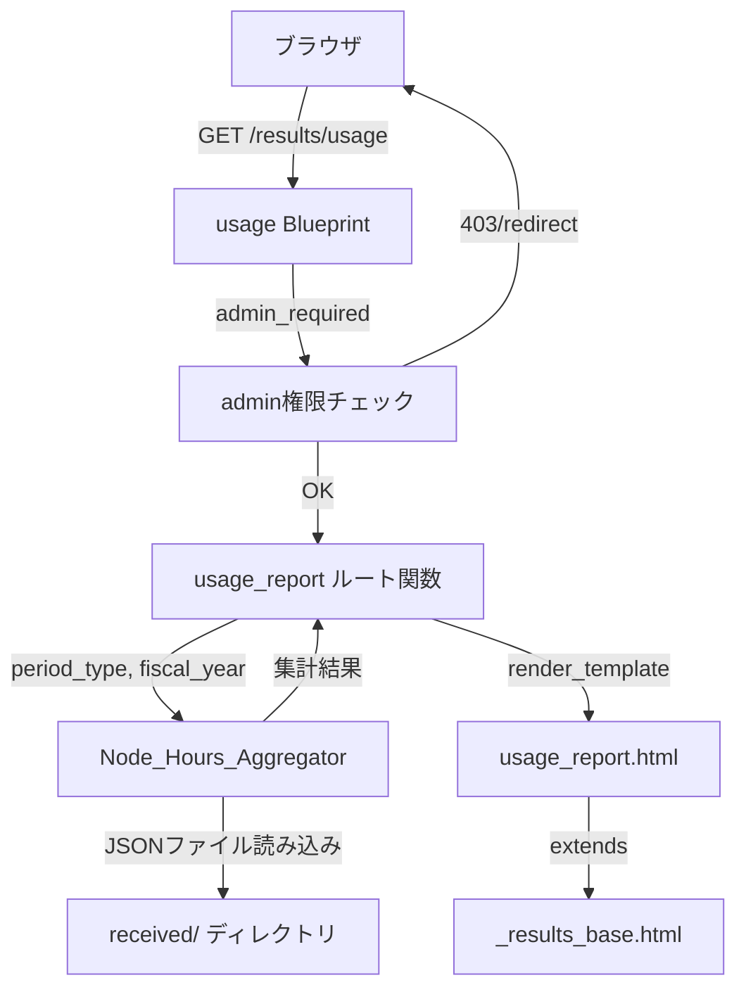

# 設計書: ノード時間使用量レポート

## 概要

result_server Flaskアプリケーションに、アプリケーション（`code`）×システム（`system`）のクロス集計テーブルでノード時間使用量を表示する管理者専用ページを追加する。

既存の `received/` ディレクトリ内のResult JSONファイルを読み込み、ファイル名のタイムスタンプから会計年度・期間を判定し、`execution_mode` に応じた計算式でノード時間を算出する。集計期間は月次・半期・年度の3種類を切り替え可能とする。

既存のアーキテクチャパターン（Blueprint、`admin_required` デコレータ、`_results_base.html` テンプレート継承、`utils/` モジュール分離）に準拠して実装する。

## アーキテクチャ



新規ページは既存の `results_bp` Blueprint内に `/usage` ルートとして追加する。新規Blueprintは作成しない。これは `/results/usage` というURLパスが要件で指定されており、`results_bp` が `/results` プレフィックスで登録されているためである。

集計ロジックは `utils/node_hours.py` に分離し、ルート関数はリクエストパラメータの取得とテンプレートレンダリングのみを担当する。

## コンポーネントとインターフェース

### 1. ルート: `results.usage_report`

ファイル: `result_server/routes/results.py` に追加

```python
@results_bp.route("/usage", methods=["GET"])
@admin_required  # routes/admin.py から import
def usage_report():
    """ノード時間使用量レポートページ"""
    ...
```

- クエリパラメータ: `period_type`（monthly/semi_annual/fiscal_year）、`fiscal_year`（整数）
- `admin_required` デコレータで認証・権限チェック（既存の `routes/admin.py` から import）
- `Node_Hours_Aggregator` を呼び出して集計結果を取得
- テンプレート `usage_report.html` をレンダリング

### 2. 集計モジュール: `utils/node_hours.py`

新規ファイル。以下の関数を提供する。

```python
def compute_node_hours(data: dict) -> float:
    """
    単一Result JSONからノード時間を算出する。
    
    - cross: node_count × run_time / 3600
    - native: node_count × (build_time + run_time) / 3600
    - node_count/run_time が欠損・非数値の場合は 0.0
    - native で build_time が欠損・非数値の場合は build_time=0 として算出
    
    Returns: float（小数点以下2桁に丸め）
    """

def extract_timestamp_from_filename(filename: str) -> datetime | None:
    """
    ファイル名から YYYYMMDD_HHMMSS パターンのタイムスタンプを抽出する。
    既存の results_loader.py と同じ正規表現パターンを使用。
    """

def get_fiscal_year(dt: datetime) -> int:
    """
    日付から会計年度を返す。
    1〜3月 → 前年の会計年度、4〜12月 → その年の会計年度
    """

def get_fiscal_month_index(dt: datetime) -> int:
    """
    会計年度内の月インデックス（0〜11）を返す。
    4月=0, 5月=1, ..., 3月=11
    """

def get_half(dt: datetime) -> str:
    """
    上期（first）か下期（second）かを返す。
    4〜9月=first, 10〜3月=second
    """

def aggregate_node_hours(
    directory: str,
    fiscal_year: int,
    period_type: str,  # "monthly" | "semi_annual" | "fiscal_year"
) -> dict:
    """
    指定ディレクトリの全JSONファイルを読み込み、ノード時間をクロス集計する。
    confidentialフィルタなし（admin専用ページのため全データ対象）。
    
    Returns: {
        "apps": [...],           # ソート済みApp名リスト
        "systems": [...],        # ソート済みSystem名リスト
        "periods": [...],        # 期間ラベルリスト
        "table": {               # {app: {system: {period: float}}}
            "AppA": {
                "SystemX": {"2025年4月": 1.23, ...},
                ...
            },
            ...
        },
        "row_totals": {app: {period: float}},
        "col_totals": {system: {period: float}},
        "grand_totals": {period: float},
        "available_fiscal_years": [2024, 2025, ...],
    }
    """
```

### 3. テンプレート: `usage_report.html`

ファイル: `result_server/templates/usage_report.html`

- `_results_base.html` を継承（ナビゲーション、共通CSS含む）
- 期間タイプ切り替えUI（ボタングループ or セレクト）
- 会計年度ドロップダウン
- クロス集計テーブル（行=App、列=System×期間、行合計、列合計、総合計）
- データなし時のメッセージ表示

### 4. ナビゲーション更新: `_navigation.html`

admin権限ユーザーにのみ「📈 Usage」リンクを表示する。既存の admin ドロップダウン内ではなく、認証済みユーザー向けのナビゲーションリンク行に追加する。

```html

<a href="{{ url_for('results.usage_report') }}" class="nav-link ...">📈 Usage</a>

```

## データモデル

### Result JSON 構造（集計に使用するフィールド）

```json
{
  "code": "string",              // アプリケーション名
  "system": "string",            // システム名
  "node_count": "number|string", // ノード数（文字列の場合あり）
  "execution_mode": "string",    // "cross" | "native" | null
  "pipeline_timing": {
    "build_time": "number",      // ビルド時間（秒）
    "run_time": "number"         // 実行時間（秒）
  },
  "confidential": "any"          // 機密タグ（集計では無視）
}
```

### ファイル名パターン

```
result_YYYYMMDD_HHMMSS_{uuid}.json
padata_YYYYMMDD_HHMMSS_{uuid}.json
```

タイムスタンプ部分（`YYYYMMDD_HHMMSS`）を正規表現 `\d{8}_\d{6}` で抽出し、`datetime.strptime` でパースする。既存の `results_loader.py` と同一のパターンを使用する。

### 集計データ構造

```python
# aggregate_node_hours の戻り値
{
    "apps": ["AppA", "AppB"],           # アルファベット順
    "systems": ["SystemX", "SystemY"],  # アルファベット順
    "periods": ["2025年4月", "2025年5月", ...],  # 期間ラベル
    "table": {
        "AppA": {
            "SystemX": {"2025年4月": 1.23, "2025年5月": 0.0},
            "SystemY": {"2025年4月": 0.45, "2025年5月": 2.10},
        },
    },
    "row_totals": {"AppA": {"2025年4月": 1.68, ...}},
    "col_totals": {"SystemX": {"2025年4月": 1.23, ...}},
    "grand_totals": {"2025年4月": 1.68, ...},
    "available_fiscal_years": [2024, 2025],
}
```

### 期間ラベル生成ルール

| period_type | ラベル例 |
|---|---|
| monthly | `2025年4月`, `2025年5月`, ..., `2026年3月` |
| semi_annual | `上期（4月〜9月）`, `下期（10月〜3月）` |
| fiscal_year | `FY2025` |


## 正当性プロパティ（Correctness Properties）

*プロパティとは、システムの全ての有効な実行において成立すべき特性や振る舞いのことである。人間が読める仕様と機械的に検証可能な正当性保証の橋渡しとなる形式的な記述である。*

### Property 1: ノード時間計算の正当性

*任意の* 有効な `node_count`（正の数値）、`run_time`（非負の数値）、`build_time`（非負の数値）、および `execution_mode` に対して、`compute_node_hours` は以下を返すべきである:
- `execution_mode` が `cross` の場合: `round(node_count × run_time / 3600, 2)`
- `execution_mode` が `native` の場合: `round(node_count × (build_time + run_time) / 3600, 2)`
- `node_count` または `run_time` が欠損・非数値の場合: `0.0`
- `native` モードで `build_time` が欠損・非数値の場合: `round(node_count × run_time / 3600, 2)`

**Validates: Requirements 2.1, 2.2, 2.3, 2.4, 2.5**

### Property 2: 小数点以下2桁の丸め

*任意の* Result JSONデータに対して、`compute_node_hours` の戻り値は小数点以下2桁以内の精度を持つべきである（`value == round(value, 2)` が成立する）。

**Validates: Requirements 2.6**

### Property 3: 会計年度分類の正当性

*任意の* 有効な日付に対して、`get_fiscal_year` は以下を返すべきである:
- 月が1〜3月の場合: `year - 1`
- 月が4〜12月の場合: `year`

**Validates: Requirements 4.3, 4.4**

### Property 4: セル集計値の正当性

*任意の* Result JSONファイル集合に対して、集計テーブルの各セル `table[app][system][period]` の値は、該当する `app`、`system`、`period` に一致する全レコードの `compute_node_hours` の合計値と等しくなるべきである。

**Validates: Requirements 5.2, 7.3**

### Property 5: 合計値の整合性

*任意の* 集計結果に対して:
- 各Appの行合計 = 全Systemのセル値の合計
- 各Systemの列合計 = 全Appのセル値の合計
- 総合計 = 全行合計の合計 = 全列合計の合計

**Validates: Requirements 5.3, 5.4, 5.5**

### Property 6: アルファベット順ソート

*任意の* 集計結果に対して、`apps` リストと `systems` リストはそれぞれアルファベット昇順にソートされているべきである。

**Validates: Requirements 5.7, 5.8**

### Property 7: 期間タイプ別の期間数

*任意の* 会計年度に対して:
- `period_type` が `monthly` の場合: 期間ラベルは正確に12個
- `period_type` が `semi_annual` の場合: 期間ラベルは正確に2個
- `period_type` が `fiscal_year` の場合: 期間ラベルは正確に1個

**Validates: Requirements 7.1, 8.1, 9.1**

### Property 8: 機密データの包含

*任意の* `confidential` タグを持つResult JSONファイルに対して、`aggregate_node_hours` はそのファイルのノード時間を集計結果に含めるべきである。

**Validates: Requirements 6.1**

### Property 9: 月次ラベルフォーマット

*任意の* 会計年度に対して、`monthly` 期間タイプの期間ラベルは全て `YYYY年M月` 形式に一致し、4月から翌年3月まで順序通りに並ぶべきである。

**Validates: Requirements 7.2**

## エラーハンドリング

| エラー状況 | 対応 |
|---|---|
| 未認証アクセス | ログインページへリダイレクト（`admin_required` デコレータ） |
| 非admin認証済みアクセス | 403 Forbidden（`admin_required` デコレータ） |
| JSONファイル読み込みエラー | 該当ファイルをスキップ（既存パターンに準拠） |
| `node_count` 欠損・非数値 | ノード時間 = 0.0 |
| `run_time` 欠損・非数値 | ノード時間 = 0.0 |
| `build_time` 欠損・非数値（native） | build_time = 0 として算出 |
| ファイル名にタイムスタンプなし | 該当ファイルをスキップ |
| 指定期間にデータなし | 「該当期間のデータがありません」メッセージ表示 |
| 不正な `period_type` パラメータ | デフォルト値 `fiscal_year` にフォールバック |
| 不正な `fiscal_year` パラメータ | 現在の会計年度にフォールバック |

## テスト戦略

### テストアプローチ

ユニットテストとプロパティベーステストの二本立てで網羅的にテストする。

- **ユニットテスト**: 具体的な入出力例、エッジケース、エラー条件の検証
- **プロパティベーステスト**: ランダム生成された入力に対する普遍的な性質の検証

### プロパティベーステスト

ライブラリ: **Hypothesis**（既存プロジェクトで使用済み）

各プロパティテストは最低100回のイテレーションで実行する。各テストにはデザインドキュメントのプロパティ番号をコメントで参照する。

タグフォーマット: `Feature: node-hours-usage-report, Property {number}: {property_text}`

各正当性プロパティは単一のプロパティベーステストで実装する。

### ユニットテスト

以下のケースをユニットテストでカバーする:

- ルートのアクセス制御（未認証→リダイレクト、非admin→403、admin→200）
- ナビゲーションリンクの表示条件
- デフォルトパラメータ（period_type=fiscal_year、現在の会計年度）
- データなし時のメッセージ表示
- 半期ラベル・年度ラベルのフォーマット
- 期間タイプ切り替えUIの存在確認

### テストファイル構成

```
result_server/tests/
├── test_node_hours.py              # compute_node_hours, get_fiscal_year 等のユニットテスト
├── test_node_hours_properties.py   # プロパティベーステスト（Property 1〜9）
└── test_usage_route.py             # ルート・テンプレートのユニットテスト
```
