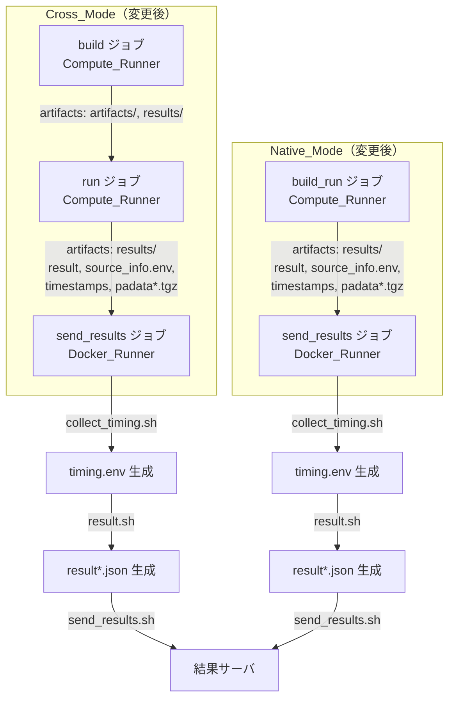

# 設計書: パイプライン結果ステージリファクタリング

## 概要

本設計は、CIパイプラインにおける結果処理スクリプト（`result.sh`, `collect_timing.sh`）の実行場所を、高コストな計算ノード（Compute_Runner）から軽量な Docker ランナー（Docker_Runner: `fncx-curl-jq`）上の `send_results` ジョブに移動するリファクタリングである。

### 現状のパイプラインフロー

```
Cross_Mode:  build → run [result.sh, collect_timing.sh] → send_results [send_results.sh]
Native_Mode: build_run [result.sh, collect_timing.sh] → send_results [send_results.sh]
```

### リファクタリング後のパイプラインフロー

```
Cross_Mode:  build → run → send_results [collect_timing.sh, result.sh, send_results.sh]
Native_Mode: build_run → send_results [collect_timing.sh, result.sh, send_results.sh]
```

### 設計判断の根拠

- `result.sh` と `collect_timing.sh` は計算ノード固有の機能を必要としない（bash, jq のみ使用）
- Docker_Runner（`fncx-curl-jq`）は bash, curl, jq, git, md5sum を提供しており、これらのスクリプト実行に十分
- 計算ノードの占有時間を削減することで、バッチジョブのキュー待ち時間とコストを低減できる
- `results/` ディレクトリは GitLab artifacts として自動的にジョブ間で受け渡されるため、データフローに変更なし

## アーキテクチャ

### データフロー図



### 変更対象ファイル

| ファイル | 変更内容 |
|---------|---------|
| `scripts/matrix_generate.sh` | run/build_run ジョブから `collect_timing.sh`/`result.sh` 呼び出しを除去 |
| `scripts/job_functions.sh` | `emit_send_results_job` 関数を拡張し、引数を追加 |
| `README.md` | パイプラインフローの説明を更新 |
| `ADD_APP.md` | 影響がある記述があれば更新 |

### 変更しないファイル

| ファイル | 理由 |
|---------|------|
| `scripts/result.sh` | ロジック変更なし。実行場所が変わるだけ |
| `scripts/collect_timing.sh` | ロジック変更なし。実行場所が変わるだけ |
| `scripts/send_results.sh` | 変更なし。result*.json を読み取る既存ロジックはそのまま |
| `scripts/record_timestamp.sh` | 変更なし。run/build_run ジョブ内で引き続き使用 |


## コンポーネントとインターフェース

### 1. `emit_send_results_job` 関数の拡張（`scripts/job_functions.sh`）

現在のシグネチャ:
```bash
emit_send_results_job "$job_prefix" "${depends_on}" "$OUTPUT_FILE"
```

変更後のシグネチャ:
```bash
emit_send_results_job "$job_prefix" "${depends_on}" "$OUTPUT_FILE" "$program" "$system" "$mode" "$build_job" "$run_job"
```

新しい引数:
- `$4`: program — プログラム名（例: `qws`）
- `$5`: system — システム名（例: `Fugaku`）
- `$6`: mode — 実行モード（`cross` または `native`）
- `$7`: build_job — ビルドジョブ名（例: `qws_Fugaku_build`）
- `$8`: run_job — ランジョブ名（例: `qws_Fugaku_N1_P4_T12_run`）

生成される YAML:
```yaml
{job_prefix}_send_results:
  stage: send_results
  needs: ["{depends_on}"]
  tags: [fncx-curl-jq]
  environment:
    name: $CI_COMMIT_BRANCH
  script:
    - bash scripts/collect_timing.sh
    - bash scripts/result.sh {program} {system} {mode} {build_job} {run_job} $CI_PIPELINE_ID
    - bash scripts/send_results.sh
```

### 2. `matrix_generate.sh` の変更

#### Cross_Mode の run ジョブ（変更箇所）

除去する行:
```yaml
    - bash scripts/collect_timing.sh
    - bash scripts/result.sh $program $system cross ${build_key}_build ${job_prefix}_run $CI_PIPELINE_ID
    - echo "After result.sh execution"
    - ls -la results/
    - echo "Results directory contents count"
    - ls results/ | wc -l
```

run ジョブの script セクション（変更後）:
```yaml
  script:
    - echo "Starting job"
    - ls -la {program_path}/
    - bash scripts/record_timestamp.sh results/run_start
    - bash {program_path}/run.sh {system} {nodes} {numproc_node} {nthreads}
    - bash scripts/record_timestamp.sh results/run_end
    - echo "Job completed"
    - ls -la .
```

#### Native_Mode の build_run ジョブ（変更箇所）

除去する行:
```yaml
    - bash scripts/collect_timing.sh
    - bash scripts/result.sh $program $system native ${job_prefix}_build_run ${job_prefix}_build_run $CI_PIPELINE_ID
    - echo "After result.sh execution"
    - ls -la results/
    - echo "Results directory contents count"
    - ls results/ | wc -l
```

build_run ジョブの script セクション（変更後）:
```yaml
  script:
    - echo "Starting build and run"
    - bash scripts/record_timestamp.sh results/build_start
    - bash {program_path}/build.sh {system}
    - bash scripts/record_timestamp.sh results/build_end
    - bash scripts/record_timestamp.sh results/run_start
    - bash {program_path}/run.sh {system} {nodes} {numproc_node} {nthreads}
    - bash scripts/record_timestamp.sh results/run_end
    - echo "Job completed"
    - ls -la .
```

#### `emit_send_results_job` 呼び出しの変更

Cross_Mode:
```bash
# 変更前
emit_send_results_job "$job_prefix" "${job_prefix}_run" "$OUTPUT_FILE"

# 変更後
emit_send_results_job "$job_prefix" "${job_prefix}_run" "$OUTPUT_FILE" "$program" "$system" "cross" "${build_key}_build" "${job_prefix}_run"
```

Native_Mode:
```bash
# 変更前
emit_send_results_job "$job_prefix" "${job_prefix}_build_run" "$OUTPUT_FILE"

# 変更後
emit_send_results_job "$job_prefix" "${job_prefix}_build_run" "$OUTPUT_FILE" "$program" "$system" "native" "${job_prefix}_build_run" "${job_prefix}_build_run"
```

### 3. アーティファクト依存関係

run/build_run ジョブの artifacts パスは変更なし（`results/`）。send_results ジョブは `needs` で前段ジョブを指定しているため、artifacts は自動的に取得される。

send_results ジョブが受け取る artifacts の内容:
- `results/result` — FOM/SECTION/OVERLAP テキストファイル（必須）
- `results/source_info.env` — ソースコード情報（存在する場合）
- `results/build_start`, `results/build_end` — ビルドタイムスタンプ
- `results/run_start`, `results/run_end` — ランタイムスタンプ
- `results/padata*.tgz` — PA データ（存在する場合）


## データモデル

### 生成される YAML 構造（Cross_Mode の例）

```yaml
# ビルドジョブ（変更なし）
qws_Fugaku_build:
  stage: build
  tags: ["fugaku_login1"]
  script:
    - mkdir -p results
    - bash scripts/record_timestamp.sh results/build_start
    - echo "[BUILD] qws for Fugaku"
    - bash programs/qws/build.sh Fugaku
    - bash scripts/record_timestamp.sh results/build_end
  artifacts:
    paths:
      - artifacts/
      - results/
    expire_in: 1 week

# ランジョブ（collect_timing.sh / result.sh を除去）
qws_Fugaku_N1_P4_T12_run:
  stage: run
  tags: ["fugaku_jacamar"]
  needs: [qws_Fugaku_build]
  script:
    - echo "Starting job"
    - ls -la programs/qws/
    - bash scripts/record_timestamp.sh results/run_start
    - bash programs/qws/run.sh Fugaku 1 4 12
    - bash scripts/record_timestamp.sh results/run_end
    - echo "Job completed"
    - ls -la .
  artifacts:
    paths:
      - results/
    expire_in: 1 week

# send_results ジョブ（collect_timing.sh / result.sh を追加）
qws_Fugaku_N1_P4_T12_send_results:
  stage: send_results
  needs: ["qws_Fugaku_N1_P4_T12_run"]
  tags: [fncx-curl-jq]
  environment:
    name: $CI_COMMIT_BRANCH
  script:
    - bash scripts/collect_timing.sh
    - bash scripts/result.sh qws Fugaku cross qws_Fugaku_build qws_Fugaku_N1_P4_T12_run $CI_PIPELINE_ID
    - bash scripts/send_results.sh
```

### 生成される YAML 構造（Native_Mode の例）

```yaml
# build_run ジョブ（collect_timing.sh / result.sh を除去）
qws_FugakuLN_N1_P1_T1_build_run:
  stage: build_run
  needs: []
  tags: ["fugaku_login1"]
  script:
    - echo "Starting build and run"
    - bash scripts/record_timestamp.sh results/build_start
    - bash programs/qws/build.sh FugakuLN
    - bash scripts/record_timestamp.sh results/build_end
    - bash scripts/record_timestamp.sh results/run_start
    - bash programs/qws/run.sh FugakuLN 1 1 1
    - bash scripts/record_timestamp.sh results/run_end
    - echo "Job completed"
    - ls -la .
  artifacts:
    paths:
      - results/
    expire_in: 1 week

# send_results ジョブ（collect_timing.sh / result.sh を追加）
qws_FugakuLN_N1_P1_T1_send_results:
  stage: send_results
  needs: ["qws_FugakuLN_N1_P1_T1_build_run"]
  tags: [fncx-curl-jq]
  environment:
    name: $CI_COMMIT_BRANCH
  script:
    - bash scripts/collect_timing.sh
    - bash scripts/result.sh qws FugakuLN native qws_FugakuLN_N1_P1_T1_build_run qws_FugakuLN_N1_P1_T1_build_run $CI_PIPELINE_ID
    - bash scripts/send_results.sh
```

### result.sh の引数マッピング

| 引数位置 | パラメータ | Cross_Mode での値 | Native_Mode での値 |
|---------|-----------|-------------------|-------------------|
| $1 | code (program) | `$program` | `$program` |
| $2 | system | `$system` | `$system` |
| $3 | execution_mode | `cross` | `native` |
| $4 | build_job | `${build_key}_build` | `${job_prefix}_build_run` |
| $5 | run_job | `${job_prefix}_run` | `${job_prefix}_build_run` |
| $6 | pipeline_id | `$CI_PIPELINE_ID` | `$CI_PIPELINE_ID` |

### estimate ジョブへの影響

estimate ジョブは `send_results` ジョブと `run`/`build_run` ジョブの両方に依存している（`needs` で指定）。この依存関係は変更しない。estimate ジョブは `send_results` ジョブ完了後に実行され、`results/result*.json` を参照する。`result.sh` が `send_results` ジョブ内で実行されるようになっても、`send_results` ジョブ完了時点で `result*.json` は生成済みであるため、estimate ジョブの動作に影響はない。

ただし、現在の `emit_estimate_job` は `run_job` のアーティファクトも取得している（`needs: ["${depends_on}", "${run_job}"]`）。`result*.json` は `send_results` ジョブ内で生成されるため、estimate ジョブが `result*.json` を必要とする場合は `send_results` ジョブのアーティファクトから取得する。現在の実装では `send_results` ジョブにはアーティファクト定義がないが、`run_estimate.sh` は `results/result*.json` を読み取るため、`send_results` ジョブにもアーティファクト定義を追加する必要がある。

**対応**: `emit_send_results_job` で生成する YAML に artifacts ブロックを追加する:
```yaml
  artifacts:
    paths:
      - results/
    expire_in: 1 week
```


## 正当性プロパティ（Correctness Properties）

*プロパティとは、システムのすべての有効な実行において真であるべき特性や振る舞いのことである。プロパティは、人間が読める仕様と機械的に検証可能な正当性保証の橋渡しとなる。*

### Property 1: 計算ジョブから結果処理スクリプトが除去されていること

*任意の* プログラムとシステムの組み合わせにおいて、Matrix_Generator が生成する計算ジョブ（Cross_Mode の run ジョブ、Native_Mode の build_run ジョブ）の script セクションには、`collect_timing.sh` および `result.sh` の呼び出しが含まれないこと。

**Validates: Requirements 1.1, 1.2, 2.1, 2.2**

### Property 2: send_results ジョブのスクリプト実行順序

*任意の* プログラムとシステムの組み合わせにおいて、Matrix_Generator が生成する send_results ジョブの script セクションでは、`collect_timing.sh` が `result.sh` より前に、`result.sh` が `send_results.sh` より前に出現すること。

**Validates: Requirements 3.1, 3.2, 3.5, 5.2, 5.3, 5.4**

### Property 3: result.sh の引数の正当性

*任意の* プログラム名 P、システム名 S、モード M（cross/native）、ビルドジョブ名 B、ランジョブ名 R の組み合わせにおいて、生成される send_results ジョブの `result.sh` 呼び出しは `bash scripts/result.sh P S M B R $CI_PIPELINE_ID` の形式であること。

**Validates: Requirements 3.3, 4.1, 4.2, 4.3, 4.4, 4.5, 4.6, 5.3**

### Property 4: send_results ジョブの依存関係とタグ

*任意の* 生成された send_results ジョブにおいて、`tags` に `fncx-curl-jq` が含まれ、かつ `needs` に正しい前段ジョブ（Cross_Mode では run ジョブ、Native_Mode では build_run ジョブ）が指定されていること。

**Validates: Requirements 3.4, 6.1, 6.2**

### Property 5: YAML 生成ルール準拠

*任意の* `emit_send_results_job` が生成する YAML 出力において、script セクションの各行にリダイレクト（`>`、`>>`、`2>`）、パイプ（`|`）、論理演算子（`&&`、`||`）、条件文（`if`、`case`）が含まれないこと。

**Validates: Requirements 5.5**

### Property 6: estimate ジョブの依存関係維持

*任意の* estimate 対象システムかつ estimate スクリプトを持つプログラムにおいて、生成される estimate ジョブの `needs` に send_results ジョブが含まれていること。

**Validates: Requirements 7.4**


## エラーハンドリング

### 1. result.sh の実行失敗

`result.sh` は `results/result` ファイルが存在しない場合や FOM 行が含まれない場合に `exit 1` で終了する。send_results ジョブ内で実行されるため、ジョブ全体が失敗し、後続の `send_results.sh` は実行されない。これは現在の動作と同一である。

### 2. collect_timing.sh の実行失敗

`collect_timing.sh` はタイムスタンプファイルが存在しない場合でもデフォルト値（0）を使用するため、失敗しない設計になっている。変更なし。

### 3. アーティファクトの欠落

run/build_run ジョブが失敗した場合、send_results ジョブは実行されない（`needs` 依存関係による）。アーティファクトが不完全な場合は `result.sh` が検出してエラーを返す。

### 4. Docker_Runner の環境差異

`result.sh` は `jq` を使用する（SECTION/OVERLAP の JSON 構築）。Docker_Runner（`fncx-curl-jq`）は `jq` を提供しているため、問題なし。`collect_timing.sh` は基本的な算術演算（`$(())`）のみ使用するため、bash があれば動作する。

## テスト戦略

### プロパティベーステスト

テストライブラリ: **Hypothesis**（Python）

`matrix_generate.sh` はシェルスクリプトであるが、テストは生成された YAML 出力を検証する形で行う。テスト用の Python スクリプトで以下を実施する:

1. テスト用の `list.csv` と `system.csv` を動的に生成
2. `matrix_generate.sh` を実行して `.gitlab-ci.generated.yml` を生成
3. 生成された YAML をパースして各プロパティを検証

各プロパティテストは最低 100 回のイテレーションで実行する。

各テストには以下のタグコメントを付与する:
```python
# Feature: pipeline-result-stage-refactor, Property {number}: {property_text}
```

### プロパティテスト設計

| Property | テスト方法 | 生成する入力 |
|----------|-----------|-------------|
| Property 1 | 生成 YAML の run/build_run ジョブ script を検査 | ランダムなプログラム名・システム名・モードの組み合わせ |
| Property 2 | send_results ジョブの script 行の順序を検証 | ランダムなプログラム名・システム名の組み合わせ |
| Property 3 | result.sh 呼び出し行の引数を正規表現でパース・検証 | ランダムなプログラム名・システム名・モード・ジョブ名 |
| Property 4 | send_results ジョブの tags と needs フィールドを検証 | ランダムなプログラム名・システム名・モードの組み合わせ |
| Property 5 | script セクション全行に対して禁止パターンの不在を検証 | ランダムなプログラム名・システム名の組み合わせ |
| Property 6 | estimate ジョブの needs フィールドに send_results が含まれることを検証 | estimate 対象システムとプログラムの組み合わせ |

### ユニットテスト

プロパティテストを補完する具体的なテストケース:

1. **具体例テスト**: `qws` + `Fugaku`（cross）の生成 YAML が期待通りであることを検証
2. **具体例テスト**: `qws` + `FugakuLN`（native）の生成 YAML が期待通りであることを検証
3. **エッジケース**: `emit_send_results_job` に空文字列引数を渡した場合の動作
4. **統合テスト**: 実際の `list.csv` と `system.csv` を使用した完全な YAML 生成と検証

### テスト実行環境

テストは Docker_Runner と同等の環境（bash, jq, Python 3）で実行する。CI 上では `fncx-curl-jq` ランナーまたは同等の環境を使用する。

