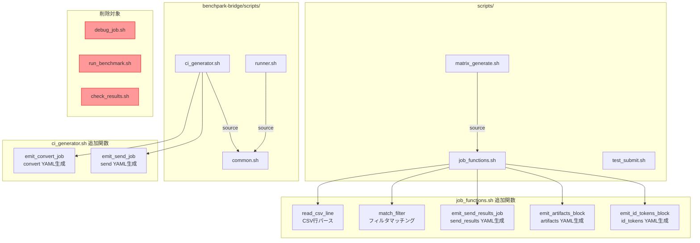

# デザインドキュメント: パイプラインスクリプトのリファクタリング

## 概要

BenchKit の CI/CD パイプライン生成・結果処理に関わるシェルスクリプト群のリファクタリングを行い、保守性を向上させる。対象は以下の7領域：

1. **CSV 読み込みロジックの共通化** — `matrix_generate.sh` と `ci_generator.sh` で重複する CSV パース処理（ヘッダースキップ、コメント行スキップ、空白トリム）を `job_functions.sh` の共通関数に集約
2. **フィルタリングロジックの共通化** — 両スクリプトで重複するカンマ区切りフィルタマッチング処理を `job_functions.sh` の共通関数に集約
3. **不要スクリプトの除去** — `scripts/` 配下で CI パイプラインや他スクリプトから参照されていない `debug_job.sh`、`run_benchmark.sh`、`check_results.sh` を削除
4. **YAML 生成パターンの共通化** — `send_results` ジョブ定義、`artifacts` 設定、`id_tokens` 設定の YAML ブロック出力を共通関数化
5. **test_submit.sh の case 文統合** — if 文の連鎖をシステム別 case 文に統合し、未知システムのエラーハンドリングを追加
6. **BenchPark CI ジョブ定義の重複排除** — `ci_generator.sh` 内の SEND_ONLY モードと通常モードで重複する convert/send ジョブ定義を関数化
7. **BenchPark common.sh の未使用関数整理** — `runner.sh` と `ci_generator.sh` から呼び出されていない関数にコメント付与または除去

既存の動作（生成される YAML 出力、ジョブ投入コマンド、結果処理）は一切変更しない。

## アーキテクチャ

### 現在の構造

```
scripts/
├── job_functions.sh       # 共通関数（get_queue_template, expand_template）
├── matrix_generate.sh     # BenchKit 用 GitLab CI YAML 生成
├── result.sh              # 結果 JSON 変換
├── send_results.sh        # 結果サーバ送信
├── wait_for_nfs.sh        # NFS 同期待機
├── test_submit.sh         # ローカルテスト用ジョブ投入
├── debug_job.sh           # 未使用（README のみ参照）
├── run_benchmark.sh       # 未使用（README のみ参照）
└── check_results.sh       # 未使用（README のみ参照）

benchpark-bridge/scripts/
├── common.sh              # BenchPark 共通関数（8関数定義、3関数のみ使用）
├── ci_generator.sh        # BenchPark 用 GitLab CI YAML 生成
├── runner.sh              # BenchPark 実験実行管理
└── result_converter.py    # BenchPark 結果変換（対象外）

.gitlab-ci.yml             # メイン CI 定義
```

### リファクタリング後の変更点




## コンポーネントとインターフェース

### 1. CSV 読み込み共通関数（job_functions.sh に追加）

```bash
# CSV行をパースし、各フィールドを変数にエクスポートする
# ヘッダー行（先頭が "system"）とコメント行（# を含む）はスキップ（return 1）
# 各フィールドの前後空白をトリムする
#
# 使用方法:
#   while IFS=, read -r f1 f2 f3 ...; do
#     parse_csv_line "$f1" "$f2" ... || continue
#     # $csv_system, $csv_mode, ... が使用可能
#   done < file.csv
#
# matrix_generate.sh 用（7フィールド: system,mode,queue_group,nodes,numproc_node,nthreads,elapse）
parse_list_csv_line() {
    local system="$1" mode="$2" queue_group="$3" nodes="$4" numproc_node="$5" nthreads="$6" elapse="$7"
    # 空白トリム
    system=$(echo "$system" | sed 's/^[[:space:]]*//;s/[[:space:]]*$//')
    mode=$(echo "$mode" | sed 's/^[[:space:]]*//;s/[[:space:]]*$//')
    queue_group=$(echo "$queue_group" | sed 's/^[[:space:]]*//;s/[[:space:]]*$//')
    nodes=$(echo "$nodes" | sed 's/^[[:space:]]*//;s/[[:space:]]*$//')
    numproc_node=$(echo "$numproc_node" | sed 's/^[[:space:]]*//;s/[[:space:]]*$//')
    nthreads=$(echo "$nthreads" | sed 's/^[[:space:]]*//;s/[[:space:]]*$//')
    elapse=$(echo "$elapse" | sed 's/^[[:space:]]*//;s/[[:space:]]*$//')

    # ヘッダー行スキップ
    [[ "$system" == "system" ]] && return 1
    # コメント行スキップ
    [[ "$system" == *"#"* ]] && return 1

    # エクスポート
    export csv_system="$system" csv_mode="$mode" csv_queue_group="$queue_group"
    export csv_nodes="$nodes" csv_numproc_node="$numproc_node"
    export csv_nthreads="$nthreads" csv_elapse="$elapse"
    return 0
}

# ci_generator.sh 用（3フィールド: system,app,description）
parse_apps_csv_line() {
    local system="$1" app="$2" description="$3"
    system=$(echo "$system" | sed 's/^[[:space:]]*//;s/[[:space:]]*$//')
    app=$(echo "$app" | sed 's/^[[:space:]]*//;s/[[:space:]]*$//')
    description=$(echo "$description" | sed 's/^[[:space:]]*//;s/[[:space:]]*$//')

    [[ "$system" == "system" ]] && return 1
    [[ "$system" == *"#"* ]] && return 1

    export csv_system="$system" csv_app="$app" csv_description="$description"
    return 0
}
```

**設計判断**: list.csv（7フィールド）と apps.csv（3フィールド）はフィールド数が異なるため、汎用的な1関数ではなく CSV 形式ごとに専用関数を用意する。これにより呼び出し側のコードがシンプルになり、フィールド名の混乱を防げる。

### 2. フィルタマッチング共通関数（job_functions.sh に追加）

```bash
# カンマ区切りフィルタ文字列と対象値を受け取り、マッチ判定を返す
# フィルタ文字列が空の場合は常にマッチ（return 0）
# マッチした場合 return 0、マッチしない場合 return 1
#
# 使用方法:
#   match_filter "$SYSTEM_FILTER" "$system" || continue
#   match_filter "$CODE_FILTER" "$program" || continue
match_filter() {
    local filter_str="$1"
    local target="$2"

    # フィルタが空なら常にマッチ
    [[ -z "$filter_str" ]] && return 0

    IFS=',' read -ra FILTER_LIST <<< "$filter_str"
    for filter_item in "${FILTER_LIST[@]}"; do
        if [[ "$target" == "$filter_item" ]]; then
            return 0
        fi
    done
    return 1
}
```

**設計判断**: `matrix_generate.sh` の system/code フィルタと `ci_generator.sh` の system/app フィルタは同一のロジック（カンマ区切り文字列を配列に分割し、対象値と一致するか判定）であるため、1つの関数で統一できる。

### 3. YAML 生成共通関数（job_functions.sh に追加）

```bash
# send_results ジョブの YAML ブロックを生成
# $1: ジョブ名プレフィックス（例: qws_Fugaku_N1_P4_T12）
# $2: 依存ジョブ名（needs に指定するジョブ名）
# $3: 出力ファイル
emit_send_results_job() {
    local job_prefix="$1"
    local depends_on="$2"
    local output="$3"

    cat >> "$output" <<EOF

${job_prefix}_send_results:
  stage: send_results
  needs: ["${depends_on}"]
  tags: [fncx-curl-jq]
  environment:
    name: \$CI_COMMIT_BRANCH
  script:
    - bash scripts/send_results.sh

EOF
}

# artifacts ブロックを生成（YAML 文字列を返す）
# $1: パス（例: results/）
# $2: 有効期限（例: 1 week）
emit_artifacts_block() {
    local path="$1"
    local expire="$2"
    echo "  artifacts:
    paths:
      - ${path}
    expire_in: ${expire}"
}

# id_tokens ブロックを生成（YAML 文字列を返す）
emit_id_tokens_block() {
    echo "  id_tokens:
    CI_JOB_JWT:
      aud: https://gitlab.swc.r-ccs.riken.jp"
}
```

**設計判断**: `matrix_generate.sh` の cross/native 両モードで `send_results` ジョブ定義が重複しているため関数化する。`artifacts` と `id_tokens` は `ci_generator.sh` でも同一パターンが使われているため、共通関数として提供する。ただし `ci_generator.sh` は独自の YAML 構造を持つため、これらの関数の利用は任意とする。

### 4. test_submit.sh の case 文統合

```bash
# 現在の if 文連鎖:
#   if [[ "$system" == "Fugaku" || "$system" == "FugakuCN" ]]; then ... fi
#   if [[ "$system" == "RC_GH200" ]]; then ... fi
#   if [[ "$system" == "MiyabiC" ]]; then ... fi
#   if [[ "$system" == "MiyabiG" ]]; then ... fi
#
# 統合後の case 文:
case "$system" in
    Fugaku|FugakuCN)
        # pjsub コマンド（既存と同一パラメータ）
        ;;
    RC_GH200)
        # sbatch コマンド（既存と同一パラメータ）
        ;;
    MiyabiC)
        # qsub -q debug-c コマンド（既存と同一パラメータ）
        ;;
    MiyabiG)
        # qsub -q debug-g コマンド（既存と同一パラメータ）
        ;;
    *)
        echo "Error: Unknown system '$system'"
        echo "Supported systems: Fugaku, FugakuCN, RC_GH200, MiyabiC, MiyabiG"
        exit 1
        ;;
esac
```

**設計判断**: 既存の if 文連鎖では、未知のシステムが指定された場合にエラーなく終了してしまう。case 文に統合することで、`*` パターンで未知システムを明示的にエラーとして処理できる。各 case ブロック内のコマンドは既存と完全に同一とする。

### 5. BenchPark CI ジョブ定義の関数化（ci_generator.sh 内）

```bash
# convert ジョブの YAML 定義を生成
# $1: ジョブ名プレフィックス
# $2: ログインノードタグ
# $3: 依存ジョブ名
# $4: system
# $5: app
# $6: 出力ファイル
emit_convert_job() {
    local job_prefix="$1" login_tag="$2" depends_on="$3"
    local system="$4" app="$5" output="$6"
    # convert ジョブの YAML を $output に追記
}

# send ジョブの YAML 定義を生成
# $1: ジョブ名プレフィックス
# $2: 依存ジョブ名（通常は ${job_prefix}_convert）
# $3: 出力ファイル
emit_send_job() {
    local job_prefix="$1" depends_on="$2" output="$3"
    # send ジョブの YAML を $output に追記
}
```

これにより、SEND_ONLY モードと通常モードの分岐は以下のようにシンプルになる：

```bash
if [[ "$SEND_ONLY" == "true" ]]; then
    emit_convert_job "$job_prefix" "$login_tag" "" "$system" "$app" "$OUTPUT_FILE"
    emit_send_job "$job_prefix" "${job_prefix}_convert" "$OUTPUT_FILE"
else
    # setup, run ジョブを出力（これらはモード固有）
    emit_convert_job "$job_prefix" "$login_tag" "${job_prefix}_run" "$system" "$app" "$OUTPUT_FILE"
    emit_send_job "$job_prefix" "${job_prefix}_convert" "$OUTPUT_FILE"
fi
```

### 6. BenchPark common.sh の未使用関数整理

現在の8関数の使用状況：

| 関数名 | runner.sh | ci_generator.sh | 状態 |
|--------|-----------|-----------------|------|
| `get_benchpark_installation_path` | ✗ | ✗ | 未使用 |
| `get_benchpark_system_tag` | ✗ | ✓ | 使用中 |
| `get_benchpark_login_tag` | ✗ | ✓ | 使用中 |
| `get_benchpark_workspace` | ✗ | ✗ | 未使用 |
| `get_benchpark_experiment_path` | ✗ | ✗ | 未使用 |
| `get_benchpark_system_path` | ✗ | ✗ | 未使用 |
| `wait_for_ramble_jobs` | ✓ | ✗ | 使用中 |
| `get_benchpark_results_dir` | ✗ | ✗ | 未使用 |

未使用の5関数（`get_benchpark_installation_path`, `get_benchpark_workspace`, `get_benchpark_experiment_path`, `get_benchpark_system_path`, `get_benchpark_results_dir`）に対して、将来使用予定であることを示すコメント `# TODO: 現在未使用。将来のシステム拡張時に使用予定` を付与する。

**設計判断**: BenchPark 統合は発展途上であり、これらの関数は将来のシステム追加（Fugaku 対応等）で使用される可能性が高い。即座に削除するよりもコメントで明示する方が安全。

### 7. 不要スクリプトの除去

以下の3ファイルは `.gitlab-ci.yml`、`matrix_generate.sh`、他のスクリプトのいずれからも呼び出されておらず、README.md のファイル一覧でのみ参照されている：

| ファイル | 内容 | 参照元 |
|---------|------|--------|
| `scripts/debug_job.sh` | デバッグ情報出力 | README.md のみ |
| `scripts/run_benchmark.sh` | ベンチマーク実行（旧式） | README.md のみ |
| `scripts/check_results.sh` | 結果ディレクトリ確認 | README.md のみ |

これらを削除し、README.md のファイル一覧からも除去する。


## データモデル

本リファクタリングではデータモデルの変更はない。以下の CSV ファイル構造はすべて維持される：

### list.csv（programs/*/list.csv）

| フィールド | 説明 | 例 |
|-----------|------|-----|
| system | 実行システム名 | Fugaku, MiyabiG |
| mode | 実行モード | cross, native |
| queue_group | キューグループ | small, debug-g |
| nodes | ノード数 | 1, 2 |
| numproc_node | ノードあたりプロセス数 | 4, 1 |
| nthreads | スレッド数 | 12, 72 |
| elapse | 実行時間制限 | 0:10:00 |

### apps.csv（benchpark-bridge/config/apps.csv）

| フィールド | 説明 | 例 |
|-----------|------|-----|
| system | 実行システム名 | RC_GH200 |
| app | アプリケーション名 | osu-micro-benchmarks |
| description | 説明 | OSU Micro-Benchmarks on RC_GH200 |

### system.csv

| フィールド | 説明 | 例 |
|-----------|------|-----|
| system | システム名 | Fugaku |
| tag | GitLab Runner タグ | fugaku_login1 |
| roles | 役割 | build, run, build_run |
| queue | キュー名 | FJ, SLURM_RC_GH200 |

### queue.csv

| フィールド | 説明 | 例 |
|-----------|------|-----|
| queue | キュー名 | FJ |
| submit_cmd | 投入コマンド | pjsub |
| template | パラメータテンプレート | "-L rscunit=..." |

生成される YAML 出力（`.gitlab-ci.generated.yml`、`.gitlab-ci.benchpark.yml`）の構造も変更しない。


## 正しさの性質（Correctness Properties）

*プロパティとは、システムのすべての有効な実行において成り立つべき特性や振る舞いのことである。人間が読める仕様と機械的に検証可能な正しさの保証を橋渡しする、形式的な記述である。*

### シェルスクリプトリファクタリングにおけるテスト可能性の制約

本リファクタリングの対象はすべてシェルスクリプト（bash）であり、プロパティベーステスト（PBT）ライブラリ（Hypothesis, fast-check 等）を直接適用できない。そのため、正しさの検証は以下の方法で行う：

- **出力等価性テスト**: リファクタリング前後で同一の入力に対して同一の出力が生成されることを diff で確認
- **具体例テスト**: 特定の入力に対する期待出力をシェルスクリプトのテストで確認
- **エッジケーステスト**: 未知システム等の境界条件での動作確認

以下に、受け入れ基準から導出された検証可能な性質を記述する。

### Property 1: BenchKit YAML 出力の等価性

*任意の* list.csv 構成（現在の programs/*/list.csv）と system/code フィルタの組み合わせに対して、リファクタリング後の `matrix_generate.sh` が生成する `.gitlab-ci.generated.yml` は、リファクタリング前のものとバイト単位で同一である。

**検証方法**: リファクタリング前の出力を保存し、リファクタリング後の出力と `diff` で比較する。

**Validates: Requirements 1.4, 2.4, 4.4**

### Property 2: BenchPark YAML 出力の等価性

*任意の* apps.csv 構成と system フィルタの組み合わせに対して、リファクタリング後の `ci_generator.sh` が生成する `.gitlab-ci.benchpark.yml` は、リファクタリング前のものとバイト単位で同一である。SEND_ONLY モードと通常モードの両方で等価性が成り立つ。

**検証方法**: 両モードでリファクタリング前の出力を保存し、リファクタリング後の出力と `diff` で比較する。

**Validates: Requirements 6.3, 6.4, 6.5**

### Property 3: test_submit.sh のコマンド等価性

*任意の* 既知システム（Fugaku, FugakuCN, RC_GH200, MiyabiC, MiyabiG）と list.csv の構成に対して、リファクタリング後の `test_submit.sh` が生成するジョブ投入コマンド（pjsub, sbatch, qsub のパラメータ）は、リファクタリング前のものと同一である。

**検証方法**: 各システムに対して `echo` 出力されるコマンド文字列を比較する。

**Validates: Requirements 5.3**

### Property 4: 未知システムのエラーハンドリング

*任意の* 既知システム以外の文字列が `test_submit.sh` に渡された場合、スクリプトはエラーメッセージを出力して非ゼロの終了コードで終了する。

**検証方法**: 未知のシステム名（例: "UnknownSystem"）を指定して実行し、終了コードとエラーメッセージを確認する。

**Validates: Requirements 5.2**

## エラーハンドリング

本リファクタリングではエラーハンドリングの変更は最小限に留める。既存のエラーハンドリングはすべて維持される。

### 変更されるエラーハンドリング

| スクリプト | 変更内容 |
|-----------|---------|
| `test_submit.sh` | 未知システムに対する明示的なエラー処理を追加（`case` 文の `*` パターン） |

### 維持されるエラーハンドリング

| スクリプト | エラー処理 |
|-----------|-----------|
| `matrix_generate.sh` | 不明な引数で `exit 1`、不明なモードで `exit 1`、テンプレート未検出で `continue` |
| `ci_generator.sh` | 不明な引数で `exit 1`、タグ未検出で `continue` |
| `job_functions.sh` | キュー未検出で `return 1` |
| `result.sh` | results/ 未検出で `exit 1`、FOM 未検出で `exit 1` |
| `send_results.sh` | curl 失敗で `exit 1`（`set -euo pipefail`） |
| `wait_for_nfs.sh` | タイムアウト時は `exit 0`（ジョブを失敗させない） |
| `common.sh` | 未知システムで `return 1` |
| `runner.sh` | ワークスペース未検出で `exit 1` |

## テスト戦略

### テストアプローチ

シェルスクリプトのリファクタリングであるため、プロパティベーステスト（PBT）は使用しない。代わりに以下の2つのアプローチで検証する：

1. **出力等価性テスト（diff テスト）**: リファクタリング前後で生成される YAML 出力が完全に一致することを確認
2. **手動検証テスト**: 特定の入力に対する動作を手動で確認

### 出力等価性テスト

リファクタリングの正しさを保証する最も確実な方法は、リファクタリング前後の出力を比較することである。

#### テスト手順

1. リファクタリング前に、現在の CSV 構成で各スクリプトを実行し、出力を保存する
2. リファクタリング後に、同一の CSV 構成で各スクリプトを実行し、出力を取得する
3. `diff` で比較し、差分がないことを確認する

#### 対象スクリプトと出力

| スクリプト | 出力ファイル | テスト条件 |
|-----------|-------------|-----------|
| `matrix_generate.sh` | `.gitlab-ci.generated.yml` | フィルタなし、system フィルタあり、code フィルタあり |
| `ci_generator.sh` | `.gitlab-ci.benchpark.yml` | 通常モード、SEND_ONLY モード |

### 手動検証テスト

以下の項目を手動で確認する：

1. **CSV パース関数の動作確認**
   - ヘッダー行がスキップされること
   - コメント行（`#` 付き）がスキップされること
   - 各フィールドの前後空白がトリムされること

2. **フィルタ関数の動作確認**
   - 空フィルタで全行がマッチすること
   - 単一値フィルタで正しくマッチすること
   - カンマ区切り複数値フィルタで正しくマッチすること

3. **test_submit.sh の case 文**
   - 各既知システムで正しいコマンドが生成されること
   - 未知システムでエラーメッセージが出力されること

4. **不要スクリプト削除後の CI 動作**
   - `matrix_generate.sh` が正常に動作すること
   - 生成される YAML が有効であること

5. **BenchPark common.sh のコメント付与**
   - 未使用関数にコメントが付与されていること
   - `runner.sh` と `ci_generator.sh` が正常に動作すること

### テストファイル配置

本リファクタリングでは新規テストファイルは作成しない。検証はリファクタリング前後の出力比較と手動確認で行う。

```bash
# 出力等価性テストの実行例
# 1. リファクタリング前の出力を保存
bash ./scripts/matrix_generate.sh
cp .gitlab-ci.generated.yml .gitlab-ci.generated.yml.before

# 2. リファクタリング後の出力を生成
bash ./scripts/matrix_generate.sh
diff .gitlab-ci.generated.yml.before .gitlab-ci.generated.yml

# 3. BenchPark YAML の比較
bash ./benchpark-bridge/scripts/ci_generator.sh
cp .gitlab-ci.benchpark.yml .gitlab-ci.benchpark.yml.before
# （リファクタリング後）
bash ./benchpark-bridge/scripts/ci_generator.sh
diff .gitlab-ci.benchpark.yml.before .gitlab-ci.benchpark.yml
```
