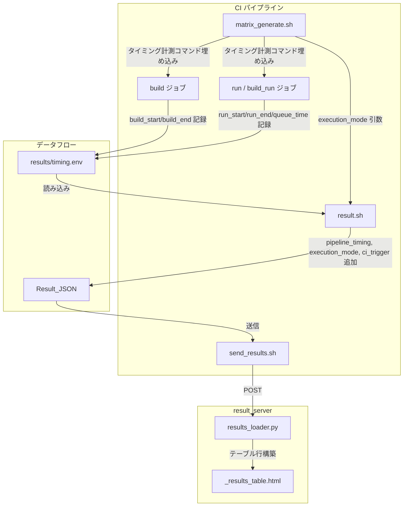
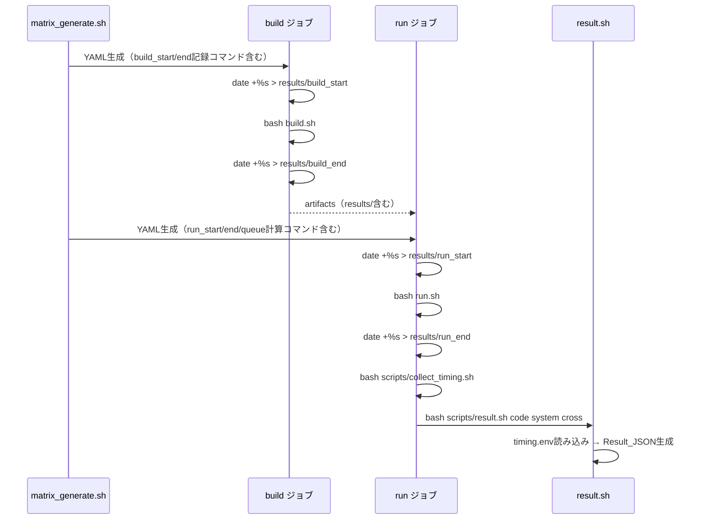
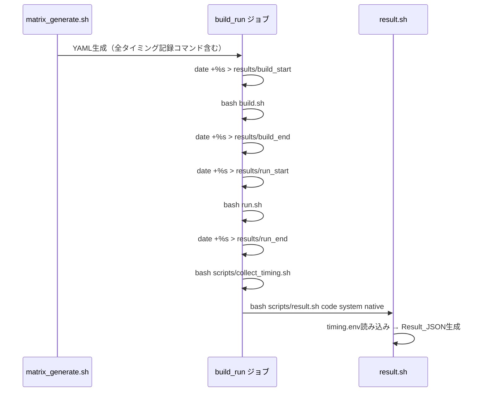

# Design Document: Pipeline Timing

## Overview

BenchKitのCIパイプラインにおけるbuild時間・queue時間・run時間の計測、実行モード（cross/native）およびCIトリガー種別の記録・表示機能を設計する。

本機能は以下の3層にまたがる変更を含む：

1. **CI層（シェルスクリプト）**: `matrix_generate.sh` が生成するYAMLにタイミング計測コマンドを埋め込み、`result.sh` がResult_JSONに新フィールドを追加
2. **データ層（Result_JSON）**: `pipeline_timing`、`execution_mode`、`ci_trigger` フィールドの追加
3. **表示層（result_server）**: `results_loader.py` での新フィールド読み取りと `_results_table.html` でのカラム追加

既存のResult_JSONとの後方互換性を維持し、新フィールドが存在しない場合は "-" をフォールバック表示する。

## Architecture



### crossモードのタイミング計測フロー



### nativeモードのタイミング計測フロー



## Components and Interfaces

### 1. `scripts/collect_timing.sh`（新規）

タイミングファイルから `results/timing.env` を生成するヘルパースクリプト。YAML内の複雑なロジックを避けるため、独立スクリプトとして分離する。

**入力:**
- `results/build_start` — ビルド開始UNIXエポック秒
- `results/build_end` — ビルド終了UNIXエポック秒
- `results/run_start` — 実行開始UNIXエポック秒
- `results/run_end` — 実行終了UNIXエポック秒
- `$CI_JOB_STARTED_AT`（GitLab CI定義済み変数）— ジョブ実行開始時刻（ISO 8601）

**出力:** `results/timing.env`
```
BUILD_TIME=120
QUEUE_TIME=45
RUN_TIME=300
```

**queue時間の計算方法:**
- runジョブ（cross）またはbuild_runジョブ（native）において、`$CI_JOB_STARTED_AT`（ジョブがランナーに割り当てられた時刻）と実際のスクリプト実行開始時刻の差分から算出する
- ただし、Jacamar-CIを使用するジョブスケジューラ（FJ, PBS, SLURM）環境では、GitLabジョブ開始後にさらにジョブスケジューラのキュー待ちが発生する
- `SCHEDULER_PARAMETERS` を使用するジョブでは、ジョブスケジューラ投入前の時刻を `results/queue_submit` に記録し、`results/run_start` との差分をqueue時間とする

**ロジック:**
```bash
# build_time = build_end - build_start
# run_time = run_end - run_start
# queue_time = run_start - queue_submit（スケジューラ投入時刻）
```

### 2. `scripts/matrix_generate.sh`（変更）

生成するYAMLに以下を追加：

**crossモード - buildジョブ:**
```yaml
script:
  - mkdir -p results
  - date +%s > results/build_start
  - echo "[BUILD] program for system"
  - bash program_path/build.sh system
  - date +%s > results/build_end
```

**crossモード - runジョブ:**
```yaml
script:
  - echo "Starting job"
  - date +%s > results/queue_submit
  - ls -la program_path/
  - bash program_path/run.sh system nodes numproc_node nthreads
  - echo "Job completed"
  - date +%s > results/run_end
  - bash scripts/collect_timing.sh
  - bash scripts/result.sh program system cross
  ...
```
※ `results/run_start` は run.sh 実行直前に記録。`results/queue_submit` はスクリプトセクション冒頭で記録し、ジョブスケジューラのキュー待ち時間を含む。

**nativeモード - build_runジョブ:**
```yaml
script:
  - echo "Starting build and run"
  - date +%s > results/queue_submit
  - date +%s > results/build_start
  - bash program_path/build.sh system
  - date +%s > results/build_end
  - date +%s > results/run_start
  - bash program_path/run.sh system nodes numproc_node nthreads
  - echo "Job completed"
  - date +%s > results/run_end
  - bash scripts/collect_timing.sh
  - bash scripts/result.sh program system native
  ...
```

**result.shへの実行モード引数:**
- 第3引数として `cross` または `native` を渡す

**CI_PIPELINE_SOURCE:**
- GitLab CI定義済み変数のため、追加設定不要。result.sh内で直接参照可能。

### 3. `scripts/result.sh`（変更）

**変更点:**
- 第3引数 `execution_mode` を受け取る（省略時は空文字）
- `results/timing.env` が存在する場合、`pipeline_timing` オブジェクトをResult_JSONに追加
- `execution_mode` フィールドをResult_JSONに追加
- `$CI_PIPELINE_SOURCE` を `ci_trigger` フィールドとしてResult_JSONに追加

**write_result_json関数の変更:**
```bash
# timing.envの読み込み
local timing_block=""
if [ -f results/timing.env ]; then
  source results/timing.env
  timing_block=",
  \"pipeline_timing\": {
    \"build_time\": ${BUILD_TIME:-0},
    \"queue_time\": ${QUEUE_TIME:-0},
    \"run_time\": ${RUN_TIME:-0}
  }"
fi

# execution_mode
local mode_block=""
if [ -n "$execution_mode" ]; then
  mode_block=",
  \"execution_mode\": \"$execution_mode\""
fi

# ci_trigger
local trigger_val="${CI_PIPELINE_SOURCE:-unknown}"
local trigger_block=",
  \"ci_trigger\": \"$trigger_val\""
```

### 4. `result_server/utils/results_loader.py`（変更）

**`_build_row` 関数の変更:**
- `pipeline_timing` オブジェクトから `build_time`、`queue_time`、`run_time` を取得
- `execution_mode` フィールドを取得
- `ci_trigger` フィールドを取得
- 存在しない場合は `"-"` をフォールバック値として使用

**`columns` リストの変更:**
- `("Mode", "execution_mode")` を追加
- `("Trigger", "ci_trigger")` を追加
- `("Build Time", "build_time")` を追加
- `("Queue Time", "queue_time")` を追加
- `("Run Time", "run_time")` を追加

### 5. `result_server/templates/_results_table.html`（変更）

新カラムをテーブルヘッダーとボディに追加。既存の表示条件ロジック（`col_name in [...]`）に新カラム名を追加する。

## Data Models

### Result_JSON 拡張スキーマ

既存フィールドに加え、以下のフィールドを追加：

```json
{
  "code": "qws",
  "system": "Fugaku",
  "FOM": 42.0,
  "FOM_version": "v1",
  "Exp": "test",
  "node_count": 4,
  "numproc_node": "4",
  "description": "null",
  "confidential": "null",
  "pipeline_timing": {
    "build_time": 120,
    "queue_time": 45,
    "run_time": 300
  },
  "execution_mode": "cross",
  "ci_trigger": "schedule"
}
```

**フィールド定義:**

| フィールド | 型 | 必須 | 説明 |
|---|---|---|---|
| `pipeline_timing` | object | No | タイミング情報オブジェクト |
| `pipeline_timing.build_time` | number | Yes（親が存在する場合） | ビルド時間（秒） |
| `pipeline_timing.queue_time` | number | Yes（親が存在する場合） | キュー待ち時間（秒） |
| `pipeline_timing.run_time` | number | Yes（親が存在する場合） | 実行時間（秒） |
| `execution_mode` | string | No | "cross" または "native" |
| `ci_trigger` | string | No | CI_PIPELINE_SOURCEの値。"schedule", "trigger", "push", "web", "merge_request_event", "unknown" のいずれか |

### timing.env フォーマット

```
BUILD_TIME=120
QUEUE_TIME=45
RUN_TIME=300
```

各値はUNIXエポック秒の差分（整数）。

### テーブル行データ（_build_row出力）

既存フィールドに加え：

| キー | 型 | フォールバック | 説明 |
|---|---|---|---|
| `build_time` | str | "-" | ビルド時間（秒数文字列） |
| `queue_time` | str | "-" | キュー待ち時間（秒数文字列） |
| `run_time` | str | "-" | 実行時間（秒数文字列） |
| `execution_mode` | str | "-" | 実行モード |
| `ci_trigger` | str | "-" | CIトリガー種別 |


## Correctness Properties

*プロパティとは、システムの全ての有効な実行において成り立つべき特性や振る舞いのことです。人間が読める仕様と機械的に検証可能な正しさの保証を橋渡しする、形式的な記述です。*

本機能の変更は主に3層（シェルスクリプト、Result_JSON、result_server）にまたがるが、Pythonのproperty-based testingで検証可能なのはresult_server層（`results_loader.py`の`_build_row`関数）である。シェルスクリプト層（matrix_generate.sh、result.sh、collect_timing.sh）はCI環境依存のため、ユニットテストで個別に検証する。

prework分析の結果、以下のプロパティを特定した：

- 要件5.1/5.3/6.1/6.3/7.1/7.3/8.1/8.2/8.3/8.4は全て「`_build_row`が任意のResult_JSONに対して新フィールドを正しく抽出し、存在しない場合はフォールバック値を返す」という1つのプロパティに統合できる
- 要件3.3（execution_modeの値制約）と4.3（ci_triggerの値制約）はResult_JSON生成側（result.sh）の制約であり、results_loader.pyのテストとしては入力データのジェネレータに組み込む
- 要件5.2/6.2/7.2（カラム表示）は静的構造の検証であり、exampleテストで十分

### Property 1: 新フィールドの抽出とフォールバック

*For any* Result_JSONデータ（`pipeline_timing`、`execution_mode`、`ci_trigger`の有無を問わず）、`_build_row`関数は常に `build_time`、`queue_time`、`run_time`、`execution_mode`、`ci_trigger` キーを含む行データを返し、元データにフィールドが存在する場合はその値を、存在しない場合は `"-"` をフォールバック値として返す。

**Validates: Requirements 5.1, 5.3, 6.1, 6.3, 7.1, 7.3, 8.1, 8.2, 8.3, 8.4**

## Error Handling

### シェルスクリプト層

| エラー状況 | 対処 |
|---|---|
| `results/timing.env` が存在しない | `pipeline_timing` フィールドを省略してResult_JSONを生成（要件2.5） |
| タイムスタンプファイル（build_start等）が存在しない | `collect_timing.sh` が該当フィールドを0として記録 |
| `$CI_PIPELINE_SOURCE` が未定義 | `ci_trigger` に `"unknown"` を記録（要件4.4） |
| `execution_mode` 引数が省略された | `execution_mode` フィールドを省略 |
| `date +%s` コマンド失敗 | タイムスタンプファイルが作成されず、collect_timing.shが0を記録 |

### result_server層

| エラー状況 | 対処 |
|---|---|
| `pipeline_timing` フィールドが存在しない | `_build_row` が `"-"` をフォールバック値として返す |
| `pipeline_timing` の子フィールドが欠損 | 個別に `"-"` をフォールバック |
| `execution_mode` フィールドが存在しない | `"-"` をフォールバック |
| `ci_trigger` フィールドが存在しない | `"-"` をフォールバック |
| `pipeline_timing` が不正な型（文字列等） | `dict` でない場合は `"-"` をフォールバック |

## Testing Strategy

### テスト方針

既存のテストスイート（95テスト、pytest + hypothesis + fakeredis）に追加する形で実装する。

### ユニットテスト

`result_server/tests/test_results_loader.py` に以下のテストを追加：

1. **新フィールド付きResult_JSONの行構築**: `pipeline_timing`、`execution_mode`、`ci_trigger` を含むResult_JSONから正しく行データが構築されることを確認
2. **新フィールドなしResult_JSONの後方互換性**: 既存形式のResult_JSONでもエラーなく行データが構築され、フォールバック値 `"-"` が返ることを確認
3. **columnsリストの検証**: 新カラム（Mode, Trigger, Build Time, Queue Time, Run Time）がcolumnsリストに含まれることを確認
4. **pipeline_timingの部分欠損**: `pipeline_timing` オブジェクトが存在するが一部フィールドが欠損している場合のフォールバック動作を確認

### プロパティベーステスト

ライブラリ: **hypothesis**（既存プロジェクトで使用済み）

各プロパティテストは最低100イテレーション実行する。

```python
# Feature: pipeline-timing, Property 1: 新フィールドの抽出とフォールバック
@given(st.fixed_dictionaries({...}, optional={...}))
@settings(max_examples=100)
def test_build_row_new_fields_extraction_and_fallback(data):
    ...
```

**ジェネレータ設計:**
- 基本Result_JSONフィールド（code, system, FOM等）をランダム生成
- `pipeline_timing` オブジェクトをオプショナルに生成（build_time/queue_time/run_timeは非負整数）
- `execution_mode` をオプショナルに生成（"cross" または "native"）
- `ci_trigger` をオプショナルに生成（"schedule", "trigger", "push", "web", "merge_request_event", "unknown"）

**検証内容:**
- 行データに `build_time`、`queue_time`、`run_time`、`execution_mode`、`ci_trigger` キーが常に存在する
- 元データにフィールドが存在する場合はその値が反映される
- 元データにフィールドが存在しない場合は `"-"` が返る
