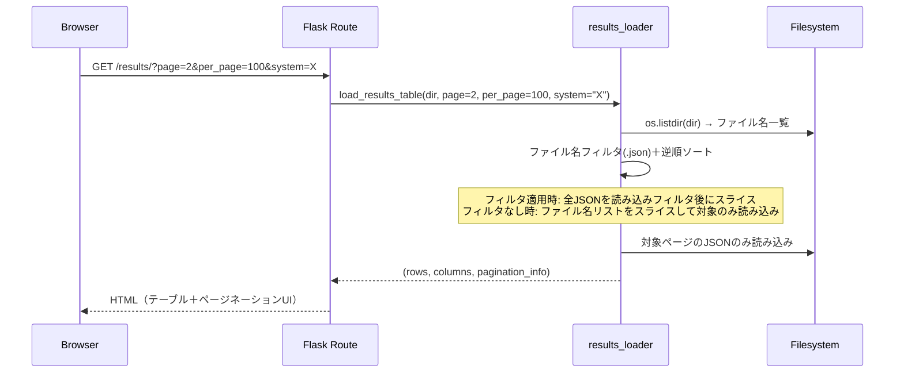

# 設計ドキュメント: 結果一覧ページネーション

## 概要

本設計は、Result_Serverの結果一覧ページ（`/results/`、`/results/confidential`、`/estimated/`）にサーバーサイドページネーションを導入する。現在の実装では`results_loader.py`がディレクトリ内の全JSONファイルを一括読み込みしているため、ファイル数が増加するとレスポンス時間とメモリ使用量が線形に増大する。

本設計では、ページネーションロジックを`results_loader.py`のローダー関数に組み込み、指定ページに該当するファイルのみをディスクから読み込む「遅延読み込み」方式を採用する。これにより、ファイル数に依存しない一定のレスポンス時間を実現する。

### 設計判断

1. **サーバーサイドページネーション**: クライアントサイドではなくサーバーサイドで実装する。理由は、1万件以上のJSONファイルを全てブラウザに送信するのは帯域・メモリの両面で非効率であるため。
2. **ファイル名ソートによる遅延読み込み**: `os.listdir()`でファイル名一覧を取得し、ファイル名の逆順ソート（新しい順）後にスライスで対象ページのファイルのみを`json.load()`する。ファイル名にタイムスタンプが含まれているため、ファイル名ソートで時系列順が保証される。
3. **フィルタはサーバーサイドに移行**: 現在のクライアントサイドドロップダウンフィルタ（SYSTEM、CODE、Exp）をクエリパラメータとしてサーバーサイドに移行する。フィルタ適用後の結果セットに対してページネーションを行うため。
4. **共通Jinja2パーシャル**: ページネーションUIは`_pagination.html`として共通化し、全対象ページで``する。

## アーキテクチャ



### フィルタ適用時の処理フロー

フィルタ（SYSTEM、CODE、Exp）が指定された場合、対象ファイルを特定するためにJSONの中身を確認する必要がある。ただし、全ファイルの全フィールドを読み込むのではなく、以下の最適化を行う：

1. ファイル名一覧を取得・ソート
2. 各JSONファイルを読み込み、フィルタ条件に一致するかチェック
3. 一致した結果のみをリストに追加
4. リスト全体からスライスでページ分を抽出

> **注意**: フィルタ適用時は全ファイルの読み込みが必要になるため、フィルタなし時と比較してパフォーマンスが低下する。将来的にはインデックスファイルやキャッシュの導入で改善可能だが、本設計のスコープ外とする。

## コンポーネントとインターフェース

### 1. `results_loader.py` — ページネーション対応ローダー

既存の`load_results_table()`と`load_estimated_results_table()`にページネーションパラメータを追加する。

```python
def load_results_table(
    directory: str,
    public_only: bool = True,
    session_email: str | None = None,
    authenticated: bool = False,
    affiliations: list[str] | None = None,
    # --- 新規パラメータ ---
    page: int = 1,
    per_page: int = 100,
    filter_system: str | None = None,
    filter_code: str | None = None,
    filter_exp: str | None = None,
) -> tuple[list[dict], list[tuple], dict]:
    """
    Returns:
        (rows, columns, pagination_info)
        pagination_info = {
            "page": int,          # 現在のページ（1始まり）
            "per_page": int,      # 1ページあたりの件数
            "total": int,         # フィルタ適用後の総件数
            "total_pages": int,   # 総ページ数
        }
    """
```

`load_estimated_results_table()`にも同様のシグネチャ変更を適用する。

### 2. ページネーション計算ユーティリティ

`results_loader.py`内にヘルパー関数を追加する。

```python
def paginate_list(items: list, page: int, per_page: int) -> tuple[list, dict]:
    """
    リストにページネーションを適用する。

    Args:
        items: ページネーション対象のリスト
        page: ページ番号（1始まり）
        per_page: 1ページあたりの件数

    Returns:
        (paginated_items, pagination_info)
    """
```

### 3. Flask ルート — クエリパラメータ処理

`routes/results.py`と`routes/estimated.py`のルートハンドラでクエリパラメータを受け取り、ローダーに渡す。

```python
@results_bp.route("/", strict_slashes=False)
def results():
    page = request.args.get("page", 1, type=int)
    per_page = request.args.get("per_page", 100, type=int)
    filter_system = request.args.get("system", None)
    filter_code = request.args.get("code", None)
    filter_exp = request.args.get("exp", None)
    # ...
```

`per_page`の値は`[50, 100, 200]`のいずれかに制限し、範囲外の値はデフォルト（100）にフォールバックする。

### 4. Jinja2テンプレート — `_pagination.html`

新規パーシャルテンプレートとして`_pagination.html`を作成する。テーブルの上部と下部の両方に``で挿入する。

```html
<!-- templates/_pagination.html -->
<div class="pagination-controls">
    <span>Showing {{ pagination.total }} results</span>
    <a href="..." class="disabled">First</a>
    <a href="..." class="disabled">Previous</a>
    <span>Page {{ pagination.page }} of {{ pagination.total_pages }}</span>
    <a href="..." class="disabled">Next</a>
    <a href="..." class="disabled">Last</a>
    <select onchange="..."><!-- 50 / 100 / 200 --></select>
</div>
```

### 5. フィルタUIの変更

現在のクライアントサイドフィルタ（JavaScript `applyFilters()`）をサーバーサイドフィルタに変更する。ドロップダウンの`onchange`イベントでクエリパラメータ付きURLにリダイレクトする。

フィルタ選択肢（SYSTEM、CODE、Expの一覧）は、ローダーが全ファイル名一覧から抽出するか、別途軽量なメタデータ取得関数を用意する。

```python
def get_filter_options(directory: str, public_only: bool = True, ...) -> dict:
    """
    フィルタドロップダウンの選択肢を返す。
    Returns: {"systems": [...], "codes": [...], "exps": [...]}
    """
```

## データモデル

### pagination_info 辞書

```python
pagination_info = {
    "page": int,          # 現在のページ番号（1始まり）
    "per_page": int,      # 1ページあたりの表示件数
    "total": int,         # フィルタ適用後の総結果件数
    "total_pages": int,   # 総ページ数 = ceil(total / per_page)
}
```

### クエリパラメータ

| パラメータ | 型 | デフォルト | 説明 |
|---|---|---|---|
| `page` | int | 1 | 表示ページ番号 |
| `per_page` | int | 100 | 1ページあたりの件数（50/100/200） |
| `system` | str | None | SYSTEMフィルタ |
| `code` | str | None | CODEフィルタ |
| `exp` | str | None | Expフィルタ |

### 既存データモデルへの影響

- `rows`（`list[dict]`）: 構造変更なし。ページ分のみ返却される。
- `columns`（`list[tuple]`）: 変更なし。
- ルートハンドラの`render_template()`呼び出しに`pagination=pagination_info`を追加。


## 正確性プロパティ (Correctness Properties)

*プロパティとは、システムの全ての有効な実行において成立すべき特性や振る舞いのことである。人間が読める仕様と機械的に検証可能な正確性保証の橋渡しとなる形式的な記述である。*

### Property 1: ページネーションによるリスト分割の正確性

*For any* リスト `items` と有効な `per_page` 値（50, 100, 200）に対して、全ページ（1〜total_pages）の結果を結合すると、元のリストと完全に一致する（欠落なし、重複なし、順序保持）。

**Validates: Requirements 1.1, 7.1, 7.2**

### Property 2: 総ページ数の計算

*For any* 非負整数 `total` と正整数 `per_page` に対して、`total_pages` は `max(1, ceil(total / per_page))` と等しい。`total` が0の場合は `total_pages` は1となる。

**Validates: Requirements 5.3, 7.3, 7.4**

### Property 3: 範囲外ページ番号のクランプ

*For any* `total_pages` >= 1 に対して、`page` < 1 の場合は1に、`page` > `total_pages` の場合は `total_pages` にクランプされる。

**Validates: Requirements 1.4**

### Property 4: フィルタ適用後の結果の正確性

*For any* 結果リストとフィルタ条件（system, code, exp）の組み合わせに対して、ページネーション後に返却される全ての行は、指定されたフィルタ条件に一致する。

**Validates: Requirements 4.1**

### Property 5: ナビゲーションボタンの状態

*For any* 有効な `page` と `total_pages`（1 <= page <= total_pages）に対して、「Previous」ボタンは `page == 1` のとき無効、それ以外で有効。「Next」ボタンは `page == total_pages` のとき無効、それ以外で有効。

**Validates: Requirements 2.2, 2.3, 2.4, 2.5**

### Property 6: ページネーションUIの必須要素

*For any* 有効な `pagination_info`（page, per_page, total, total_pages）に対して、レンダリングされたページネーションUIは「Page X of Y」テキスト、「First」リンク、「Last」リンク、およびフィルタ適用後の総件数を含む。

**Validates: Requirements 2.1, 2.6, 4.4**

### Property 7: ページネーションリンクのフィルタ保持

*For any* フィルタ条件（system, code, exp）とページ番号の組み合わせに対して、ページネーションリンク（Previous, Next, First, Last）のURLは適用中のフィルタ条件をクエリパラメータとして保持する。

**Validates: Requirements 4.3**

## エラーハンドリング

### ページ番号の範囲外

- `page < 1`: ページ1にリダイレクト（302）
- `page > total_pages`: 最終ページにリダイレクト（302）
- リダイレクト時はフィルタ条件とper_pageをクエリパラメータに保持

### per_page の不正値

- 許可値 `[50, 100, 200]` 以外の値: デフォルト値100にフォールバック
- 負の値や文字列: Flaskの`request.args.get()`の`type=int`で処理され、デフォルト値が使用される

### ファイルシステムエラー

- `os.listdir()`失敗: 既存の動作を維持（Flaskの500エラー）
- 個別JSONファイルの読み込み失敗: 既存の`load_json_with_confidential_filter()`が`None`を返し、スキップされる（変更なし）

### 結果0件

- `total_pages`を1として返却
- 空のテーブルとページネーションUI（「Page 1 of 1」、全ボタン無効）を表示

## テスト戦略

### テストフレームワーク

- **ユニットテスト**: pytest（既存のテストスイートと同じ）
- **プロパティベーステスト**: hypothesis（既存の`.hypothesis/`ディレクトリが存在し、プロジェクトで使用済み）

### ユニットテスト

具体的な例とエッジケースを検証する：

- `paginate_list()`にデフォルトパラメータ（page=1, per_page=100）を渡した場合の動作
- 結果0件の場合に`total_pages=1`が返却される
- `per_page`の不正値（例: 75）がデフォルト100にフォールバックする
- 各ページ（`/results/`, `/results/confidential`, `/estimated/`）にページネーションUIが存在する
- ページネーションUIがテーブルの上部と下部の両方に表示される
- フィルタ変更時にページが1にリセットされる
- 表示件数セレクタに50, 100, 200の選択肢がある
- 既存機能（キーワード検索、Compare、認証制御）が維持される

### プロパティベーステスト

各プロパティテストは最低100回のイテレーションで実行する。各テストにはデザインドキュメントのプロパティ番号をタグとして付与する。

タグ形式: **Feature: results-pagination, Property {number}: {property_text}**

- **Property 1**: ランダムなリストとper_page値を生成し、全ページの結合が元リストと一致することを検証
- **Property 2**: ランダムなtotalとper_page値を生成し、total_pagesの計算が`max(1, ceil(total/per_page))`と一致することを検証
- **Property 3**: ランダムな範囲外ページ番号を生成し、クランプ後の値が有効範囲内であることを検証
- **Property 4**: ランダムな結果リストとフィルタ条件を生成し、返却された全行がフィルタ条件に一致することを検証
- **Property 5**: ランダムなpage/total_pagesの組み合わせを生成し、ボタン状態が正しいことを検証
- **Property 6**: ランダムなpagination_infoを生成し、レンダリング結果に必須要素が含まれることを検証
- **Property 7**: ランダムなフィルタ条件とページ番号を生成し、ページネーションリンクにフィルタパラメータが保持されることを検証

### テスト構成

```
result_server/tests/
├── test_results_loader.py          # 既存テスト（変更なし）
├── test_pagination.py              # ページネーション ユニットテスト
└── test_pagination_properties.py   # ページネーション プロパティテスト
```

各プロパティテストは1つのプロパティに対して1つのテスト関数で実装する。hypothesisの`@given`デコレータと`@settings(max_examples=100)`を使用する。
