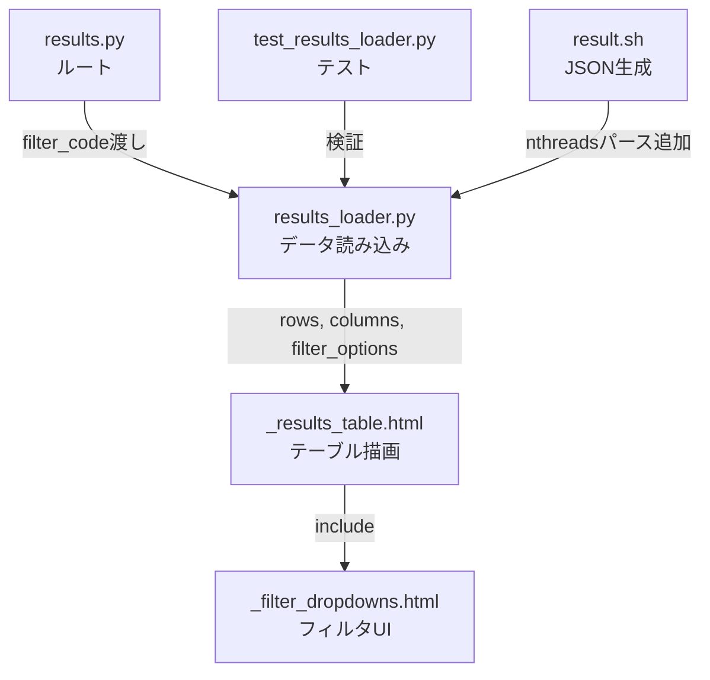

# 設計ドキュメント: テーブルUX改善

## 概要

result_serverのサマリーテーブル（`_results_table.html`）に対するUX改善を実装する。

1. **Compareカラム位置変更**: 左端からFOMカラムの右隣に移動し、ツールチップの見切れ問題を解消
2. **Expフィルタのカスケード連動**: Codeフィルタ選択時にExpの選択肢を連動絞り込み
3. **Proc/nodeカラム追加**: ノード当たりプロセス数をNodesカラムの隣に表示
4. **Thread/procカラム追加**: プロセス当たりスレッド数をProc/nodeカラムの隣に表示。result.shでFOM行から`nthreads:`をパースしResult_JSONに記録
5. **ハードスペック系カラム削除**: CPU Name, GPU Name, CPU/node, GPU/node, CPU Core Countをテーブルから削除（SYSTEMツールチップで既に表示済み）。`_build_row`からも対応フィールド抽出を削除

すべての変更はサーバーサイド処理（Python/Jinja2テンプレート）とCIスクリプト（shell）で完結し、クライアントサイドJavaScriptの変更は最小限に留める。既存のテストが引き続きパスすることを保証する。

変更後のテーブルカラム順序:
`Timestamp | CODE | Exp | FOM | Compare | FOM version | SYSTEM | Nodes | Proc/node | Thread/proc | JSON | PA Data | Mode | Trigger | Pipeline | Detail`

## アーキテクチャ

### 変更対象ファイルと責務



### 変更の流れ

1. `results_loader.py`: カラム順序変更（ハードスペック系削除、Proc/node・Thread/proc追加）、`_build_row`からハードスペック系フィールド抽出削除・`nthreads`/`numproc_node`フィールド追加、`get_filter_options`にカスケードフィルタ対応
2. `results.py`: `get_filter_options`呼び出し時に`filter_code`パラメータを渡す
3. `_results_table.html`: Compareカラムの位置変更、Proc/node・Thread/procカラムの描画追加、ハードスペック系カラムの描画削除
4. `_filter_dropdowns.html`: 変更不要（サーバーサイドで絞り込み済みの選択肢が渡される）
5. `result.sh`: FOM行から`nthreads:`をパースする処理を追加（`numproc_node`と同じパターン）

## コンポーネントとインターフェース

### 1. `results_loader.py` の変更

#### カラムリスト変更

現在の`columns`リスト（`load_results_table`内）を以下の順序に変更する。ハードスペック系カラム（CPU Name, GPU Name, CPU/node, GPU/node, CPU Core Count）を削除し、Proc/nodeとThread/procを追加:

```python
columns = [
    ("Timestamp", "timestamp"),
    ("CODE", "code"),
    ("Exp", "exp"),
    ("FOM", "fom"),
    ("FOM version", "fom_version"),
    ("SYSTEM", "system"),
    ("Nodes", "nodes"),
    ("Proc/node", "numproc_node"),   # 新規追加
    ("Thread/proc", "nthreads"),     # 新規追加
    ("JSON", "json_link"),
    ("PA Data", "data_link"),
    ("Mode", "execution_mode"),
    ("Trigger", "ci_trigger"),
    ("Pipeline", "pipeline_id"),
]
```

注: Compareカラムはテンプレート側で挿入されるため、columnsリストには含まれない。テンプレート側でFOMの後にCompareを挿入することで、最終的なカラム順序は:
`Timestamp | CODE | Exp | FOM | Compare | FOM version | SYSTEM | Nodes | Proc/node | Thread/proc | JSON | PA Data | Mode | Trigger | Pipeline | Detail`

#### `_build_row` の変更

ハードスペック系フィールドの抽出コードを削除し、`numproc_node`および`nthreads`フィールドを追加する。

削除するフィールド抽出:
```python
# 以下を削除
cpu = data.get("cpu_name", "N/A")
gpu = data.get("gpu_name", "N/A")
cpus = data.get("cpus_per_node", "N/A")
gpus = data.get("gpus_per_node", "N/A")
cpu_cores = data.get("cpu_cores", "N/A")
```

追加するフィールド抽出:
```python
numproc_node = data.get("numproc_node", "N/A")
if numproc_node is None or numproc_node == "":
    numproc_node = "N/A"

nthreads = data.get("nthreads", "N/A")
if nthreads is None or nthreads == "":
    nthreads = "N/A"
```

rowから削除するキー: `"cpu"`, `"gpu"`, `"cpus"`, `"gpus"`, `"cpu_cores"`

rowに追加するキー:
```python
row = {
    # ... 既存フィールド
    "numproc_node": numproc_node,
    "nthreads": nthreads,
    # ... 既存フィールド
}
```

#### `get_filter_options` のシグネチャ変更

```python
def get_filter_options(directory, public_only=True, authenticated=False, 
                       affiliations=None, field_map=None, filter_code=None):
```

`filter_code`が指定された場合、Exp抽出時にそのCodeを持つJSONからのみExpを収集する。`filter_code=None`の場合は従来通り全Expを返す。

設計判断: `filter_code`パラメータをキーワード引数として末尾に追加することで、既存の呼び出し元（estimated_results等）に影響を与えない。

### 2. `results.py` の変更

`_render_results_list`内の`get_filter_options`呼び出しに`filter_code`を渡す:

```python
filter_options = get_filter_options(received_dir, filter_code=filter_code, **filter_kwargs)
```

### 3. `_results_table.html` の変更

#### Compareカラムの位置変更

- ヘッダー: `<thead>`内でCompareカラムをFOMの後に配置（``の後にCompare thを挿入）
- ボディ: `<tbody>`内で各行のチェックボックスセルをFOMセルの後に配置
- ツールチップ: `tooltip-left`クラスを削除し、デフォルト方向（中央上）を使用

#### Proc/nodeおよびThread/procカラムの追加

テンプレートの``リストに`"Proc/node"`, `"Thread/proc"`を追加し、ツールチップ付きヘッダーを描画する。ボディ側の``リストに`"numproc_node"`, `"nthreads"`を追加する。

ツールチップテキスト:
- Proc/node: "Number of processes per node"
- Thread/proc: "Number of threads per process"

#### ハードスペック系カラムの削除

テンプレートの``リストから`"CPU Name"`, `"GPU Name"`, `"CPU/node"`, `"GPU/node"`, `"CPU Core Count"`を削除する。ボディ側の``リストからも対応するキー（`"cpu"`, `"gpu"`, `"cpus"`, `"gpus"`, `"cpu_cores"`）を削除する。

SYSTEMカラムのツールチップは変更しない（CPU Name, CPU/node, CPU Cores, GPU Name, GPU/node, Memoryの情報を`system_info.py`から取得して引き続き表示）。

### 4. `_filter_dropdowns.html`

変更不要。サーバーサイドで絞り込まれた`filter_options.exps`がそのまま描画される。フィルタ変更時の`applyServerFilter()`は既存のページリロード方式を維持する。

### 5. `result.sh` の変更

#### nthreadsのFOM行パース追加

`numproc_node`と同じパターンで、FOM行から`nthreads:`をパースする処理を追加する。

既存の`numproc_node`パース処理（参考）:
```bash
numproc_node_line=$(echo $line | grep -Eo 'numproc_node:[ ]*[0-9]*' | head -n1 | awk -F':' '{print $2}' | sed 's/^ *//')
if [ -n "$numproc_node_line" ]; then
  numproc_node=${numproc_node_line}
else
  numproc_node=""
fi
```

追加する`nthreads`パース処理:
```bash
nthreads_line=$(echo $line | grep -Eo 'nthreads:[ ]*[0-9]*' | head -n1 | awk -F':' '{print $2}' | sed 's/^ *//')
if [ -n "$nthreads_line" ]; then
  nthreads=${nthreads_line}
else
  nthreads=""
fi
```

#### nthreadsの初期値

スクリプト冒頭で`numproc_node`と同様に初期値を設定:
```bash
nthreads=""
```

#### Result_JSONへのnthreadsフィールド追加

`write_result_json`関数内のJSON出力テンプレートに`nthreads`フィールドを追加:

```bash
cat <<EOF > results/result${idx}.json
{
  "code": "$code",
  "system": "$system",
  "FOM": "$fom",
  "FOM_version": "$fom_version",
  "Exp": "$exp",
  "node_count": "$node_count",
  "numproc_node": "$numproc_node",
  "nthreads": "$nthreads",
  ...
}
EOF
```

## データモデル

### Result_JSON構造（関連フィールド）

```json
{
  "code": "qws",
  "system": "Fugaku",
  "Exp": "CASE0",
  "FOM": 1.234,
  "node_count": 4,
  "numproc_node": "4",
  "nthreads": "12"
}
```

`numproc_node`は既存フィールド（FOM行からパース）。`nthreads`は新規フィールド（FOM行からパース、`numproc_node`と同じ方式）。古いJSONファイルには`nthreads`が存在しない場合があり、その場合は`"N/A"`を表示する。

`cpu_name`, `gpu_name`, `cpus_per_node`, `gpus_per_node`, `cpu_cores`はResult_JSONに引き続き記録される（result.shは変更しない）が、テーブルカラムとしては表示しない。`_build_row`からもこれらのフィールド抽出を削除する。

### テーブル行データ（row dict）

`_build_row`が返すdictの変更:

削除するキー: `"cpu"`, `"gpu"`, `"cpus"`, `"gpus"`, `"cpu_cores"`

追加するキー:
```python
row = {
    "timestamp": "2025-01-01 12:00:00",
    "code": "qws",
    "exp": "CASE0",
    "fom": 1.234,
    "fom_version": "v1",
    "system": "Fugaku",
    "nodes": 4,
    "numproc_node": "4",      # 新規追加（値またはN/A）
    "nthreads": "12",         # 新規追加（値またはN/A）
    "json_link": "/results/...",
    "data_link": "/results/...",
    "has_vector": False,
    "detail_link": None,
    "filename": "result_...",
    "build_time": "-",
    "queue_time": "-",
    "run_time": "-",
    "execution_mode": "-",
    "ci_trigger": "-",
    "build_job": "-",
    "run_job": "-",
    "pipeline_id": "-",
}
```

### フィルタオプション（filter_options dict）

```python
{
    "systems": ["Fugaku", "RC_GH200"],
    "codes": ["qws", "genesis"],
    "exps": ["CASE0", "CASE1"]  # filter_code指定時は絞り込み済み
}
```

### FOM行フォーマット（result.sh入力）

```
FOM:1.234 node_count:4 numproc_node:4 nthreads:12 Exp:CASE0 FOM_version:v1
```

`nthreads:N` は `numproc_node:N` と同じパターンでFOM行に記述される。


## 正確性プロパティ (Correctness Properties)

*プロパティとは、システムの全ての有効な実行において成り立つべき特性や振る舞いのことである。人間が読める仕様と機械的に検証可能な正確性保証の橋渡しとなる。*

### Property 1: カスケードフィルタの正確性

*任意の* Result_JSONファイル群と *任意の* `filter_code`値（Noneを含む）に対して、`get_filter_options`が返す`exps`は、`filter_code`が指定されている場合はそのCodeを持つJSONに含まれるExp値の集合と一致し、`filter_code`がNoneの場合は全JSONに含まれるExp値の集合と一致する。

**Validates: Requirements 2.1, 2.2**

### Property 2: numproc_nodeフィールド抽出の正確性

*任意の* Result_JSONデータに対して、`_build_row`が返すrowの`numproc_node`値は、JSONに`numproc_node`フィールドが存在し空でない場合はその値と一致し、存在しないかNullか空文字列の場合は`"N/A"`となる。

**Validates: Requirements 3.2, 3.5**

### Property 3: nthreadsフィールド抽出の正確性

*任意の* Result_JSONデータに対して、`_build_row`が返すrowの`nthreads`値は、JSONに`nthreads`フィールドが存在し空でない場合はその値と一致し、存在しないかNullか空文字列の場合は`"N/A"`となる。

**Validates: Requirements 4.2, 4.5**

### Property 4: ハードスペック系カラムの非表示

*任意の* `load_results_table`呼び出しに対して、返されるカラムリストに`("CPU Name", "cpu")`, `("GPU Name", "gpu")`, `("CPU/node", "cpus")`, `("GPU/node", "gpus")`, `("CPU Core Count", "cpu_cores")`が含まれない。

**Validates: Requirements 5.1**

## エラーハンドリング

### `numproc_node`および`nthreads`フィールドの欠損

古いResult_JSONファイルには`nthreads`フィールドが存在しない場合がある。`_build_row`は`data.get("nthreads", "N/A")`でフォールバックし、テーブルに`"N/A"`を表示する。`None`値や空文字列の場合も`"N/A"`に変換する。`numproc_node`も同様の処理を行う。

### `get_filter_options`の`filter_code`パラメータ

- `filter_code=None`: 従来通り全Expを返す（後方互換性維持）
- `filter_code`に存在しないCode値が指定された場合: Expsは空リストとなる（正常動作）
- `filter_code=""`（空文字列）: Noneと同様に扱い、全Expを返す

### result.shのnthreadsパース

- FOM行に`nthreads:`が含まれない場合: `nthreads`フィールドは空文字列として記録
- FOM行に`nthreads:12`のように含まれる場合: `nthreads`フィールドに`"12"`を記録

### 既存テストへの影響

カラムリストの変更により、`test_existing_columns_unchanged`テストが失敗する。このテストの期待値を新しいカラムリスト（ハードスペック系削除、Proc/node・Thread/proc追加済み）に更新する必要がある。

## テスト戦略

### テストフレームワーク

- **ユニットテスト**: pytest（既存のテストスイートに追加）
- **プロパティベーステスト**: hypothesis（既存プロジェクトで使用済み）
- 各プロパティテストは最低100イテレーション実行

### ユニットテスト

既存の`test_results_loader.py`に以下のテストを追加:

1. **カラムリスト検証**: `Proc/node`カラムが`Nodes`の直後、`Thread/proc`が`Proc/node`の直後に存在し、ハードスペック系カラムが含まれないことを確認（Requirements 3.1, 4.1, 5.1）
2. **既存カラムテスト更新**: `test_existing_columns_unchanged`の期待値を新カラムリストに更新
3. **カスケードフィルタの統合テスト**: `get_filter_options`に`filter_code`を渡した場合のExpフィルタリング動作確認（Requirements 2.3）
4. **numproc_nodeフォールバック**: `numproc_node`なしのJSONで`"N/A"`が返ることを確認（Requirements 3.5のエッジケース）
5. **nthreadsフォールバック**: `nthreads`なしのJSONで`"N/A"`が返ることを確認（Requirements 4.5のエッジケース）

### プロパティベーステスト

各テストはhypothesisの`@given`デコレータを使用し、`@settings(max_examples=100)`で最低100イテレーション実行する。

1. **Feature: table-ux-improvements, Property 1: カスケードフィルタの正確性**
   - ランダムなResult_JSONデータセット（複数のcode/exp組み合わせ）を生成
   - ランダムなfilter_code値（Noneまたはデータセット内のcode値）を選択
   - `get_filter_options`の返すexpsが期待される集合と一致することを検証

2. **Feature: table-ux-improvements, Property 2: numproc_nodeフィールド抽出の正確性**
   - ランダムなResult_JSONデータ（numproc_nodeあり/なし/None/空文字列）を生成
   - `_build_row`の返すrowのnumproc_node値が期待値と一致することを検証

3. **Feature: table-ux-improvements, Property 3: nthreadsフィールド抽出の正確性**
   - ランダムなResult_JSONデータ（nthreadsあり/なし/None/空文字列）を生成
   - `_build_row`の返すrowのnthreads値が期待値と一致することを検証

4. **Feature: table-ux-improvements, Property 4: ハードスペック系カラムの非表示**
   - ランダムなResult_JSONデータを生成
   - `load_results_table`の返すカラムリストにハードスペック系カラムが含まれないことを検証
