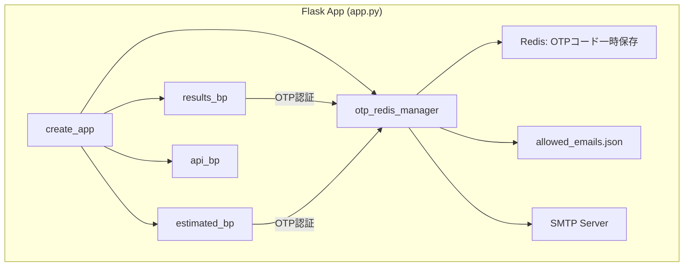
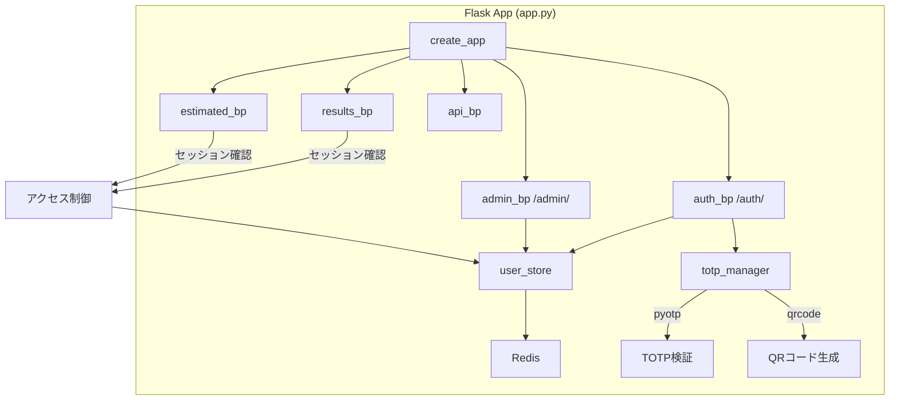
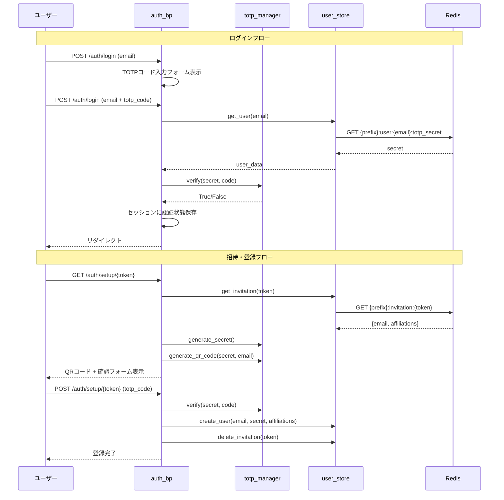
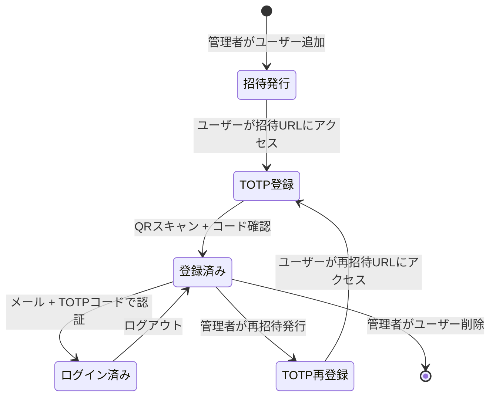

# 設計ドキュメント: TOTP認証システム

## 概要

BenchKit結果サーバの認証方式をEmail OTP（SMTP依存）からTOTP（Time-based One-Time Password）に移行する。現在の`otp_redis_manager.py`と`otp_manager.py`を廃止し、`pyotp`/`qrcode`ライブラリを使用したTOTP認証と、Redisベースのユーザー管理を導入する。

主な変更点:
- SMTP依存の完全排除
- `allowed_emails.json`からRedisベースのユーザーストアへ移行
- 管理者による招待リンク方式のユーザー登録
- 専用Auth/Admin Blueprintによるルート分離
- 開発モード（`app_dev.py`）のスタブ更新

## アーキテクチャ

### 現在のアーキテクチャ



### 新アーキテクチャ



### リクエストフロー



## コンポーネントとインターフェース

### 1. `utils/totp_manager.py` - TOTP操作モジュール

TOTP秘密鍵の生成、QRコード生成、コード検証を担当する純粋なユーティリティモジュール。状態を持たない。

```python
"""TOTP認証操作モジュール"""
import pyotp
import qrcode
import io
import base64

ISSUER_NAME = "BenchKit"

def generate_secret() -> str:
    """Base32エンコードされたTOTP秘密鍵を生成する。
    
    Returns:
        str: Base32エンコードされた秘密鍵文字列
    """

def generate_totp_uri(secret: str, email: str, issuer: str = ISSUER_NAME) -> str:
    """otpauth URIを生成する。
    
    Args:
        secret: Base32エンコードされた秘密鍵
        email: ユーザーのメールアドレス
        issuer: サービス名（デフォルト: "BenchKit"）
    
    Returns:
        str: otpauth://totp/{issuer}:{email}?secret={secret}&issuer={issuer}
    """

def generate_qr_base64(secret: str, email: str, issuer: str = ISSUER_NAME) -> str:
    """QRコード画像をBase64エンコードされたPNG文字列として返す。
    
    Args:
        secret: Base32エンコードされた秘密鍵
        email: ユーザーのメールアドレス
        issuer: サービス名
    
    Returns:
        str: "data:image/png;base64,..." 形式の文字列
    """

def verify_code(secret: str, code: str) -> bool:
    """TOTPコードを検証する。前後1ステップ（30秒）の時間ずれを許容。
    
    Args:
        secret: Base32エンコードされた秘密鍵
        code: ユーザーが入力した6桁のコード
    
    Returns:
        bool: 検証成功ならTrue
    """
```

### 2. `utils/user_store.py` - Redisベースユーザー管理

Redis接続とキープレフィックスを保持し、ユーザーCRUDと招待トークン管理を提供する。

```python
"""Redisベースのユーザーストア"""
import secrets
from typing import Optional, List, Dict

INVITATION_TTL = 86400  # 24時間

class UserStore:
    def __init__(self, redis_conn, key_prefix: str = ""):
        """
        Args:
            redis_conn: Redisクライアント接続
            key_prefix: 環境ごとのキープレフィックス（"main:" or "dev:"）
        """
    
    # --- ユーザー管理 ---
    
    def create_user(self, email: str, totp_secret: str, affiliations: List[str]) -> None:
        """ユーザーを登録する。usersセットへの追加、秘密鍵・所属情報の保存。"""
    
    def get_user(self, email: str) -> Optional[Dict]:
        """ユーザー情報を取得する。
        
        Returns:
            {"email": str, "totp_secret": str, "affiliations": list} or None
        """
    
    def delete_user(self, email: str) -> bool:
        """ユーザーを削除する。全関連キーを削除。"""
    
    def list_users(self) -> List[Dict]:
        """全ユーザーの一覧を返す。"""
    
    def update_affiliations(self, email: str, affiliations: List[str]) -> bool:
        """ユーザーの所属情報を更新する。"""
    
    def user_exists(self, email: str) -> bool:
        """ユーザーが登録済みか確認する。"""
    
    def get_affiliations(self, email: str) -> List[str]:
        """ユーザーの所属情報を取得する。"""
    
    def clear_totp_secret(self, email: str) -> bool:
        """ユーザーのTOTP秘密鍵を削除する（再登録用）。"""
    
    def has_totp_secret(self, email: str) -> bool:
        """ユーザーがTOTP秘密鍵を持っているか確認する。"""
    
    # --- 招待トークン管理 ---
    
    def create_invitation(self, email: str, affiliations: List[str]) -> str:
        """招待トークンを生成してRedisに保存する。
        
        Returns:
            str: 招待トークン文字列
        """
    
    def get_invitation(self, token: str) -> Optional[Dict]:
        """招待トークンの情報を取得する。
        
        Returns:
            {"email": str, "affiliations": list} or None（無効/期限切れ）
        """
    
    def delete_invitation(self, token: str) -> None:
        """招待トークンを削除する。"""
```

### 3. `routes/auth.py` - 認証Blueprint

ログイン、TOTP登録（セットアップ）、ログアウトのルーティングを担当。

```python
"""認証Blueprint"""
from flask import Blueprint

auth_bp = Blueprint("auth", __name__, url_prefix="/auth")

# --- エンドポイント ---

@auth_bp.route("/login", methods=["GET", "POST"])
def login():
    """ログインページ。
    
    GET: ログインフォーム表示
    POST (emailのみ): TOTPコード入力フォーム表示
    POST (email + totp_code): 認証処理
      - 成功: セッションに認証状態保存、リダイレクト
      - 失敗: エラーメッセージ表示
    
    セッションキー:
      - "authenticated": bool
      - "user_email": str
      - "user_affiliations": list
    """

@auth_bp.route("/setup/<token>", methods=["GET", "POST"])
def setup(token):
    """TOTP登録ページ。
    
    GET: 招待トークン検証 → QRコード表示
    POST: 確認用TOTPコード検証 → ユーザー登録
    """

@auth_bp.route("/logout")
def logout():
    """ログアウト。セッションクリア後、トップページにリダイレクト。"""
```

### 4. `routes/admin.py` - 管理者Blueprint

ユーザーCRUD操作と招待リンク管理を提供。`admin`所属を持つ認証済みユーザーのみアクセス可能。

```python
"""管理者Blueprint"""
from flask import Blueprint
from functools import wraps

admin_bp = Blueprint("admin", __name__, url_prefix="/admin")

def admin_required(f):
    """admin所属を持つ認証済みユーザーのみアクセスを許可するデコレータ。
    
    未認証: /auth/login にリダイレクト
    admin所属なし: 403エラー
    """

@admin_bp.route("/users", methods=["GET"])
@admin_required
def users():
    """ユーザー一覧ページ。
    
    表示項目: メールアドレス、所属情報、登録状態（TOTP設定済み/未設定）
    """

@admin_bp.route("/users/add", methods=["POST"])
@admin_required
def add_user():
    """ユーザー追加。招待トークン生成、招待URL表示。
    
    フォーム: email, affiliations（カンマ区切り）
    既に登録済みの場合: 再登録フローを案内
    """

@admin_bp.route("/users/<email>/delete", methods=["POST"])
@admin_required
def delete_user(email):
    """ユーザー削除。"""

@admin_bp.route("/users/<email>/affiliations", methods=["POST"])
@admin_required
def update_affiliations(email):
    """所属情報の更新。"""

@admin_bp.route("/users/<email>/reinvite", methods=["POST"])
@admin_required
def reinvite_user(email):
    """TOTP再登録用招待リンク生成。既存秘密鍵を無効化。"""
```

### 5. アクセス制御の共通化

現在`results.py`と`estimated.py`に重複しているアクセス制御ロジックを、`user_store`の`get_affiliations()`を使用する形に統一する。

```python
# routes/results.py, routes/estimated.py 共通パターン
from utils.user_store import get_user_store

def check_file_permission(filename, dir_path):
    """ファイルアクセス権限確認（セッションベース）"""
    tags = get_file_confidential_tags(filename, dir_path)
    if not tags:
        return  # 公開ファイル
    
    authenticated = session.get("authenticated", False)
    email = session.get("user_email")
    store = get_user_store()
    affs = store.get_affiliations(email) if email else []
    
    if not authenticated or not (set(tags) & set(affs)):
        abort(403)
```

### 6. `app.py` の初期化変更

```python
# 変更前
import utils.otp_redis_manager as otp_redis_manager
otp_redis_manager.init_redis(r_conn, key_prefix)

# 変更後
from utils.user_store import UserStore

user_store = UserStore(r_conn, key_prefix)
app.config["USER_STORE"] = user_store

# Blueprint登録
from routes.auth import auth_bp
from routes.admin import admin_bp
app.register_blueprint(auth_bp, url_prefix=f"{prefix}/auth")
app.register_blueprint(admin_bp, url_prefix=f"{prefix}/admin")
```

`get_user_store()`ヘルパー関数で`current_app.config["USER_STORE"]`にアクセスする。

```python
# utils/user_store.py
from flask import current_app

def get_user_store() -> "UserStore":
    """現在のアプリコンテキストからUserStoreインスタンスを取得する。"""
    return current_app.config["USER_STORE"]
```


### 7. セッション管理の統一

現在、`results.py`と`estimated.py`で別々のセッションキー（`authenticated_confidential`/`authenticated_estimated`、`otp_email`/`otp_email_estimated`）を使用しているが、TOTP認証では一度のログインで全ページにアクセスできるよう統一する。

| 現在のセッションキー | 新しいセッションキー |
|---|---|
| `authenticated_confidential` | `authenticated` |
| `authenticated_estimated` | `authenticated` |
| `otp_email` | `user_email` |
| `otp_email_estimated` | `user_email` |
| （なし） | `user_affiliations` |

これにより、`/auth/login`で一度認証すれば、`/results/confidential`と`/estimated/`の両方にアクセスできる。

### 8. テンプレート変更

#### `_navigation.html` の更新

認証状態に応じたナビゲーション表示:

```html
<nav>
    <a href="{{ url_for('results.results') }}">📊 Results</a>
    <a href="{{ url_for('systemlist') }}">🖥️ Systems</a>
    <a href="{{ url_for('results.results_confidential') }}">🔒 Confidential</a>
    <a href="{{ url_for('estimated.estimated_results') }}">🔐 Estimated</a>
    
    
        
            <a href="{{ url_for('admin.users') }}">⚙️ Admin</a>
        
        <span>{{ session.get('user_email') }}</span>
        <a href="{{ url_for('auth.logout') }}">ログアウト</a>
    
        <a href="{{ url_for('auth.login') }}">ログイン</a>
    
</nav>
```

#### `_otp_modal.html` → 廃止

OTPモーダルを廃止し、未認証ユーザーには`/auth/login`へのリダイレクトリンクを表示する。`results_confidential.html`と`estimated_results.html`では、未認証時にログインページへのリンクを表示する。

#### 新規テンプレート

- `auth_login.html`: メールアドレス入力 → TOTPコード入力の2段階フォーム
- `auth_setup.html`: QRコード表示 + 確認用TOTPコード入力フォーム
- `admin_users.html`: ユーザー一覧テーブル、追加/削除/編集/再招待フォーム

### 9. 開発モード（`app_dev.py`）の更新

```python
def _create_stub_totp_manager():
    """TOTP検証を常に成功させるスタブ"""
    mod = types.ModuleType("utils.totp_manager")
    mod.generate_secret = lambda: "DEVDEVDEVDEVDEVDEV"
    mod.generate_totp_uri = lambda s, e, **kw: f"otpauth://totp/BenchKit:{e}?secret={s}"
    mod.generate_qr_base64 = lambda s, e, **kw: ""
    mod.verify_code = lambda s, c: True
    mod.ISSUER_NAME = "BenchKit"
    return mod

def _create_stub_user_store():
    """Redis不要のインメモリユーザーストアスタブ"""
    # 辞書ベースのインメモリ実装
    # 任意のメールアドレスで認証成功
    # get_affiliations() は常に ["dev", "admin"] を返す
```

## データモデル

### Redisキー構造

```
{prefix}:users                          → Set型: 登録済みメールアドレスの集合
{prefix}:user:{email}:totp_secret       → String型: Base32エンコードされたTOTP秘密鍵
{prefix}:user:{email}:affiliations      → List型: 所属グループのリスト
{prefix}:invitation:{token}             → Hash型: {email, affiliations} (TTL: 24時間)
```

### キープレフィックス

| 環境 | プレフィックス | 例 |
|---|---|---|
| 本番 (port 8800) | `main:` | `main:users`, `main:user:user@example.com:totp_secret` |
| 開発 (port 8801) | `dev:` | `dev:users`, `dev:user:user@example.com:totp_secret` |

### 招待トークンデータ

```json
{
  "email": "user@example.com",
  "affiliations": "group1,group2"
}
```

Redis Hash型で保存。`affiliations`はカンマ区切り文字列として保存し、取得時にリストに変換する。TTLは24時間（86400秒）。

### セッションデータ

```python
session = {
    "authenticated": True,          # 認証済みフラグ
    "user_email": "user@example.com",  # ユーザーメールアドレス
    "user_affiliations": ["group1", "admin"],  # 所属グループリスト
}
```

### ユーザー状態遷移




## 正当性プロパティ (Correctness Properties)

*プロパティとは、システムの全ての有効な実行において成り立つべき特性や振る舞いのことです。人間が読める仕様と機械的に検証可能な正当性保証の橋渡しとなる、形式的な記述です。*

### Property 1: TOTP検証ラウンドトリップ

*任意の*生成されたTOTP秘密鍵に対して、`pyotp.TOTP(secret).now()`で生成した現在のコードを`verify_code(secret, code)`に渡した場合、検証は成功する（Trueを返す）。また、秘密鍵は有効なBase32エンコード文字列である。

**Validates: Requirements 1.1, 1.4, 1.5**

### Property 2: otpauth URI構造の正当性

*任意の*メールアドレスとイシュア名に対して、`generate_totp_uri(secret, email, issuer)`が返すURIは`otpauth://totp/`で始まり、指定されたemail、secret、issuerをパラメータとして含む。また、`generate_qr_base64()`の出力は`data:image/png;base64,`で始まる有効なBase64エンコード文字列である。

**Validates: Requirements 1.2, 1.3**

### Property 3: ユーザー作成ラウンドトリップ

*任意の*メールアドレス、TOTP秘密鍵、所属情報リストに対して、`create_user(email, secret, affiliations)`で作成した後、`get_user(email)`で取得したデータは元の秘密鍵と所属情報と一致する。また、`user_exists(email)`はTrueを返し、`list_users()`の結果に該当ユーザーが含まれる。

**Validates: Requirements 2.1, 2.2, 2.3**

### Property 4: ユーザー削除の完全性

*任意の*登録済みユーザーに対して、`delete_user(email)`を実行した後、`get_user(email)`はNoneを返し、`user_exists(email)`はFalseを返し、`get_affiliations(email)`は空リストを返す。

**Validates: Requirements 2.4**

### Property 5: キープレフィックスによるデータ分離

*任意の*メールアドレスとユーザーデータに対して、プレフィックス`"main:"`で作成したUserStoreに登録したユーザーは、プレフィックス`"dev:"`のUserStoreからは参照できない（`get_user()`がNoneを返す）。逆も同様。

**Validates: Requirements 2.6**

### Property 6: 招待トークンラウンドトリップ

*任意の*メールアドレスと所属情報リストに対して、`create_invitation(email, affiliations)`で生成したトークンを`get_invitation(token)`で取得した場合、元のメールアドレスと所属情報が一致する。また、トークンは十分な長さ（32文字以上）を持ち、複数回の生成で全て一意である。

**Validates: Requirements 3.1, 3.2**

### Property 7: ユーザー列挙攻撃の防止

*任意の*メールアドレス（登録済み・未登録を問わず）に対して、ログインフォームにメールアドレスを送信した場合のHTTPレスポンスステータスコードは同一である。

**Validates: Requirements 4.3**

### Property 8: アクセス制御の交差判定

*任意の*所属情報リストとConfidential_Tagリストに対して、アクセス可否は両リストの交差（共通要素の存在）によって決定される。交差が空でなければアクセス許可、空ならアクセス拒否。ただし、所属情報に`"admin"`が含まれる場合は、Confidential_Tagの内容に関わらず常にアクセスが許可される。

**Validates: Requirements 5.1, 5.2, 5.3**

### Property 9: 管理者権限チェック

*任意の*`admin`所属を持たない認証済みユーザーに対して、Admin_Panelの全エンドポイント（`/admin/users`等）へのアクセスは403ステータスコードを返す。

**Validates: Requirements 6.7**

### Property 10: 開発モードでの認証バイパス

*任意の*メールアドレスとTOTPコードに対して、開発モードのスタブ`verify_code()`は常にTrueを返す。

**Validates: Requirements 8.2**

### Property 11: スタブと本番のインターフェース互換性

*任意の*`totp_manager`モジュールの公開関数名に対して、開発モードのスタブモジュールは同一の関数名を持つ。同様に、`UserStore`クラスの公開メソッド名に対して、開発モードのスタブは同一のメソッド名を持つ。

**Validates: Requirements 8.4**

## エラーハンドリング

### 認証エラー

| エラー状況 | 処理 | ユーザーへの表示 |
|---|---|---|
| 未登録メールアドレスでログイン | TOTPコード入力フォームを表示（列挙攻撃防止） | 通常のTOTPコード入力画面 |
| 無効なTOTPコード | 認証失敗、再入力を促す | "Authentication failed. Please check your code." |
| 無効/期限切れ招待トークン | エラーページ表示 | "This invitation link is invalid or has expired." |
| セッション期限切れ | ログインページにリダイレクト | Flash message: "Your session has expired." |

### アクセス制御エラー

| エラー状況 | HTTPステータス | 処理 |
|---|---|---|
| 未認証でAdmin_Panelアクセス | 302 | `/auth/login`にリダイレクト |
| 非adminでAdmin_Panelアクセス | 403 | Forbiddenエラーページ |
| 未認証で機密ファイルアクセス | 403 | Forbiddenエラーページ |
| 所属不一致で機密ファイルアクセス | 403 | Forbiddenエラーページ |

### Redis接続エラー

| エラー状況 | 処理 |
|---|---|
| Redis接続失敗（本番） | アプリ起動時にエラー終了 |
| Redis接続失敗（開発モード） | インメモリスタブにフォールバック |
| Redis操作中のエラー | 500エラー、ログ出力 |

### 入力バリデーション

- メールアドレス: 基本的なフォーマット検証（`@`を含む）
- TOTPコード: 6桁の数字のみ
- 所属情報: 空文字列を除外、トリム処理
- 招待トークン: 英数字のみ

## テスト戦略

### テストフレームワーク

- ユニットテスト: `pytest`
- プロパティベーステスト: `hypothesis`（Python用PBTライブラリ）
- 各プロパティテストは最低100イテレーション実行

### プロパティベーステスト

各正当性プロパティに対して1つのプロパティベーステストを実装する。テストにはプロパティ番号を参照するタグコメントを付与する。

タグ形式: `# Feature: totp-authentication, Property {number}: {property_text}`

#### テスト対象と戦略

| プロパティ | テスト対象モジュール | 生成戦略 |
|---|---|---|
| Property 1 | `totp_manager` | `hypothesis.strategies.text()`で秘密鍵生成をトリガー |
| Property 2 | `totp_manager` | ランダムなメールアドレス・イシュア名を生成 |
| Property 3 | `user_store` | ランダムなメールアドレス・秘密鍵・所属リストを生成 |
| Property 4 | `user_store` | ランダムなユーザーを作成後に削除 |
| Property 5 | `user_store` | 2つの異なるプレフィックスでUserStoreを作成 |
| Property 6 | `user_store` | ランダムなメールアドレス・所属リストで招待を生成 |
| Property 7 | `auth_bp` (Flask test client) | ランダムなメールアドレスでログインPOST |
| Property 8 | アクセス制御関数 | ランダムな所属リスト・タグリストの組み合わせ |
| Property 9 | `admin_bp` (Flask test client) | ランダムな非admin所属でアクセス |
| Property 10 | スタブ`totp_manager` | ランダムな秘密鍵・コードで検証 |
| Property 11 | スタブモジュール | 本番モジュールの公開関数名を列挙して比較 |

### ユニットテスト

プロパティベーステストを補完する具体的なシナリオテスト:

- 招待トークンのTTL（24時間）が正しく設定されること（要件3.3）
- 有効な招待URLでQRコードが表示されること（要件3.5）
- セットアップ完了後に招待トークンが削除されること（要件3.7）
- 登録済みメールアドレスへの招待で適切な通知が返ること（要件3.9）
- ログアウト後にセッションがクリアされること（要件4.5）
- セッション設定（Secure、HttpOnly、SameSite、30分）が維持されること（要件4.6）
- 未認証ユーザーがAdmin_Panelにアクセスするとログインにリダイレクトされること（要件6.8）
- 開発モードでRedis接続なしで動作すること（要件8.3）
- 認証済みユーザーのナビゲーションにログアウトリンクが表示されること（要件9.1）
- 未認証ユーザーのナビゲーションにログインリンクが表示されること（要件9.2）
- adminユーザーのナビゲーションに管理パネルリンクが表示されること（要件9.3）

### テスト環境

- プロパティテスト（Property 3-6）: `fakeredis`ライブラリを使用してRedisをモック
- プロパティテスト（Property 7, 9）: Flaskテストクライアント + `fakeredis`
- プロパティテスト（Property 1-2, 10-11）: 外部依存なし（純粋なユニットテスト）

### テスト実行

```bash
# 全テスト実行
pytest tests/test_totp_manager.py tests/test_user_store.py tests/test_auth.py tests/test_admin.py -v

# プロパティテストのみ
pytest tests/ -v -k "property"
```
