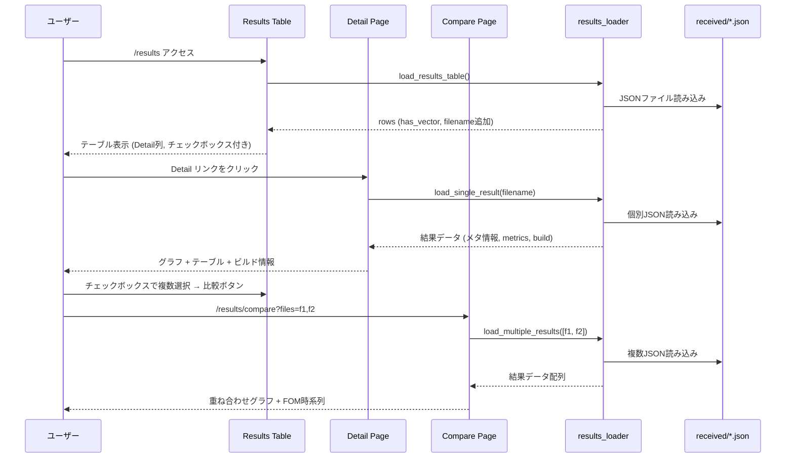

# Design Document: ベクトル型メトリクスのグラフ表示機能

## Overview

BenchKit結果サーバ（Flask + Jinja2）に、ベクトル型メトリクスのインタラクティブなグラフ表示機能とリグレッション比較機能を追加する。

現在の結果一覧テーブルはスカラー値（FOM）のみを表示しているが、BenchParkから取り込んだ結果には`metrics.vector`（メッセージサイズ vs バンド幅/レイテンシ等）が含まれる。本設計では以下を実現する：

1. 結果一覧テーブルに「Detail」カラムとチェックボックスを追加
2. 個別結果の詳細ページ（グラフ、データテーブル、スカラーメトリクス、ビルド情報）
3. 複数結果の比較ページ（ベクトル型メトリクスの重ね合わせ、FOM時系列グラフ）

### グラフライブラリの選定

CDN経由のJavaScriptグラフライブラリとして **Chart.js** を採用する。

| 観点 | Chart.js | Apache ECharts | Plotly.js |
|------|----------|----------------|-----------|
| CDNサイズ | ~70KB (gzip) | ~400KB (gzip) | ~1MB (gzip) |
| 対数スケール | ✅ `type: 'logarithmic'` | ✅ | ✅ |
| 複数系列 | ✅ | ✅ | ✅ |
| 学習コスト | 低い | 中程度 | 中程度 |
| ドキュメント | 英語、充実 | 中英、充実 | 英語、充実 |
| 依存関係 | なし | なし | D3.js内包 |

**選定理由:**
- 本プロジェクトのグラフ要件（折れ線グラフ、対数スケール、複数系列、重ね合わせ）はChart.jsで十分対応可能
- CDNサイズが最小で、既存のシンプルなFlask+Jinja2アーキテクチャに適合
- 広く使われており、情報が豊富
- 既存テンプレートにはビルドツール（webpack等）がなく、CDN経由の単一スクリプトタグで導入できるChart.jsが最適

CDN URL: `https://cdn.jsdelivr.net/npm/chart.js`

## Architecture

### 全体構成

```
┌─────────────────────────────────────────────────────┐
│                    Flask App                         │
│                                                      │
│  routes/results.py                                   │
│  ├── /results              (既存: 結果一覧)          │
│  ├── /results/<filename>   (既存: JSON表示)          │
│  ├── /results/detail/<fn>  (新規: 詳細ページ)        │
│  └── /results/compare      (新規: 比較ページ)        │
│                                                      │
│  utils/results_loader.py                             │
│  ├── load_results_table()  (変更: has_vector追加)    │
│  ├── load_single_result()  (新規)                    │
│  └── load_multiple_results() (新規)                  │
│                                                      │
│  templates/                                          │
│  ├── _results_table.html   (変更: Detail列+checkbox) │
│  ├── result_detail.html    (新規: 詳細ページ)        │
│  └── result_compare.html   (新規: 比較ページ)        │
└─────────────────────────────────────────────────────┘
         │
         ▼
┌─────────────────────┐
│  received/*.json     │  ← Result_JSON ファイル群
└─────────────────────┘
```

### データフロー



## Components and Interfaces

### 1. routes/results.py（変更）

新規ルートを2つ追加する。既存ルートは変更しない。

```python
@results_bp.route("results/detail/<filename>")
def result_detail(filename):
    """個別結果の詳細ページ"""
    # 1. 権限チェック (既存のcheck_file_permission再利用)
    # 2. load_single_result(filename) でデータ取得
    # 3. result_detail.html をレンダリング
    pass

@results_bp.route("results/compare")
def result_compare():
    """リグレッション比較ページ"""
    # 1. クエリパラメータ files からファイル名リスト取得
    # 2. 各ファイルの権限チェック
    # 3. load_multiple_results(filenames) でデータ取得
    # 4. system+code の一致検証
    # 5. result_compare.html をレンダリング
    pass
```

### 2. utils/results_loader.py（変更）

既存の`load_results_table()`を拡張し、新規関数を2つ追加する。

```python
def load_results_table(public_only=True, session_email=None, authenticated=False):
    """変更: 各rowに has_vector, detail_link, filename を追加"""
    # 既存ロジック + metrics.vector の有無チェック
    pass

def load_single_result(filename, save_dir=SAVE_DIR):
    """新規: 個別結果JSONの全データを返す"""
    # JSONファイルを読み込み、dict として返す
    # ファイルが存在しない場合は None を返す
    pass

def load_multiple_results(filenames, save_dir=SAVE_DIR):
    """新規: 複数結果JSONを読み込み、リストで返す"""
    # 各ファイルを load_single_result で読み込み
    # タイムスタンプ順にソート
    pass
```

### 3. テンプレート

#### _results_table.html（変更）
- 先頭にチェックボックス列を追加
- 末尾に「Detail」列を追加
- テーブル下部に比較ボタンを追加
- JS: チェックボックス選択数に応じた比較ボタンの有効/無効制御
- JS: system+code一致バリデーション

#### result_detail.html（新規）
- `_table_base.html` のCSS/JSを継承
- `_navigation.html` を含む
- メタ情報セクション（code, system, Exp, FOM, FOM_unit, node_count, cpus_per_node）
- ベクトル型メトリクスグラフ（Chart.js、対数X軸、複数系列）
- ベクトル型メトリクスデータテーブル
- スカラー型メトリクスセクション（条件付き表示）
- ビルド情報セクション（条件付き表示）
- 結果一覧への戻りリンク

#### result_compare.html（新規）
- `_table_base.html` のCSS/JSを継承
- `_navigation.html` を含む
- ベクトル型メトリクス重ね合わせグラフ（結果ごとに異なる色、タイムスタンプラベル）
- FOM時系列グラフ（X軸: タイムスタンプ、Y軸: FOM値）
- 結果一覧への戻りリンク

### 4. app_dev.py（変更）

`generate_sample_data()`を拡張し、リグレッションテスト用に同一system+codeで異なるタイムスタンプのデータを追加生成する。

```python
# 既存: osu_bibw (現在時刻)
# 追加: osu_bibw_old (7日前、少し異なる値)
# 追加: osu_bibw_older (14日前、さらに異なる値)
```

## Data Models

### Result_JSON 構造（既存、変更なし）

```json
{
  "code": "string",
  "system": "string",
  "Exp": "string",
  "FOM": "number",
  "FOM_unit": "string",
  "FOM_version": "string",
  "node_count": "number",
  "cpus_per_node": "number",
  "metrics": {
    "scalar": { "key": "value", ... },
    "vector": {
      "x_axis": { "name": "string", "unit": "string" },
      "table": {
        "columns": ["string", ...],
        "rows": [["number", ...], ...]
      }
    }
  },
  "build": {
    "tool": "string",
    "spack": {
      "compiler": { "name": "string", "version": "string" },
      "mpi": { "name": "string", "version": "string" },
      "packages": [{ "name": "string", "version": "string" }, ...]
    }
  }
}
```

### load_results_table() の row 拡張

既存のrowフィールドに以下を追加：

| フィールド | 型 | 説明 |
|-----------|-----|------|
| `has_vector` | bool | `metrics.vector` が存在するか |
| `detail_link` | str \| None | 詳細ページURL（has_vectorがTrueの場合のみ） |
| `filename` | str | JSONファイル名（比較ページ遷移用） |

### load_single_result() の戻り値

JSONファイルの内容をそのまま `dict` として返す。テンプレート側で `json.dumps()` を使いJavaScriptに渡す。

### load_multiple_results() の戻り値

```python
[
    {
        "filename": "result_20250101_120000_uuid.json",
        "timestamp": "2025-01-01 12:00:00",
        "data": { ... }  # JSONファイルの内容
    },
    ...
]
```

タイムスタンプ昇順でソートして返す。


## Correctness Properties

*A property is a characteristic or behavior that should hold true across all valid executions of a system—essentially, a formal statement about what the system should do. Properties serve as the bridge between human-readable specifications and machine-verifiable correctness guarantees.*

以下のプロパティは、要件文書の受入基準を分析し、自動テスト可能な普遍的性質を抽出したものである。

### Property 1: has_vector フラグと metrics.vector の存在が一致する

*For any* Result_JSON、`load_results_table()` が返す row の `has_vector` フラグは、元のJSONに `metrics.vector` フィールドが存在する場合にのみ True であり、存在しない場合は False である。また、`detail_link` は `has_vector` が True の場合にのみ非None値を持つ。

**Validates: Requirements 1.1, 1.2**

### Property 2: load_single_result はメタ情報フィールドを保持する

*For any* 有効な Result_JSON ファイル、`load_single_result()` が返す dict は、元のJSONに存在する全てのメタ情報フィールド（code, system, Exp, FOM, FOM_unit, node_count, cpus_per_node）を保持する。

**Validates: Requirements 2.1**

### Property 3: グラフ系列数は table.columns の長さ - 1 に等しい

*For any* `metrics.vector.table` を持つ Result_JSON、描画すべきグラフ系列の数は `len(table.columns) - 1` に等しい（先頭のX軸カラムを除く）。

**Validates: Requirements 3.3**

### Property 4: スカラーメトリクスセクションの表示条件

*For any* Result_JSON、`metrics.scalar` が存在しキーが2つ以上ある場合にのみスカラーメトリクスセクションを表示すべきであり、キーが「FOM」のみの場合は表示しない。すなわち、表示フラグは `len(metrics.scalar.keys()) >= 2` と同値である。

**Validates: Requirements 5.1, 5.2**

### Property 5: ビルド情報フィールドの抽出

*For any* `build` フィールドを持つ Result_JSON、`build.tool` が取得可能であり、`build.spack` が存在する場合は `compiler`（name, version）、`mpi`（name, version）、`packages`（各要素のname, version）が全て取得可能である。

**Validates: Requirements 6.1, 6.2, 6.3, 6.4**

### Property 6: 比較時の system+code 一致バリデーション

*For any* 2つ以上の Result_JSON の組み合わせにおいて、`system` または `code` が一致しない場合、比較エンドポイントはエラーを返す。逆に、全ての結果の `system` と `code` が一致する場合はエラーを返さない。

**Validates: Requirements 7.4**

### Property 7: load_multiple_results のタイムスタンプ昇順ソート

*For any* 複数の Result_JSON ファイル名のリスト、`load_multiple_results()` が返すリストはタイムスタンプの昇順でソートされている。

**Validates: Requirements 9.1**

### Property 8: metrics フィールドなしの既存結果の後方互換性

*For any* `metrics` フィールドを持たない既存形式の Result_JSON、`load_results_table()` は従来通り全ての既存フィールド（timestamp, code, exp, fom, fom_version, system, json_link 等）を含む row を返し、`has_vector` は False、`detail_link` は None となる。

**Validates: Requirements 10.1**

### Property 9: confidential 結果へのアクセス制御

*For any* confidential タグ付きの Result_JSON、未認証状態で詳細ページ（`/results/detail/<filename>`）または比較ページ（`/results/compare`）にアクセスした場合、HTTP 403 エラーが返される。

**Validates: Requirements 10.2, 11.4**

## Error Handling

### HTTPエラー

| 状況 | HTTPステータス | 説明 |
|------|---------------|------|
| 存在しないファイル名で詳細ページアクセス | 404 | `load_single_result()` が None を返した場合 |
| confidential結果への未認証アクセス | 403 | 既存の `check_file_permission()` による |
| 比較ページで files パラメータなし | 400 | クエリパラメータのバリデーション |
| 比較ページで1件のみ指定 | 400 | 最低2件必要 |
| 比較ページで system+code 不一致 | 400 | バリデーションエラー、エラーメッセージ付きで結果一覧にリダイレクト |

### データ欠損への対応

| 状況 | 対応 |
|------|------|
| `metrics` フィールドなし | 既存形式として処理。has_vector=False、詳細ページではグラフセクション非表示 |
| `metrics.vector` なし、`metrics.scalar` あり | スカラーメトリクスのみ表示 |
| `metrics.scalar` なし、`metrics.vector` あり | ベクトルメトリクスのみ表示 |
| `build` フィールドなし | ビルド情報セクション非表示 |
| `build.spack` フィールドなし | Spack詳細セクション非表示、`build.tool` のみ表示 |
| `FOM_unit` フィールドなし | 「N/A」を表示 |

### JavaScript側のエラー処理

- Chart.js CDN読み込み失敗時: グラフ領域に「グラフを読み込めませんでした」メッセージを表示
- データが空の場合: 「データがありません」メッセージを表示

## Testing Strategy

### テストフレームワーク

- **ユニットテスト**: `pytest`
- **プロパティベーステスト**: `hypothesis`（Python用PBTライブラリ）
- **Flaskテスト**: `pytest` + Flask test client

### ユニットテスト

具体的な例やエッジケースを検証する：

1. **詳細ページ 404**: 存在しないファイル名でのアクセスが404を返すことを確認
2. **結果一覧の Detail カラム**: columns リストに "Detail" エントリが含まれることを確認
3. **既存カラムの維持**: 既存の9カラム（Timestamp, SYSTEM, CODE, FOM, FOM version, Exp, Nodes, JSON, PA Data）が変更されていないことを確認
4. **ルーティング**: `/results/detail/<filename>` と `/results/compare` が正しく応答することを確認
5. **比較ページ遷移**: files クエリパラメータが正しく処理されることを確認

### プロパティベーステスト

`hypothesis` ライブラリを使用し、各プロパティテストは最低100回のイテレーションで実行する。各テストにはデザインドキュメントのプロパティ番号をタグとしてコメントに記載する。

タグ形式: **Feature: vector-metrics-graph, Property {number}: {property_text}**

| プロパティ | テスト内容 | 生成戦略 |
|-----------|-----------|---------|
| Property 1 | has_vector フラグの正確性 | metrics.vector の有無をランダムに切り替えた Result_JSON を生成 |
| Property 2 | メタ情報フィールドの保持 | ランダムなメタ情報値を持つ Result_JSON を生成し、load_single_result の戻り値を検証 |
| Property 3 | 系列数の一致 | ランダムな列数（2〜10）の vector.table を生成し、系列数 = 列数 - 1 を検証 |
| Property 4 | スカラーセクション表示条件 | ランダムなキー数（0〜5）の metrics.scalar を生成し、表示条件を検証 |
| Property 5 | ビルド情報フィールド抽出 | ランダムなビルド情報を持つ Result_JSON を生成し、全フィールドの取得可能性を検証 |
| Property 6 | system+code 一致バリデーション | ランダムな system/code の組み合わせを持つ複数結果を生成し、バリデーション結果を検証 |
| Property 7 | タイムスタンプソート | ランダムな順序のタイムスタンプを持つファイル名リストを生成し、ソート結果を検証 |
| Property 8 | 後方互換性 | metrics フィールドなしの Result_JSON を生成し、既存フィールドの保持と has_vector=False を検証 |
| Property 9 | アクセス制御 | confidential タグ付き Result_JSON を生成し、未認証アクセスでの 403 応答を検証 |

### テスト実行

```bash
cd result_server
pip install pytest hypothesis
pytest tests/ -v
```

各プロパティベーステストは単一の `@given` デコレータで実装し、1プロパティ = 1テスト関数とする。`@settings(max_examples=100)` で最低100回のイテレーションを保証する。
